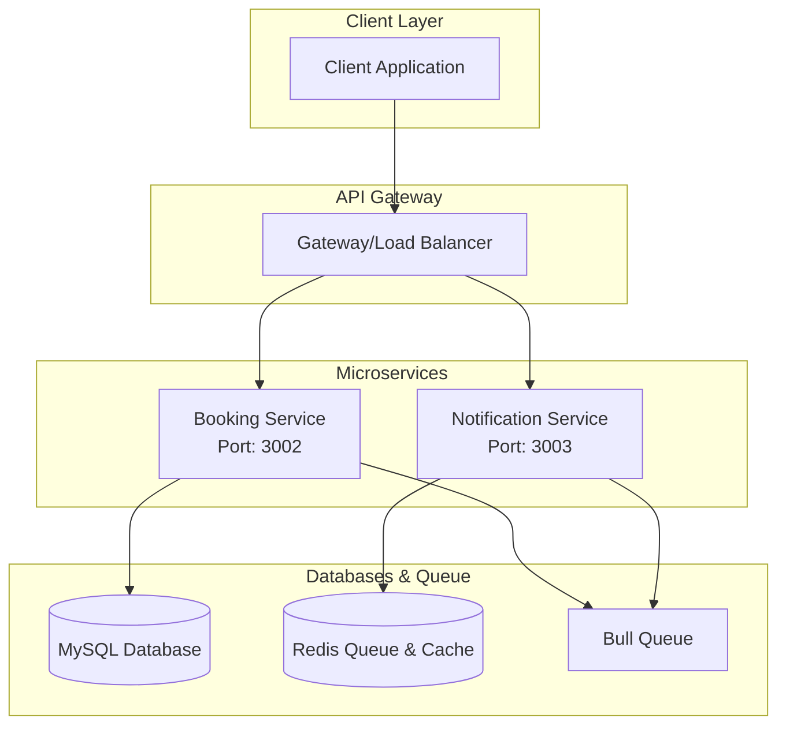
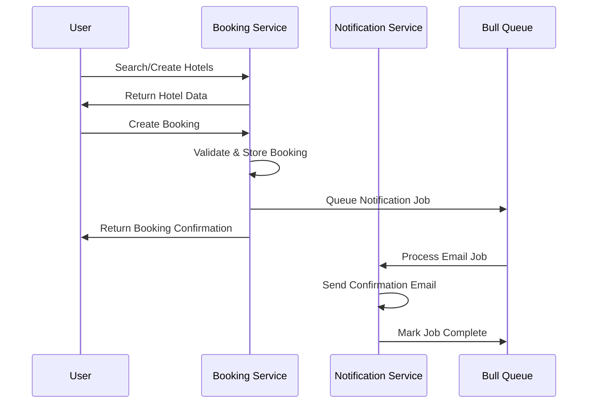

# Airbnb Booking System

> A microservices-based Airbnb clone built with Node.js, TypeScript, and Docker for scalable hospitality platform management.

**ExpressJs, TypeScript, NodeJs, MySQL, Redis, Zod, Golang** | Aug 2025 – Sep 2025

| Service | Architecture | Focus |
| :--- | :--- | :--- |
| **Microservices** | 2 Core Services | Booking & Notifications |

---

## Overview

A production-ready, microservices-based Airbnb clone featuring hotel management through booking operations and notification services. Built with modern technologies for scalable deployment.

### Key Highlights
- **ACID Transactions**: Enforced multi-step transactions for zero data inconsistencies via automatic rollbacks.
- **Concurrency Management**: Implemented **Redis Redlock** and pessimistic locking to eliminate race conditions.
- **Idempotency**: Built idempotent APIs to prevent duplicate payments.
- **High Throughput**: Integrated a Golang API gateway to proxy requests with low-latency routing.

## Interactive System Flow
<div class="flow-visualizer-container" data-nodes='["Guest", "API Gateway", "Auth Service", "Booking Engine", "MySQL Cluster"]'>
    <div class="flow-nodes">
        <div class="flow-packet"></div>
    </div>
    <div class="flow-controls">
        <button class="md-button md-button--primary flow-btn trace-btn">Trace Request</button>
        <button class="md-button flow-btn reset-btn">Reset</button>
    </div>
</div>

## System Architecture



### Service Communication Flow



## Services

### Booking Service (Port 3002)
- **Purpose**: Hotel management, booking operations and reservation management
- **Database**: PostgreSQL with Prisma ORM (MySQL compatible schema design)
- **Features**:
  - Hotel CRUD operations
  - Hotel search and filtering capabilities
  - Reservation creation and management
  - Booking status tracking
  - Cancellation handling
  - Room availability management

### Notification Service (Port 3003) 
- **Purpose**: Email notifications and messaging
- **Database**: Redis for queue management
- **Features**:
  - Asynchronous email processing
  - Bull Queue for job management
  - Template-based notifications
  - Delivery status tracking

## Tech Stack

### Backend Core
```
Runtime          │ Node.js 18+ with Express.js
Language         │ TypeScript for type safety
Package Manager  │ npm for efficient dependency management
```

### Databases & Storage
```
Hotels & Bookings │ PostgreSQL / MySQL with Prisma ORM
Queue & Cache     │ Redis with Bull Queue
```
