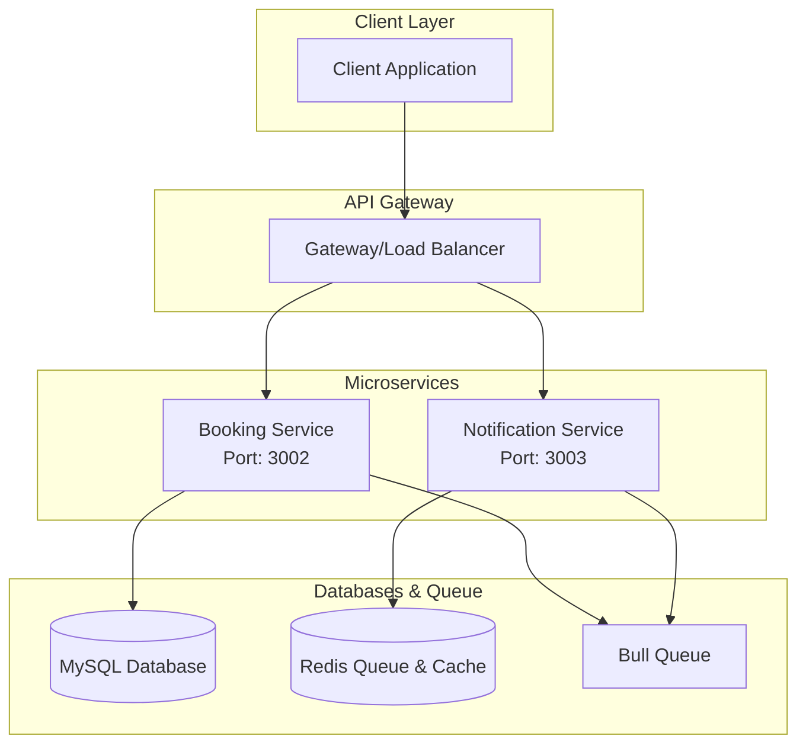
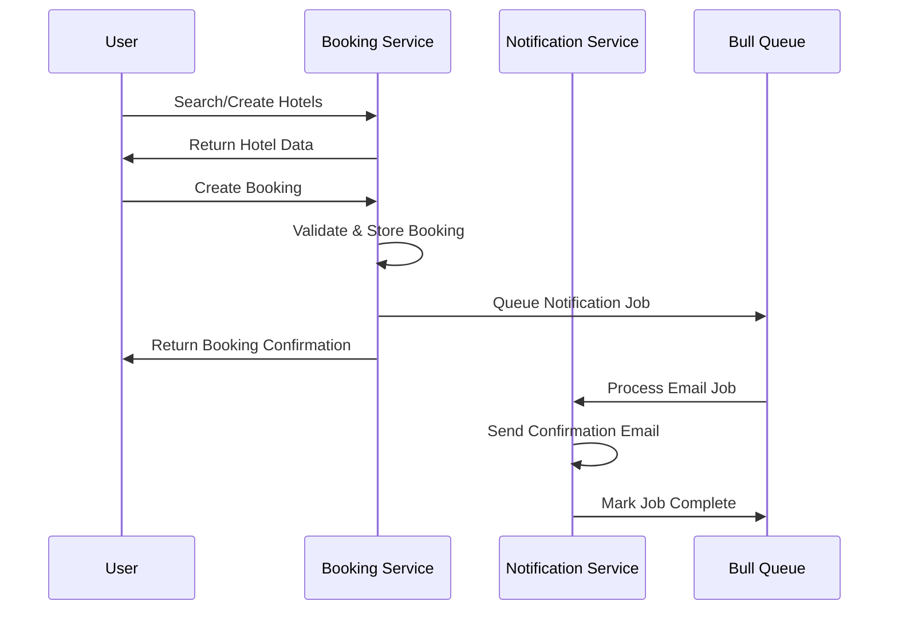

# Airbnb Booking System

> A microservices-based Airbnb clone built with Node.js, TypeScript, and Docker for scalable hospitality platform management.

**ExpressJs, TypeScript, NodeJs, MySQL, Redis, Zod, Golang** | Aug 2025 – Sep 2025

<div class="github-links">
<a href="https://github.com/Jyotishmoy12/airbnb-booking-backend" class="github-link" target="_blank"><svg viewBox="0 0 16 16"><path d="M8 0C3.58 0 0 3.58 0 8c0 3.54 2.29 6.53 5.47 7.59.4.07.55-.17.55-.38 0-.19-.01-.82-.01-1.49-2.01.37-2.53-.49-2.69-.94-.09-.23-.48-.94-.82-1.13-.28-.15-.68-.52-.01-.53.63-.01 1.08.58 1.23.82.72 1.21 1.87.87 2.33.66.07-.52.28-.87.51-1.07-1.78-.2-3.64-.89-3.64-3.95 0-.87.31-1.59.82-2.15-.08-.2-.36-1.02.08-2.12 0 0 .67-.21 2.2.82.64-.18 1.32-.27 2-.27.68 0 1.36.09 2 .27 1.53-1.04 2.2-.82 2.2-.82.44 1.1.16 1.92.08 2.12.51.56.82 1.27.82 2.15 0 3.07-1.87 3.75-3.65 3.95.29.25.54.73.54 1.48 0 1.07-.01 1.93-.01 2.2 0 .21.15.46.55.38A8.013 8.013 0 0016 8c0-4.42-3.58-8-8-8z"/></svg>Booking</a>
<a href="https://github.com/Jyotishmoy12/Notification-service-airbnb" class="github-link" target="_blank"><svg viewBox="0 0 16 16"><path d="M8 0C3.58 0 0 3.58 0 8c0 3.54 2.29 6.53 5.47 7.59.4.07.55-.17.55-.38 0-.19-.01-.82-.01-1.49-2.01.37-2.53-.49-2.69-.94-.09-.23-.48-.94-.82-1.13-.28-.15-.68-.52-.01-.53.63-.01 1.08.58 1.23.82.72 1.21 1.87.87 2.33.66.07-.52.28-.87.51-1.07-1.78-.2-3.64-.89-3.64-3.95 0-.87.31-1.59.82-2.15-.08-.2-.36-1.02.08-2.12 0 0 .67-.21 2.2.82.64-.18 1.32-.27 2-.27.68 0 1.36.09 2 .27 1.53-1.04 2.2-.82 2.2-.82.44 1.1.16 1.92.08 2.12.51.56.82 1.27.82 2.15 0 3.07-1.87 3.75-3.65 3.95.29.25.54.73.54 1.48 0 1.07-.01 1.93-.01 2.2 0 .21.15.46.55.38A8.013 8.013 0 0016 8c0-4.42-3.58-8-8-8z"/></svg>Notifications</a>
</div>

| Service | Architecture | Focus |
| :--- | :--- | :--- |
| **Microservices** | 2 Core Services | Booking & Notifications |

---

## Overview

A production-ready, microservices-based Airbnb clone featuring hotel management through booking operations and notification services. Built with modern technologies for scalable deployment.

### Key Highlights
- **ACID Transactions**: Enforced multi-step transactions for zero data inconsistencies via automatic rollbacks.
- **Concurrency Management**: Implemented **Redis Redlock** and pessimistic locking to eliminate race conditions.
- **Idempotency**: Built idempotent APIs to prevent duplicate payments.
- **High Throughput**: Integrated a Golang API gateway to proxy requests with low-latency routing.

## Interactive System Flow
<div class="flow-visualizer-container" data-nodes='["Guest", "API Gateway", "Auth Service", "Booking Engine", "MySQL Cluster"]'>
    <div class="flow-nodes">
        <div class="flow-packet"></div>
    </div>
    <div class="flow-controls">
        <button class="md-button md-button--primary flow-btn trace-btn">Trace Request</button>
        <button class="md-button flow-btn reset-btn">Reset</button>
    </div>
</div>

## System Architecture



### Service Communication Flow



## Services

### Booking Service (Port 3002)
- **Purpose**: Hotel management, booking operations and reservation management
- **Database**: PostgreSQL with Prisma ORM (MySQL compatible schema design)
- **Features**:
  - Hotel CRUD operations
  - Hotel search and filtering capabilities
  - Reservation creation and management
  - Booking status tracking
  - Cancellation handling
  - Room availability management

### Notification Service (Port 3003) 
- **Purpose**: Email notifications and messaging
- **Database**: Redis for queue management
- **Features**:
  - Asynchronous email processing
  - Bull Queue for job management
  - Template-based notifications
  - Delivery status tracking

## Tech Stack

### Backend Core
```
Runtime          │ Node.js 18+ with Express.js
Language         │ TypeScript for type safety
Package Manager  │ npm for efficient dependency management
```

### Databases & Storage
```
Hotels & Bookings │ PostgreSQL / MySQL with Prisma ORM
Queue & Cache     │ Redis with Bull Queue
```
