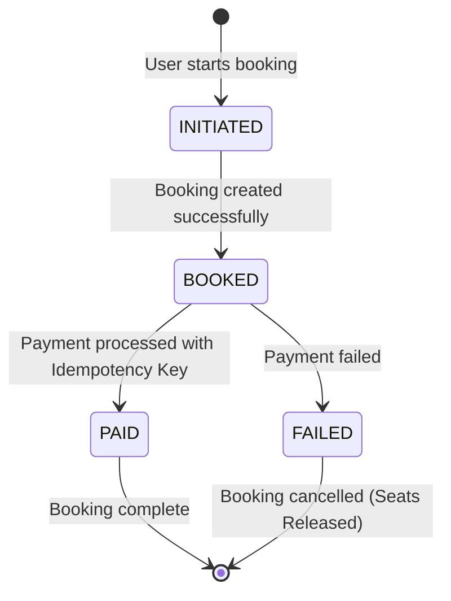

# Airline Booking System

> A comprehensive microservices-based airline booking platform with robust data management and transactional integrity.

**ExpressJs, NodeJs, MySQL, Sequelize ORM** | Jul 2025 – Aug 2025

| Service | Architecture | Scale |
| :--- | :--- | :--- |
| **Microservices** | 2 Dedicated Services | Flight Data & Bookings |

---

## Overview

A scalable airline booking system built with microservices architecture, featuring comprehensive flight data management, real-time seat availability, and secure booking transactions with automated cleanup processes.

### Key Highlights
- **Microservices Architecture**: Strategic separation of booking logic from flight data management.
- **ACID Transactions**: Rollback mechanisms for secure booking operations.
- **High-Performance APIs**: Dynamic filtering and real-time airplane lookup.
- **Relational Database**: Foreign key constraints ensuring data integrity.
- **Automated Cleanup**: Cron jobs for unconfirmed booking management.
- **Idempotent APIs**: Prevention of duplicate booking submissions via `x-idempotency-key`.

## System Architecture

The system consists of **two dedicated microservices**:
1. **Flight Data Service**: Manages cities, airports, flights, and airplanes.
2. **Booking Service**: Handles transactional booking logic, payments, and seat allocation.

### Booking Lifecycle Flow



## Features

### Data Management
- **Comprehensive Models**: Cities, airports, flights, and airplanes with data validation.
- **Relational Integrity**: Strict MySQL foreign key constraints across all entities.
- **Optimized Queries**: Join operations for efficient JSON responses.

### Flight Operations
- **Dynamic Search**: Filter flights by departure/arrival airports.
- **Real-time Availability**: Live airplane lookup functionality.
- **Seat Management**: Automated seat allocation and real-time availability tracking.

### Booking & Payment System
- **ACID Compliance**: Transaction rollback mechanisms across multi-step bookings.
- **Idempotency Keys**: Guarantee exactly-once processing to prevent duplicate payments and double bookings.
- **Race Condition Prevention**: Secure concurrent booking handling using pessimistic locking.
- **Automated Cleanup**: Background cron jobs release unconfirmed reservations after 15 minutes, optimizing seat availability.

## Tech Stack

### Backend Core
```text
Runtime          │ Node.js 18+ with Express.js
Architecture     │ Microservices with REST APIs
Background Jobs  │ Automated Cron scheduling
```

### Database
```text
Database         │ MySQL
ORM              │ Sequelize (Relational Schema Design)
```
