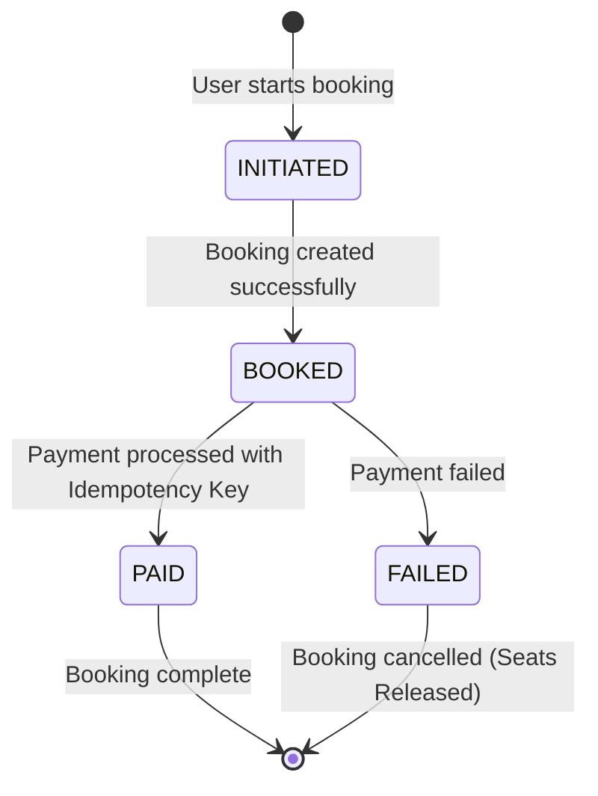

# Airline Booking System

> A comprehensive microservices-based airline booking platform with robust data management and transactional integrity.

**ExpressJs, NodeJs, MySQL, Sequelize ORM** | Jul 2025 – Aug 2025

<div class="github-links">
<a href="https://github.com/Jyotishmoy12/flight-booking-system" class="github-link" target="_blank"><svg viewBox="0 0 16 16"><path d="M8 0C3.58 0 0 3.58 0 8c0 3.54 2.29 6.53 5.47 7.59.4.07.55-.17.55-.38 0-.19-.01-.82-.01-1.49-2.01.37-2.53-.49-2.69-.94-.09-.23-.48-.94-.82-1.13-.28-.15-.68-.52-.01-.53.63-.01 1.08.58 1.23.82.72 1.21 1.87.87 2.33.66.07-.52.28-.87.51-1.07-1.78-.2-3.64-.89-3.64-3.95 0-.87.31-1.59.82-2.15-.08-.2-.36-1.02.08-2.12 0 0 .67-.21 2.2.82.64-.18 1.32-.27 2-.27.68 0 1.36.09 2 .27 1.53-1.04 2.2-.82 2.2-.82.44 1.1.16 1.92.08 2.12.51.56.82 1.27.82 2.15 0 3.07-1.87 3.75-3.65 3.95.29.25.54.73.54 1.48 0 1.07-.01 1.93-.01 2.2 0 .21.15.46.55.38A8.013 8.013 0 0016 8c0-4.42-3.58-8-8-8z"/></svg>Flights</a>
<a href="https://github.com/Jyotishmoy12/booking-service" class="github-link" target="_blank"><svg viewBox="0 0 16 16"><path d="M8 0C3.58 0 0 3.58 0 8c0 3.54 2.29 6.53 5.47 7.59.4.07.55-.17.55-.38 0-.19-.01-.82-.01-1.49-2.01.37-2.53-.49-2.69-.94-.09-.23-.48-.94-.82-1.13-.28-.15-.68-.52-.01-.53.63-.01 1.08.58 1.23.82.72 1.21 1.87.87 2.33.66.07-.52.28-.87.51-1.07-1.78-.2-3.64-.89-3.64-3.95 0-.87.31-1.59.82-2.15-.08-.2-.36-1.02.08-2.12 0 0 .67-.21 2.2.82.64-.18 1.32-.27 2-.27.68 0 1.36.09 2 .27 1.53-1.04 2.2-.82 2.2-.82.44 1.1.16 1.92.08 2.12.51.56.82 1.27.82 2.15 0 3.07-1.87 3.75-3.65 3.95.29.25.54.73.54 1.48 0 1.07-.01 1.93-.01 2.2 0 .21.15.46.55.38A8.013 8.013 0 0016 8c0-4.42-3.58-8-8-8z"/></svg>Booking</a>
</div>

| Service | Architecture | Scale |
| :--- | :--- | :--- |
| **Microservices** | 2 Dedicated Services | Flight Data & Bookings |

---

## Overview

A scalable airline booking system built with microservices architecture, featuring comprehensive flight data management, real-time seat availability, and secure booking transactions with automated cleanup processes.

### Key Highlights
- **Microservices Architecture**: Strategic separation of booking logic from flight data management.
- **ACID Transactions**: Rollback mechanisms for secure booking operations.
- **High-Performance APIs**: Dynamic filtering and real-time airplane lookup.
- **Relational Database**: Foreign key constraints ensuring data integrity.
- **Automated Cleanup**: Cron jobs for unconfirmed booking management.
- **Idempotent APIs**: Prevention of duplicate booking submissions via `x-idempotency-key`.

## Interactive System Flow
<div class="flow-visualizer-container" data-nodes='["Passenger", "Flight API", "Seat Allocation", "Payment Svc", "MySQL DB"]'>
    <div class="flow-nodes">
        <div class="flow-packet"></div>
    </div>
    <div class="flow-controls">
        <button class="md-button md-button--primary flow-btn trace-btn">Trace Request</button>
        <button class="md-button flow-btn reset-btn">Reset</button>
    </div>
</div>

## System Architecture

The system consists of **two dedicated microservices**:
1. **Flight Data Service**: Manages cities, airports, flights, and airplanes.
2. **Booking Service**: Handles transactional booking logic, payments, and seat allocation.

### Booking Lifecycle Flow



## Features

### Data Management
- **Comprehensive Models**: Cities, airports, flights, and airplanes with data validation.
- **Relational Integrity**: Strict MySQL foreign key constraints across all entities.
- **Optimized Queries**: Join operations for efficient JSON responses.

### Flight Operations
- **Dynamic Search**: Filter flights by departure/arrival airports.
- **Real-time Availability**: Live airplane lookup functionality.
- **Seat Management**: Automated seat allocation and real-time availability tracking.

### Booking & Payment System
- **ACID Compliance**: Transaction rollback mechanisms across multi-step bookings.
- **Idempotency Keys**: Guarantee exactly-once processing to prevent duplicate payments and double bookings.
- **Race Condition Prevention**: Secure concurrent booking handling using pessimistic locking.
- **Automated Cleanup**: Background cron jobs release unconfirmed reservations after 15 minutes, optimizing seat availability.

## Tech Stack

### Backend Core
```text
Runtime          │ Node.js 18+ with Express.js
Architecture     │ Microservices with REST APIs
Background Jobs  │ Automated Cron scheduling
```

### Database
```text
Database         │ MySQL
ORM              │ Sequelize (Relational Schema Design)
```
