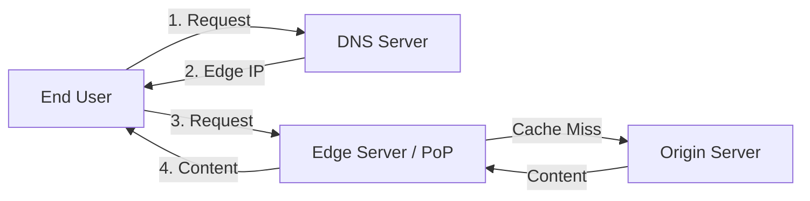

# CDN Deep-Dive: The Invisible Backbone of the High-Speed Web

Let’s take a deep dive into the fascinating world of CDNs — the invisible backbone powering your favorite high-speed web experiences.

Ever wonder how Netflix streams 4K video with zero lag across the globe? The secret: CDNs. Netflix uses a custom CDN called Open Connect, designed specifically to handle their massive video traffic efficiently. A content delivery network (CDN) is a network of interconnected servers that speeds up webpage loading for data-heavy applications.

---

## Building Blocks of a CDN

### 1. Edge Servers (PoPs — Points of Presence)
These are geographically distributed servers located closer to end users. They cache and deliver content quickly by reducing the distance data travels. When a user in India requests a website hosted in the US, the Indian edge server serves the content.

### 2. Origin Server
The original server where the main content is hosted. It sends content to edge servers for caching or handles requests not served from cache (cache-miss). This is typically your web hosting server or cloud storage where your app’s core data resides.

### CDN Request Flow

---

## Evolution of CDNs

CDN evolution can be segmented into three generations, each introducing new capabilities and technologies:

1. **Static CDN (1990s):** Focused on caching static files like images and scripts.
2. **Dynamic CDN (2001+):** Introduced techniques to speed up dynamic content delivery.
3. **Multi-Purpose CDN (2010+):** Modern networks capable of handling complex logic at the edge.

---

## Routing Techniques

CDNs use various routing strategies to direct traffic efficiently:

- **Anycast Routing:** A single IP address advertised from multiple edge locations (e.g., Akamai).
- **Latency-Based Routing:** Selects the edge location with the lowest round-trip time (RTT).
- **GeoRouting:** Directs user requests to the geographically closest data center.

---

## Caching: The Heart of the CDN

Caching works by selectively storing website files on a CDN’s proxy servers. CDNs improve performance by caching content based on headers like `Cache-Control`, `ETag`, or `Last-Modified`.

### Common Caching Algorithms
- **Least Recently Used (LRU):** Discards the least recently used items first.
- **Most Recently Used (MRU):** Discards the most recently used items first (less common for web caching).

---

## Traffic Management

CDNs manage data flow to prevent network congestion using several strategies:

### Load Balancing
Load balancing is critical within a CDN, distributing incoming traffic across a pool of servers to ensure no single server bears too much load.

- **Round Robin:** Rotates requests among a list of servers in cyclic order.
- **Least Connections:** Sends requests to the server with the fewest active connections.
- **IP Hash:** Uses the client’s IP address hash to determine the server, ensuring session consistency.

---

## Key Benefits of Using a CDN

1. **Better Performance:** Minimizes latency for users worldwide.
2. **Increased Reliability:** Provides redundancy and handles traffic spikes.
3. **Cost Savings:** Reduces bandwidth costs at the origin server.
4. **Security:** Offers resilience against cyber attacks like DDoS.
