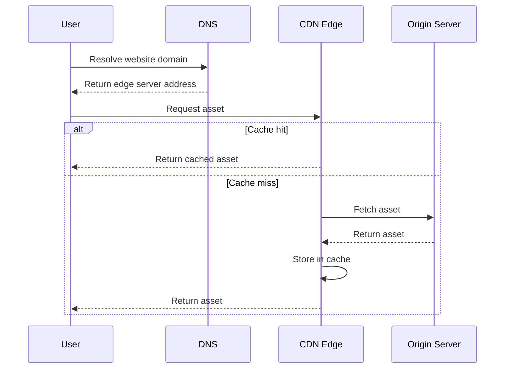
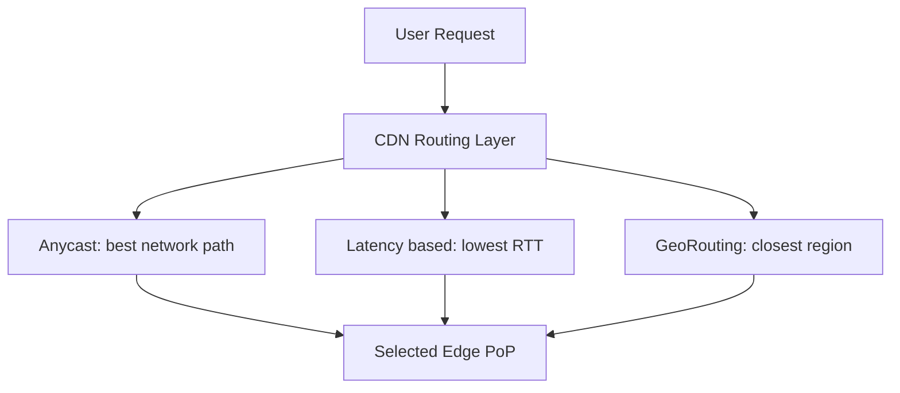
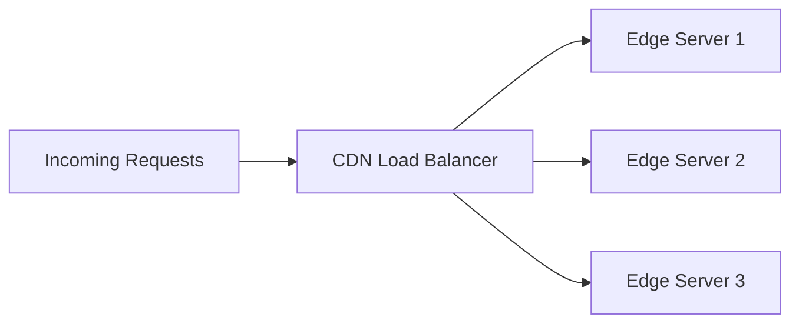

# CDN Deep-Dive: The Invisible Backbone of the High-Speed Web

**Technical Deep-Dive** | Distributed Systems | April 2025

Let's take a deep dive into the fascinating world of CDNs: the invisible backbone powering many of the fast web experiences we use every day.

Ever wondered how Netflix streams 4K video across the globe with minimal buffering? One major reason is its custom CDN, **Open Connect**, which is designed specifically to deliver massive video traffic efficiently.

A **Content Delivery Network (CDN)** is a geographically distributed network of servers that delivers content from locations closer to users. Instead of making every user fetch data from one faraway origin server, a CDN places cached copies near users and routes requests to the best available edge location.

---

## Why CDNs Exist

Without a CDN, every user request travels all the way to the origin server.

If the origin is in the United States and the user is in India, every image, video chunk, script, and stylesheet may need to cross long network paths. That adds latency, increases origin load, and makes failures more painful.

A CDN improves this by introducing nearby edge servers.

```mermaid
flowchart LR
    U[User in India] --> E[Nearby Edge Server]
    E -->|cache miss| O[Origin Server]
    O --> E
    E -->|cached response| U
```

The user still gets the original content, but the delivery path is shorter and more resilient.

---

## Building Blocks of a CDN

### Edge Servers / PoPs

**Edge servers** are geographically distributed machines located close to end users. A group of edge servers in one location is often called a **Point of Presence (PoP)**.

Their job is to cache and deliver content quickly by reducing the distance data must travel.

For example, when a user in India requests a website hosted in the United States, the request may be served from an Indian or nearby Asian edge server rather than the US origin.

### Origin Server

The **origin server** is where the original version of the content lives.

It may be your web server, cloud storage bucket, backend application, or media storage system. If the CDN edge does not have the requested object, it fetches the object from the origin and may cache it for future requests.

### DNS Servers

DNS helps map user requests to the right CDN endpoint.

When a user requests a domain, DNS can return an address that points to an appropriate edge server. CDN providers use DNS, Anycast, latency measurements, geographic information, and health checks to route users toward a good PoP.

---

## CDN Request Flow

Here is the common request path:

```mermaid
sequenceDiagram
    participant U as User
    participant DNS as DNS
    participant Edge as CDN Edge
    participant Origin as Origin Server

    U->>DNS: Resolve website domain
    DNS-->>U: Return edge server address
    U->>Edge: Request asset
    alt Cache hit
        Edge-->>U: Return cached asset
    else Cache miss
        Edge->>Origin: Fetch asset
        Origin-->>Edge: Return asset
        Edge->>Edge: Store in cache
        Edge-->>U: Return asset
    end
```

The best case is a **cache hit**, where the edge already has the requested content. The slower case is a **cache miss**, where the edge must fetch content from the origin first.

---

## Evolution of CDNs

CDNs evolved in stages as the web became more dynamic and traffic-heavy.

| Generation | Era | Focus |
| --- | --- | --- |
| Static CDN | 1990s | Cache static files such as images, CSS, JavaScript, and downloads |
| Dynamic CDN | 2001+ | Accelerate dynamic pages and API-like traffic using routing and optimization |
| Multi-Purpose CDN | 2010+ | Add edge compute, security, DDoS protection, bot defense, and programmable logic |

Early CDNs mainly helped with static assets. Modern CDNs often sit in front of entire applications and handle performance, traffic management, TLS termination, security filtering, and even serverless workloads at the edge.

---

## Routing Techniques

CDNs need to answer a key question:

> Which edge server should handle this user request?

Several routing techniques are commonly used.

### Anycast Routing

With **Anycast**, the same IP address is advertised from multiple edge locations.

Internet routing naturally sends the user's packets to a nearby or best-routed location. Providers such as Akamai and Cloudflare use Anycast heavily.

### Latency-Based Routing

Latency-based routing selects the edge location with the lowest measured round-trip time.

This can be more precise than simple geography. The closest datacenter on a map is not always the fastest one on the network.

### GeoRouting

GeoRouting directs requests based on the user's approximate geographic location.

For example, users in India may be routed to an Indian or Singapore PoP, while users in Germany may be routed to a Frankfurt PoP.

```mermaid
flowchart TB
    User[User Request] --> Router[CDN Routing Layer]
    Router --> Anycast[Anycast: best network path]
    Router --> Latency[Latency based: lowest RTT]
    Router --> Geo[GeoRouting: closest region]

    Anycast --> Edge[Selected Edge PoP]
    Latency --> Edge
    Geo --> Edge
```

---

## Caching: The Heart of a CDN

Caching is the core of CDN performance.

A CDN cache stores selected website files on edge proxy servers so nearby users can access them quickly. This can include:

- Images
- Videos
- CSS and JavaScript
- Fonts
- API responses
- Downloadable files

CDNs decide how long to cache content using HTTP headers such as:

- `Cache-Control`
- `ETag`
- `Last-Modified`

```mermaid
flowchart LR
    Request[User requests /logo.png] --> Check{In edge cache?}
    Check -->|Yes| Hit[Cache hit]
    Hit --> User[Return immediately]
    Check -->|No| Miss[Cache miss]
    Miss --> Origin[Fetch from origin]
    Origin --> Store[Store at edge]
    Store --> User
```

### Common Caching Algorithms

CDNs use cache eviction algorithms to decide what to remove when storage is full.

| Algorithm | Behavior |
| --- | --- |
| LRU | Removes the least recently used object first |
| MRU | Removes the most recently used object first |

**LRU** is commonly useful for web caching because recently accessed objects are more likely to be accessed again. **MRU** can be useful in special access patterns, but it is usually less common for general web caching.

---

## Traffic Management in a CDN

Just as a city traffic system prevents congestion, a CDN manages network traffic so no single server or path becomes overloaded.

### Load Balancing

Load balancing distributes incoming traffic across multiple servers. This keeps one machine from becoming a bottleneck and improves reliability.

Common methods include:

| Method | How it works |
| --- | --- |
| Round Robin | Rotates requests among servers in order |
| Least Connections | Sends traffic to the server with the fewest active connections |
| IP Hash | Uses the client's IP address to consistently route them to the same server |

```mermaid
flowchart LR
    Users[Incoming Requests] --> LB[CDN Load Balancer]
    LB --> S1[Edge Server 1]
    LB --> S2[Edge Server 2]
    LB --> S3[Edge Server 3]
```

Load balancing matters because CDN traffic is bursty. A viral video, flash sale, sports event, or product launch can create sudden spikes.

---

## Why Web Applications Use CDNs

Web applications use CDNs because they provide four major benefits.

### Better Performance

Users receive content from nearby edge servers, reducing latency and improving page load times.

### Increased Reliability

If one edge location fails, traffic can be routed to another healthy location.

### Cost Savings

Serving cached content from the CDN reduces bandwidth and compute pressure on the origin server.

### Security and Attack Resilience

CDNs can absorb large traffic spikes and help defend against DDoS attacks, bot traffic, and abusive request patterns.

---

## Key Takeaways

- A CDN is a geographically distributed network for delivering content closer to users.
- Edge servers cache content so users do not always need to hit the origin.
- DNS and routing systems help choose the best edge location.
- Cache hits make responses fast; cache misses go back to the origin.
- CDNs use routing, caching, and load balancing to improve performance and reliability.
- Modern CDNs are not just caches; they are also traffic-management and security layers.

---

[← Back to Blogs](blogs.md){ .md-button }
