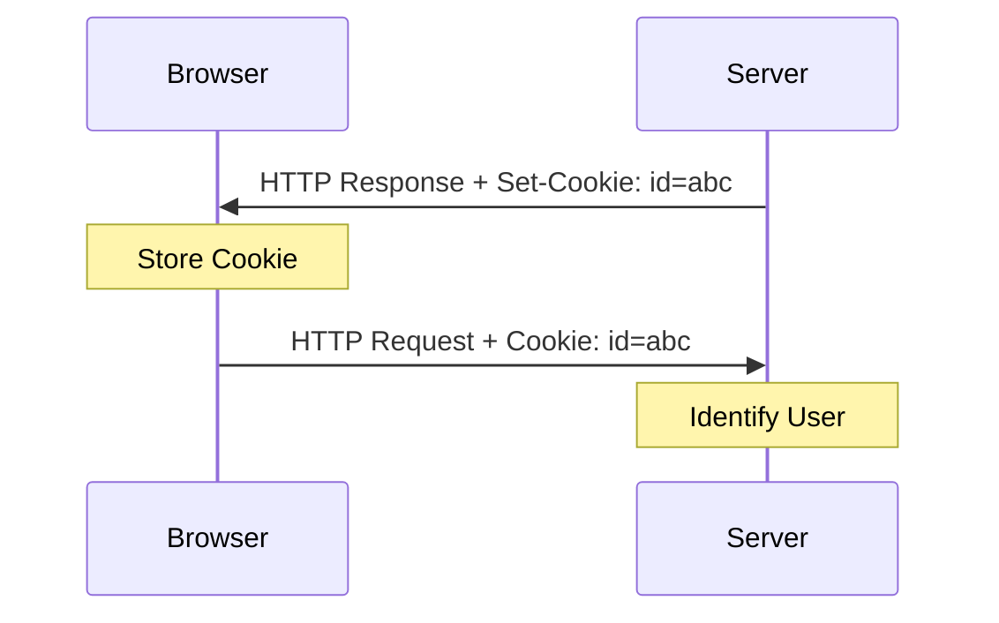

# Unwrapping the Web: A Delicious Dive into the World of Cookies

Ever wondered how websites remember your login details or track your behavior? Let’s dive into the world of cookies!

Cookies are small files of information that a web server generates to send to a web browser. It helps inform websites about the users enabling a personalized experience.

---

## Structure of a Cookie

`Set-Cookie: <cookie-name>=<cookie-value>; Attribute1=Value1; Attribute2=Value2; ...`

### Cookie Lifecycle

---

### Key Components:

1.  **cookie-name=cookie-value**: The actual content of the cookie (a key-value pair).
2.  **Expires=DATE**: Defines the exact date and time when the cookie should expire. Permanent cookies are deleted after this date.
3.  **Max-Age=SECONDS**: Specifies the lifetime of the cookie in seconds from when it’s set.
    > [!NOTE]
    > Cookies without a `Max-Age` or `Expires` attribute are deleted when the current session ends (session cookies).
4.  **Domain=example.com**: Defines which domain(s) the cookie belongs to. Subdomains also get access if a wider domain is set.
5.  **Path=/somepath**: Indicates a URL path that must exist in the requested URL in order to send the cookie header.
6.  **Secure**: Tells browsers to send the cookies only over HTTPS connections.
7.  **HttpOnly**: Prevents JavaScript (client-side code) from accessing the cookies, mitigating XSS risks.
8.  **SameSite**: Helps prevent CSRF (cross-site request forgery) attacks. Options include `Lax`, `Strict`, or `None`.

---

## Full Example

`Set-Cookie: sessionId=abc123xyz; Max-Age=3600; Secure; HttpOnly; Path=/; SameSite=Lax`

- **sessionId=abc123xyz**: Sets a cookie named `sessionId` with value `abc123xyz`.
- **Max-Age=3600**: Lasts for 1 hour.
- **Secure**: Only sent over HTTPS.
- **HttpOnly**: Inaccessible via JavaScript.
- **Path=/**: Valid under the root path.
- **SameSite=Lax**: Sent for top-level same-site GET requests.

---

## Storage & Types

Most modern browsers (Chrome, Firefox, etc.) store cookies in a local **SQLite database**.

### Different Types of Cookies:

- **Session Cookies**: Track a user’s session and are deleted when the session ends. They have no expiration date.
- **Persistent Cookies**: Remain in the browser for a predetermined length of time (days, months, or years). They always contain an expiration date.
- **Authentication Cookies**: Created when users log in, allowing websites to identify them across sessions.

### Real-World Examples:
- **Google**: Uses `NID` and `_Secure-ENID` for search services.
- **YouTube**: Uses `VISITOR_INFO1_LIVE` and `__Secure-YEC` for analytics.
- **UULE**: Sends precise location information from the browser to servers.
