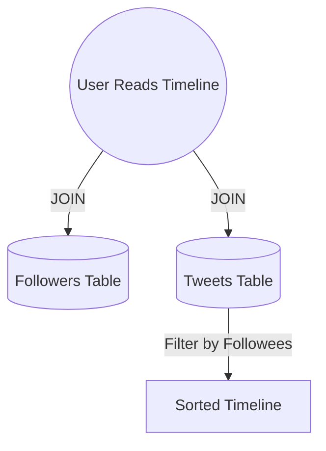
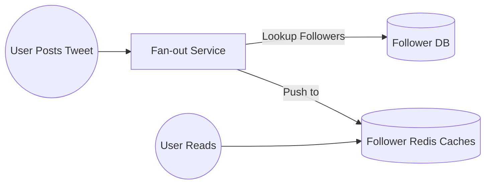

# Chapter 1: Foundations of Data Systems

**Reliability, Scalability, and Maintainability**

The first chapter of *Designing Data-Intensive Applications* explores the fundamental challenges of building systems that handle large volumes of data, high traffic, and complex requirements. It defines the three core pillars that every architect must optimize for.

---

## The Three Core Pillars

Modern software systems generally prioritize three main concerns:

1. **Reliability**: Continuing to work correctly even when things go wrong.
2. **Scalability**: Strategies for dealing with growth in load and data.
3. **Maintainability**: Ensuring the system is easy for people to work on in the future.

---

## Reliability: Expecting the Unexpected

Reliability is about building **fault-tolerant** systems. A system is reliable if it performs as expected, tolerates user mistakes, handles expected load, and prevents abuse.

### Fault vs. Failure
- **Fault**: One component deviating from its specification.
- **Failure**: The entire system stops providing service to the user.

### Types of Faults

| Type | Examples |
|------|----------|
| **Hardware** | Disk crashes, faulty RAM, power grid blackouts. |
| **Software** | Bugs, runaway processes eating CPU/RAM, cascading failures. |
| **Human** | Configuration errors, accidental deletions (the leading cause of outages). |

### Preventing Human Error
- **Design for Safety**: Minimize opportunities for error through good abstractions and APIs.
- **Sandboxing**: Decouple the places where people make mistakes from the production environment.
- **Thorough Testing**: Implement unit tests, integration tests, and manual verification.

---

## Scalability: Handling Growth

Scalability is not a "yes/no" property; it's about asking: *"If the system grows in a particular way, what are our options for coping with the growth?"*

### Case Study: Twitter's Timeline Evolution

Twitter's primary challenge was the **fan-out** of tweets to followers' home timelines.

#### Approach 1: Relational Schema (Used Initially)
Initially, Twitter used a standard relational join. Every time a user viewed their timeline, the system joined the followers and tweets tables.

- **Pros**: Simple write.
- **Cons**: Extremely slow at read-time as load increased.

#### Approach 2: Proactive Fan-out (Push)
The system shifted to pushing tweets to a "Home Timeline" cache for every follower as soon as a tweet is posted.

- **Pros**: Read is extremely fast (just a KV lookup).
- **Cons**: "Writes" become multiple cache updates. A celebrity with 10M followers causes 10M writes.

#### The Hybrid Approach (Current)
Today, Twitter uses a hybrid: approach 2 for most users, but for "celebrities" with massive followings, their tweets are merged at read-time (approach 1) to avoid massive write spikes.

---

## Latency and Response Time

While often used interchangeably, they are distinct:

- **Response Time**: The total time the client sees (Service Time + Network Delay + Queueing Delay).
- **Latency**: The duration a request sits in a queue waiting to be handled.

### Measuring Performance: Percentiles
Mean (average) response times are often misleading because they don't show outliers. Instead, we use **percentiles**:

- **p50 (Median)**: Half of the requests are faster than this.
- **p95 / p99**: The "tail latencies." Important because the users with the most data (and often the most value) are usually the ones hitting these slow outliers.

---

## Coping with Load

### Vertical vs. Horizontal Scaling
- **Scaling Up (Vertical)**: Moving to a more powerful machine (more CPU/RAM).
- **Scaling Out (Horizontal)**: Distributing load across multiple smaller machines.

### Elasticity
- **Elastic Systems**: Automatically add/remove resources based on load. Useful for unpredictable traffic.
- **Manual Scaling**: Simpler and leads to fewer operational surprises; better for predictable growth.

---

## Maintainability: The Long Game

We should design software to avoid creating "legacy" systems from the start.

### 1. Operability
Making life easy for the operations team by:
- Monitoring system health.
- Tracking down the cause of performance degradation.
- Keeping security patches up-to-date.

### 2. Simplicity (Managing Complexity)
Complexity leads to tight coupling and tangled dependencies. We combat this using **Abstractions** that hide implementation details behind clean APIs.

### 3. Evolvability
---
*Last Updated: April 09, 2026*

**End Note**: Reliability, scalability, and maintainability are not achieved by accident; they are the result of deliberate architectural choices. Chapter 1 serves as the benchmark for every subsequent design decision.
