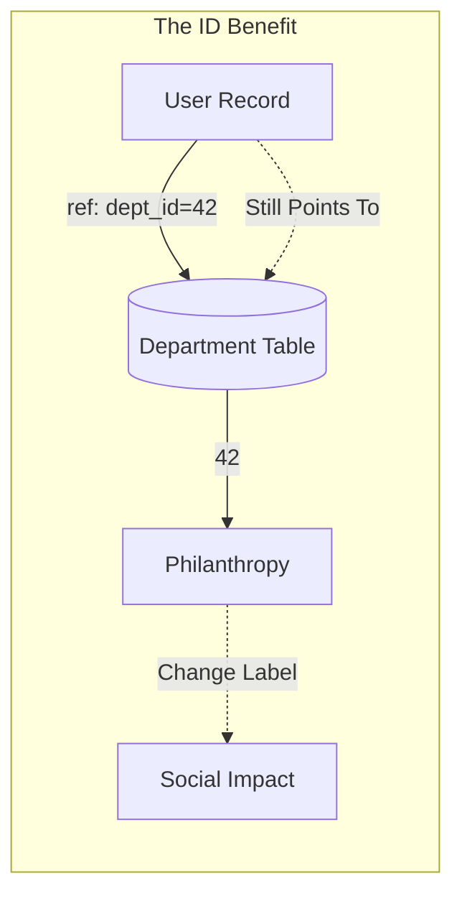
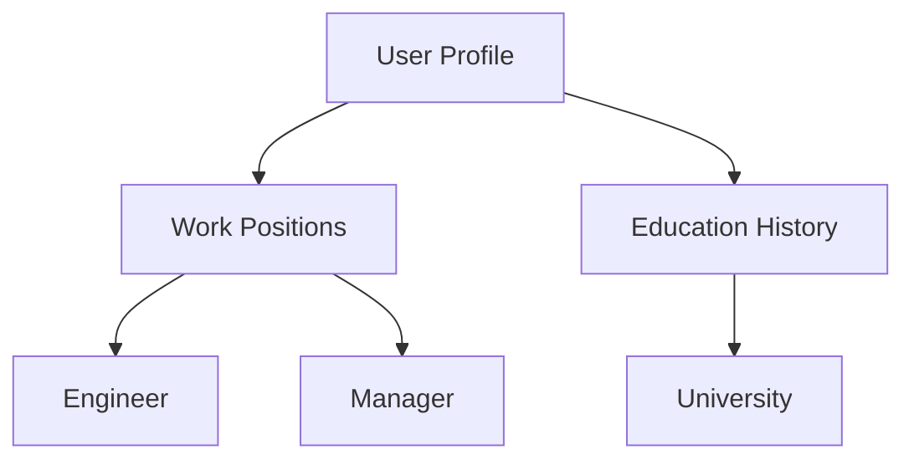

# Chapter 2: Data Models and Query Languages

Data models are perhaps the most important part of developing software because they have a profound effect: not only on how the software is written but also on how we think about the problem we are solving.

---

## Relational Model vs. Document Model

The **Relational Data Model**, introduced by Edgar Codd in 1970, organizes data into tables (relations) made up of rows (tuples). It originated from business data processing needs in the 1960s–70s, such as banking, reservations, and payroll systems.

In contrast, the **Document Model** (and NoSQL) emerged in the 2010s to challenge relational dominance, focusing on distributed systems and flexibility.

| Feature | Relational Model | Document Model |
|---------|------------------|----------------|
| **Structure** | Tables/Rows (Tuples) | Nested documents (JSON/BSON) |
| **Best For** | Many-to-many relationships | One-to-many / Tree-like structures |
| **Joins** | Native support | Often requires manual application-side joins |
| **Schema** | Explicit (Schema-on-write) | Implicit (Schema-on-read) |

---

## The Advantages of Using IDs

Whether you store an ID or a text string is a question of **duplication**. 

1.  **Normalization**: Using an ID (e.g., `34`) instead of a string (e.g., `Philanthropy`) ensures that human-meaningful information is stored in only one place.
2.  **Immutability**: Because an ID has no inherent meaning to humans, it never needs to change. Even if the text representation changes, the reference remains valid.
3.  **Redundancy**: If information is duplicated, updating it requires finding and changing every record, which is error-prone.



---

## Are Document Databases Repeating History?

In the 1970s, IBM’s **Information Management System (IMS)** used the **Hierarchical Model**, which is remarkably similar to the JSON model used by document databases today.

### The Hierarchical Model (IMS)
IMS represented all data as a tree of records nested within records.
- **Pros**: Worked well for simple one-to-many relationships.
- **Cons**: Many-to-many relationships were difficult, and it did not support joins. Developers had to manually resolve references or denormalize data.



---

## The Network Model (CODASYL)

The Network Model was standardized by CODASYL. It allowed a record to have **multiple parents**, enabling many-to-one and many-to-many relationships.

### The Concept of Access Paths
Unlike foreign keys, links in the network model were like **pointers** stored on disk. To access a record, you had to follow a specific path from a root record along these chains.

### Why it Failed
- **Manual Navigation**: Querying required moving a cursor through the database by iterating over records.
- **Complexity**: If a record had multiple parents, the developer had to keep track of all relationships. CODASYL committee members admitted this was like "navigating around an n-dimensional data space."

---

## The Relational Solution

The relational model simplified everything by laying data out in the open: a table is simply a collection of rows. There are no labyrinthine nested structures or complicated manual access paths.

### The Query Optimizer
In a relational database, you simply describe the data you want (Declarative). The **Query Optimizer** automatically decides:
- Which parts of the query to execute first.
- Which indexes to use.

These choices are the "access paths," but they are managed **automatically** by the database, not the developer.

---

## Schema Flexibility

| Concept | Schema-on-write (Relational) | Schema-on-read (Document) |
|---------|-----------------------------|---------------------------|
| **Enforcement** | Database ensures all data conforms to the schema. | Database stores anything; code interprets structure. |
| **Analogy** | Statically typed programming language. | Dynamically typed programming language. |
| **Migration** | Requires `ALTER TABLE` (can be slow). | Just start writing new fields to new documents. |

> [!WARNING]
> **MySQL Limitation**: Most relational systems execute `ALTER TABLE` in milliseconds. However, MySQL copies the entire table on `ALTER TABLE`, which can cause hours of downtime for large datasets.

---

## Declarative vs. Imperative Query Languages

- **Imperative**: Tells the computer *how* to perform operations in a specific order (e.g., iterating through a list).
- **Declarative (SQL)**: Describes *what* data is needed, but not the implementation details.

### Why Declarative is Better:
1.  **Optimization**: The database can optimize the execution path behind the scenes (e.g., reclaiming disk space without breaking queries).
2.  **Parallelism**: Declarative languages are much easier to execute in parallel because they don't specify a rigid order of operations.

---

## Graph-like Data Models

When many-to-many relationships become the core of your data, the **Graph Model** is the most natural choice. A graph consists of **Vertices** (Nodes) and **Edges** (Relationships).

**Common Graph Examples:**
- **Social Graphs**: Vertices are people; edges are friendships.
- **Web Graphs**: Vertices are pages; edges are HTML links.
- **Logistics**: Vertices are junctions; edges are roads/rails.

### Property Graphs
In this model:
- **Vertices** have a unique ID, incoming/outgoing edges, and property KVs.
- **Edges** have a unique ID, head/tail vertices, a label, and property KVs.

### Example: Cypher Query Language
Cypher is a declarative language (created for Neo4j) used to describe patterns in graphs.

```cypher
CREATE
  (NAmerica:Location {name:'North America', type:'continent'}),
  (USA:Location {name:'United States', type:'country' }),
  (Idaho:Location {name:'Idaho', type:'state' }),
  (Lucy:Person {name:'Lucy' }),
  (Idaho) -[:WITHIN]-> (USA) -[:WITHIN]-> (NAmerica),
  (Lucy) -[:BORN_IN]-> (Idaho)
```

---

## Comparison: Graph Databases vs. Network Model

| Feature | CODASYL (Network Model) | Graph Databases |
|---------|-------------------------|-----------------|
| **Schema** | Rigid; specified which types could nest. | Flexible; any vertex can link to any other. |
| **Access** | Only via manual access paths. | Direct ID reference or property indexes. |
| **Ordering** | Children were an ordered set (manual management). | No defined ordering; sort only in queries. |

---

*Last Updated: April 11, 2026*

**End Note**: Data models provide the interface between components. Choosing a model that doesn't match the application's data structure leads to "impedance mismatch" and unnecessary complexity. Whether it's the simplicity of Relational, the flexibility of Document, or the connectivity of Graph, the goal remains the same: reducing the gap between how we think and how the data is stored.
