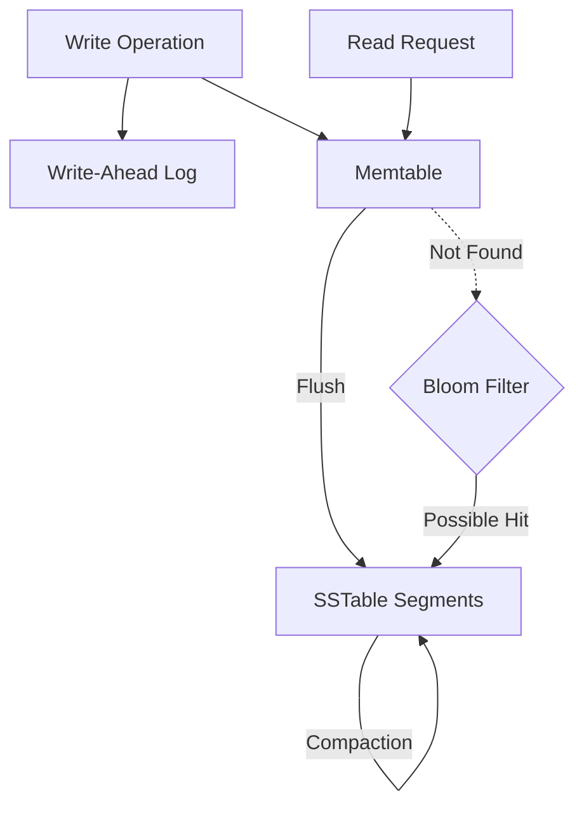
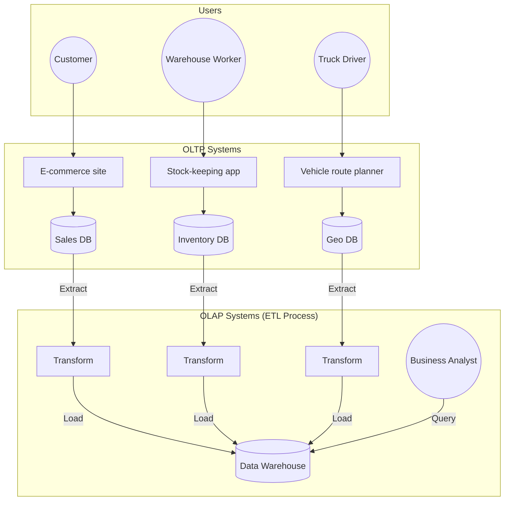

# Chapter 3: Storage and Retrieval

> **How Databases Store and Retrieve Data: From the World's Simplest Key-Value Store to High-Performance LSM-Trees and B-Trees.**

At its most fundamental level, a database is a tool for storing data and finding it again. This chapter explores the storage engines that power modern databases, comparing log-structured approaches with page-oriented structures.

---

## The World's Simplest Database

Consider a database implemented as two Bash functions:

```bash
#!/bin/bash
db_set () {
    echo "$1,$2" >> database
}

db_get () {
    grep "^$1," database | sed -e "s/^$1,//" | tail -n 1
}
```

This implements a simple **append-only log**. 
- **Write**: Extremely fast (O(1)) because it just appends to the end of a file.
- **Read**: Terrible performance (O(n)) because it must scan the entire file to find a key.

**The "So What?"**: To make reads efficient, we need an **Index**. However, any index slows down writes because it must be updated every time data is written. This is the fundamental trade-off in storage systems.

---

## I. Hash Indexes

The simplest indexing strategy is a **Hash Map** kept in memory, where every key is mapped to a byte offset in the data file.

### i. Bitcask (Riak's Default Engine)
Bitcask offers high-performance reads and writes but requires all keys to fit in **RAM**.
- **Efficiency**: Values can be larger than memory because they are loaded with a single disk seek.
- **Workload**: Ideal for scenarios where a limited number of keys are updated frequently (e.g., a play counter for a URL).

### ii. Compaction and Merging
To prevent running out of disk space, the log is broken into segments. **Compaction** throws away duplicate keys, keeping only the most recent update. Multiple segments are merged in the background to keep the total number of files manageable.

---

## II. SSTables and LSM-Trees

To improve upon hash indexes, we require that the sequence of key-value pairs is **sorted by key**. This format is called a **Sorted String Table (SSTable)**.

#### i. The LSM-Tree Flow
Log-Structured Merge-Trees (LSM-Trees) use SSTables as their core storage format, managing data from volatile RAM to immutable disk segments.


- `Write --> WAL`: Every write is first appended to the Write-Ahead Log to ensure durability.

- `Write --> Memtable`: The write is simultaneously added to a sorted in-memory balanced tree (Memtable).

- `Memtable --> SSTable`: When full, the Memtable is flushed to disk as a sorted, immutable SSTable segment.

- `SSTable --> Compaction`: Background processes merge and compact segments to reclaim space and reduce read amplification.

- `Read --> Memtable`: The system first checks the Memtable to retrieve the most recent version of a key.

- `Mem --> Bloom Filter`: If missing from RAM, the system checks the Bloom Filter to avoid unnecessary disk probes.

- `Bloom --> SSTable`: If the Bloom Filter indicates a possible match, the system searches the on-disk segments.

### ii. Bloom Filters
LSM-Trees can be slow for non-existent keys. **Bloom Filters** are memory-efficient structures that can quickly confirm if a key definitely *does not* exist, saving unnecessary disk I/O.

> [!TIP]
> **Hands-on Implementation**: I built a production-grade LSM-Tree in Go. Check out the [Go-LSM Project](go-lsm.md) to see these concepts in action.

---

## III. B-Trees

While LSM-Trees are gaining popularity, **B-Trees** remain the most widely used indexing structure. They break the database down into fixed-size **pages** (usually 4 KB).

### i. Architecture
One page is the **root**. It contains keys and pointers to child pages. Each child covers a continuous range of keys.
- **Height**: A B-tree with *n* keys always has a height of $O(\log n)$.
- **Update-in-place**: Unlike LSM-trees, B-trees overwrite pages on disk with new data.

### ii. Durability: WAL and Latches
- **Write-Ahead Log (WAL)**: Since B-trees overwrite pages, a crash during an update could corrupt the tree. The WAL is used to restore the tree to a consistent state.
- **Latches**: Lightweight locks used to protect the tree's internal state during concurrent access.

---

## IV. LSM-Trees vs. B-Trees: The Trade-offs

| Feature | LSM-Tree | B-Tree |
|---------|----------|--------|
| **Write Pattern** | Append-only (Sequential) | Update-in-place (Random) |
| **Throughput** | High Write Throughput | Consistent Read Performance |
| **Storage Overhead** | Fragmented (Needs Compaction) | Fixed-size Pages |
| **Consistency** | Eventual (via Merging) | Strong (Single Key Location) |

---

## V. Indexing Secondary Structures

- **Heap Files**: A common pattern where an index stores references to rows stored in a separate "heap" file.
- **Multi-Column Indexes**: 
    - **Concatenated Index**: Appends one column to another to form a single key.
    - **Multi-dimensional Index**: Crucial for geospatial data (e.g., searching within a rectangular map area). PostGIS uses **R-trees** for this purpose.

---

## VI. OLTP vs. OLAP

Modern data systems are split between transaction processing and analytics.

| Feature | OLTP (Transaction) | OLAP (Analytics) |
|---------|-------------------|------------------|
| **Read Pattern** | Small number of records by key | Aggregates over millions of rows |
| **Write Pattern** | Random-access, low-latency | Bulk import (ETL) |
| **User** | End user (via Web App) | Internal Analyst |
| **Dataset Size** | Gigabytes to Terabytes | Terabytes to Petabytes |

### Data Warehousing
To avoid slowing down production OLTP systems, companies use **Data Warehouses**. The process of moving data from OLTP to the warehouse is known as **Extract-Transform-Load (ETL)**.


- `User --> App`: Different user roles interact with specialized applications to perform business tasks.

- `App --> DB`: Each application writes its operational data to a dedicated OLTP database.

- `DB --> Transform`: Data is extracted from various production databases to begin the ETL lifecycle.

- `Transform --> WH`: Cleaned and formatted data is loaded into the central Data Warehouse for consolidation.

- `Analyst --> WH`: Business analysts run complex analytical queries against the warehouse to drive decision-making.

### i. Stars and Snowflakes: Schemas for Analytics
Unlike the complex, highly normalized schemas in OLTP, data warehouses often use a **Star Schema** (also known as dimensional modeling).
- **Fact Tables**: The center of the star. Each row represents an event (e.g., a single sale) and contains foreign keys to dimension tables.
- **Dimension Tables**: The points of the star. They contain descriptive data (e.g., product details, date information, store locations).
- **Snowflake Schema**: A variation where dimensions are further broken down into sub-dimensions (e.g., "brand" is a sub-dimension of "product").

### ii. Column-Oriented Storage
Transactional databases store data row-by-row on disk. For analytics, this is inefficient because most queries only need a few columns but scan millions of rows.
- **The Solution**: Store all values from each column together on disk.
- **Efficiency**: If a query only needs `total_price`, the engine only reads that specific column's file, skipping every other field.

### iii. Column Compression
Storing columns together allows for extreme compression because values in a column are often repetitive.
- **Bitmap Encoding**: For columns with low cardinality (e.g., "gender" or "product_category"), we can use a bitmask for each value.
- **Run-length Encoding**: Compressing repeated sequences of the same value.

### iv. Aggregations: Data Cubes and Materialized Views
In some cases, even columnar storage is too slow. 
- **Materialized Views**: Storing the actual results of a query on disk (like a cache) to avoid re-calculating common aggregates.
- **Data Cubes**: A multi-dimensional materialized view that pre-computes sums for every combination of dimensions (e.g., sales by product, by store, by day).

---
*Last Updated: April 26, 2026*

**End Note**: Storage engines are not one-size-fits-all. A Bitcask engine is perfect for a cache, an LSM-tree for a high-write time-series database, and a B-tree for a traditional relational store. Understanding the underlying data structures is the first step toward choosing the right tool for the job.
