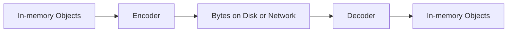
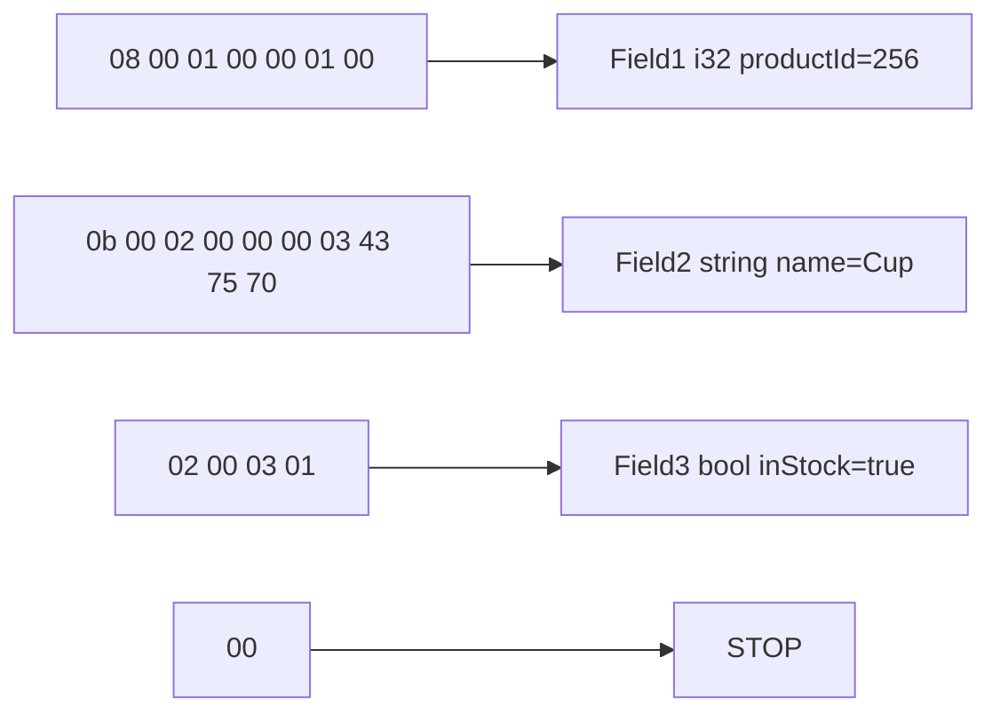
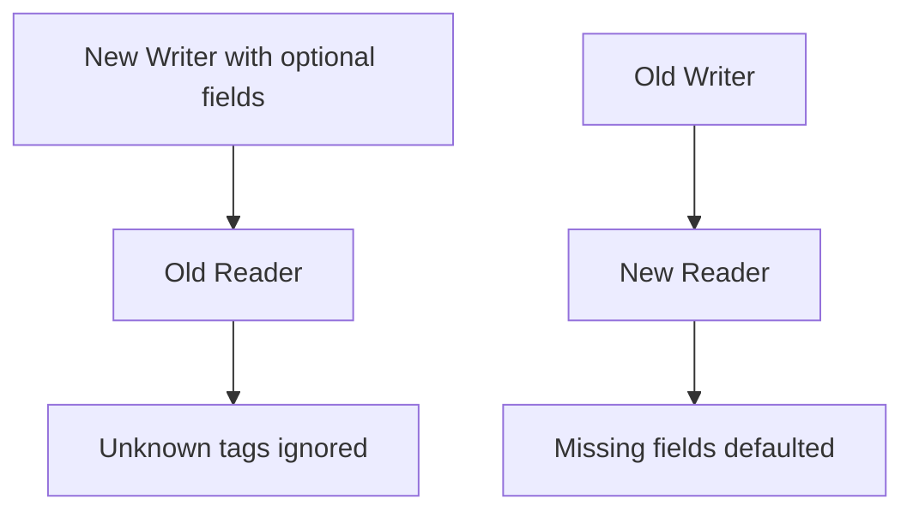
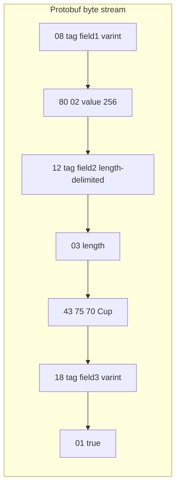

# Chapter 4: Encoding and Evolution

> **How data moves across process boundaries, why binary formats matter, and how schema evolution keeps systems compatible over time.**

Applications use data in two different forms:

1. **In-memory representation**: objects, structs, arrays, hash maps, trees.
2. **Byte-level representation**: a self-contained sequence of bytes for disk/network.

This conversion is **encoding/serialization** (and decoding/deserialization on read).

---

## I. Why Encoding Exists



Pointers are process-local, so data crossing process boundaries must be encoded into portable bytes.

---

## II. Language-Specific Encodings and Problems

Language-coupled formats are convenient but risky:

1. **Interoperability pain** across polyglot services.
2. **Security risks** from arbitrary class instantiation during decode.
3. **Weak schema evolution support** in many native serializers.
4. **Performance overhead** (e.g., classic Java serialization bloat).

---

## III. Text Formats: JSON, XML, CSV

### Number ambiguity

- XML/CSV cannot reliably distinguish numbers from numeric strings without schema.
- JSON has number/string distinction, but precision and int-vs-float details can be ambiguous.

### Binary data handling

JSON/XML are text-oriented; raw bytes are usually Base64-encoded (size overhead).

### CSV schema ambiguity

CSV has no built-in schema; producer/consumer changes need careful coordination.

---

## IV. Why Binary Encodings Matter

At scale, format choice impacts:

- Network bandwidth
- Storage footprint
- CPU parsing cost
- Latency

JSON is compact vs XML, but still verbose compared to binary.

---

## V. Thrift and Protocol Buffers

- **Protocol Buffers** (Google)
- **Thrift** (Facebook)

Both are schema-driven and use generated code for multiple languages.

JSON:

```json
{
  "userName": "Martin",
  "favoriteNumber": 1337,
  "interests": ["daydreaming", "hacking"]
}
```

Thrift:

```thrift
struct Person {
  1: required string userName,
  2: optional i64 favoriteNumber,
  3: optional list<string> interests
}
```

Protobuf:

```proto
message Person {
  required string user_name = 1;
  optional int64 favorite_number = 2;
  repeated string interests = 3;
}
```

---

## VI. Thrift BinaryProtocol: Byte-Level View

JSON payload:

```json
{
  "productId": 256,
  "name": "Cup",
  "inStock": true
}
```

Schema:

```thrift
struct Product {
  1: i32 productId,
  2: string name,
  3: bool inStock
}
```

Encoded bytes:

```text
08 00 01 00 00 01 00 0b 00 02 00 00 00 03 43 75 70 02 00 03 01 00
```

Parsing pattern:

**[Field Type] + [Field ID] + [Value] ... until STOP marker**



### Interactive Decoder Lab

Use this mini game to decode the same payload step-by-step.

<div class="thrift-mini-game" data-bytes="08 00 01 00 00 01 00 0b 00 02 00 00 00 03 43 75 70 02 00 03 01 00">
  <div class="thrift-game-header">
    <strong>BinaryProtocol Stream Explorer</strong>
    <span class="thrift-progress">Step 1 / 5</span>
  </div>
  <div class="thrift-bytes-row"></div>
  <div class="thrift-step-panel">
    <div class="thrift-step-label"></div>
    <div class="thrift-step-explain"></div>
  </div>
  <div class="thrift-controls">
    <button class="md-button thrift-prev">Prev</button>
    <button class="md-button md-button--primary thrift-next">Next</button>
    <button class="md-button thrift-auto">Auto Play</button>
    <button class="md-button thrift-reset">Reset</button>
  </div>
</div>

---

## VII. Schema Evolution and Compatibility

Field IDs (tags) are the wire contract.

- Field names can change.
- Tag numbers must remain stable.
- Type changes require caution.

### Forward compatibility

Old readers skip unknown tags written by new writers.

**Real-life example (mobile app rollout):**
Your backend adds a new optional field `user_tier = 4` (`FREE`, `PRO`) to a Protobuf `UserProfile` response. Users on older app versions (old reader) don't know tag `4`, so they ignore it and still render name/email correctly.

### Backward compatibility

New readers can read old data if newly added fields are optional/defaulted.

**Real-life example (event streaming with mixed producers):**
You deploy a new consumer that expects an optional `discount_code` field in `OrderCreated` events. Some services are still publishing the old event schema without that field. The new consumer reads those old events and safely treats `discount_code` as empty/default.



Rules:

1. Never recycle old tag numbers.
2. New fields should be optional/defaulted.
3. Remove only optional fields, and never reuse their tags.

---

## VIII. Data Type Changes and Risk

Example: `int32` -> `int64`

- New readers can generally read old `int32`.
- Old readers may truncate large `int64` values.

So type changes must be rolled out carefully.

---

## IX. Repeated Fields in Protocol Buffers

```proto
repeated string interests = 3;
```

The same tag can appear multiple times and is decoded as a list.

### Protocol Buffers: Byte-Level Mini Lab

Protobuf on the wire looks different from Thrift. Before the interactive lab, here is the mental model.

#### How Protobuf differs from Thrift (one sentence)

- **Thrift BinaryProtocol** sends: `[type byte] + [field id] + [value]` (field names never appear; type and id are separate bytes).
- **Protobuf** sends: `[tag byte] + [value]` where the **tag byte** already encodes both **which field** and **how to read the value**.

So in Protobuf you do not see a separate “string type” byte like Thrift’s `0b`. You infer meaning from the **wire type** embedded in the tag.

#### What is a “tag” byte?

Each field in the binary stream starts with one tag byte built from your `.proto` schema:

```text
tag = (field_number << 3) | wire_type
```

| Piece | Meaning |
|-------|---------|
| **field_number** | The number you wrote in `.proto` (`= 1`, `= 2`, `= 3`) — same idea as Thrift field id |
| **wire_type** | Tells the parser **how many bytes to read next** and **how to interpret them** |

**Example:** tag `08` (hex) = decimal `8` = binary `0000 1000`

- Lower 3 bits (`000`) → **wire type 0** (varint)
- Upper bits (`00001`) → **field 1**

So `08` means: “Field 1 is next, and its value is encoded as a varint.”

#### What is a “wire type”?

Wire type is **not** “int vs string” in the Thrift sense. It is **the encoding shape on the wire**:

| Wire type | Name | How the parser reads the value |
|-----------|------|--------------------------------|
| **0** | Varint | Read 1+ bytes until a varint ends; decode as integer/bool/enum |
| **1** | 64-bit | Read exactly 8 bytes (fixed64) |
| **2** | Length-delimited | Read a varint **length**, then read that many raw bytes (strings, bytes, embedded messages) |
| **5** | 32-bit | Read exactly 4 bytes (fixed32) |

Your schema (`.proto`) still says `int32`, `string`, `bool` — the **wire type** only tells the parser the **byte pattern** to consume. The generated code then maps that to the correct Go/Java/C++ type.

#### What is a varint?

A **varint** (variable-length integer) uses 1–10 bytes for an integer:

- Each byte uses **7 bits** for data.
- The **high bit** (`0x80`) means “more bytes follow.”
- Small numbers use fewer bytes (efficient on the wire).

**Why `256` becomes `80 02` (not `00 00 01 00` like Thrift):**

- `256` needs more than 7 bits.
- First chunk: `0x80 | 0` → `80` (continuation + low 7 bits).
- Second chunk: `2` → `02`.
- Decoder: `(0 & 0x7F) + (2 << 7) = 256`.

Booleans in Protobuf are often wire type 0 with value `01` (true) or `00` (false) — still a varint, not a single dedicated bool byte like Thrift’s `02` type + `01`.

#### How strings work (wire type 2)

For `string name = 2`:

1. Tag byte: field `2`, wire type `2` → hex **`12`** (because `(2 << 3) | 2 = 18` = `0x12`).
2. **Length** as varint: `03` = “next 3 bytes are payload.”
3. **Payload**: raw UTF-8 bytes `43 75 70` = `"Cup"`.

No separate “string type” byte — only **tag + length + bytes**.

#### Our example schema → wire layout

```proto
message Product {
  int32 productId = 1;   // varint  -> tag 08, then varint value
  string name = 2;       // string  -> tag 12, then length + bytes
  bool inStock = 3;      // bool    -> tag 18, then 01 or 00
}
```



Full payload for `{ productId: 256, name: "Cup", inStock: true }`:

```text
08 80 02 12 03 43 75 70 18 01
```

| Bytes | Meaning |
|-------|---------|
| `08` | Field **1**, wire type **0** (varint) → `productId` |
| `80 02` | Varint value **256** |
| `12` | Field **2**, wire type **2** (length-delimited) → `name` |
| `03` | Length **3** |
| `43 75 70` | UTF-8 **"Cup"** |
| `18` | Field **3**, wire type **0** (varint) → `inStock` |
| `01` | **true** |

Use the explorer below to step through each group with highlighting.

<div class="thrift-mini-game"
     data-bytes="08 80 02 12 03 43 75 70 18 01"
     data-steps='[
       {"label":"Field 1 key","range":[0,0],"explanation":"08 = (field 1 << 3) | wire_type 0. So field=1, varint value follows."},
       {"label":"Field 1 value (varint)","range":[1,2],"explanation":"80 02 is varint-encoded 256."},
       {"label":"Field 2 key + length","range":[3,4],"explanation":"12 = field 2, wire_type 2 (length-delimited). 03 means next 3 bytes are string data."},
       {"label":"Field 2 string bytes","range":[5,7],"explanation":"43 75 70 is UTF-8 for C u p."},
       {"label":"Field 3 key + bool","range":[8,9],"explanation":"18 = field 3, wire_type 0. 01 = true."}
     ]'>
  <div class="thrift-game-header">
    <strong>Protobuf Wire Stream Explorer</strong>
    <span class="thrift-progress">Step 1 / 5</span>
  </div>
  <div class="thrift-bytes-row"></div>
  <div class="thrift-step-panel">
    <div class="thrift-step-label"></div>
    <div class="thrift-step-explain"></div>
  </div>
  <div class="thrift-controls">
    <button class="md-button thrift-prev">Prev</button>
    <button class="md-button md-button--primary thrift-next">Next</button>
    <button class="md-button thrift-auto">Auto Play</button>
    <button class="md-button thrift-reset">Reset</button>
  </div>
</div>

---

## X. REST vs SOAP (Quick Contrast)

- **REST**: architectural style over HTTP.
- **SOAP**: strict XML-based protocol.

Specs:

- REST commonly uses **OpenAPI/Swagger**.
- SOAP commonly uses **WSDL**.

---

*Last Updated: May 28, 2026*

**End Note**: Encoding is a long-term contract between independently evolving systems. Teams that treat schema evolution as a first-class concern avoid brittle migrations, silent corruption, and expensive rewrites.
