# Chapter 5: Replication

> **How databases keep copies of the same data on multiple machines, why replication lag creates strange user-visible bugs, and how quorum systems reason about correctness under failure.**

Replication means keeping a copy of the same data on multiple machines connected over a network.

At first, it may sound unnecessary. Why not just keep the database on one powerful machine?

Because one machine gives you one failure point, one geographic location, and one read-capacity ceiling. Replication helps a system:

1. Keep data geographically close to users, reducing latency.
2. Continue operating when some machines fail, increasing availability.
3. Serve more read traffic by distributing reads across replicas.

The hard part is not copying data once. The hard part is keeping multiple copies correct while clients are continuously reading and writing.

---

## I. Leaders and Followers

Each node that stores a copy of the database is called a **replica**.

If there are multiple replicas, the first question is simple:

> How do we ensure that every replica eventually contains the same data?

One common answer is **leader-based replication**, also called **primary-replica**, **active/passive**, or historically **master/slave** replication.

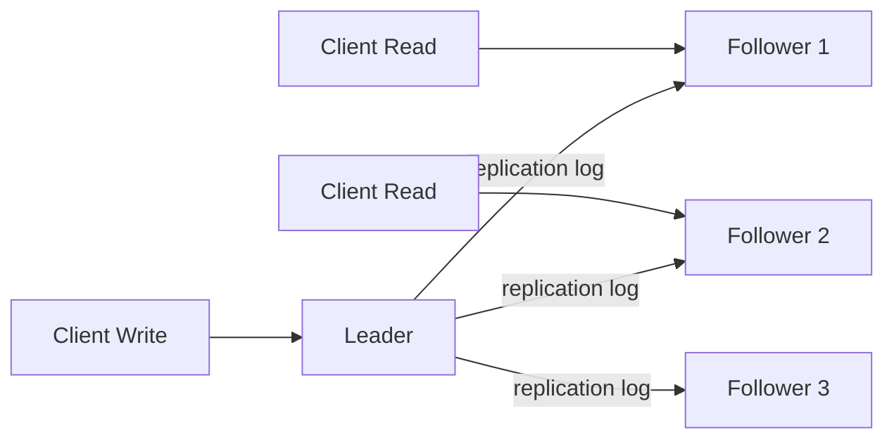

The flow is:

1. One replica is designated as the **leader**.
2. Clients send all writes to the leader.
3. The leader writes the change to its local storage.
4. The leader sends the change to followers through a **replication log** or **change stream**.
5. Followers apply the log in the same order as the leader.
6. Reads may go to the leader or followers, but writes go only to the leader.

This model is used in many relational databases such as PostgreSQL and MySQL, as well as non-relational databases and message systems such as MongoDB, Kafka, and RabbitMQ.

---

## II. Synchronous vs. Asynchronous Replication

An important design choice is whether followers replicate changes synchronously or asynchronously.

Imagine a user updates their profile image:

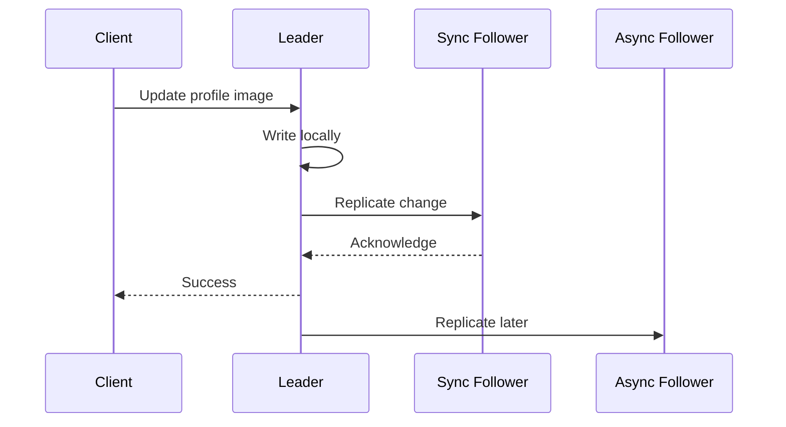

### Synchronous replication

With synchronous replication, the leader waits until at least one follower confirms that it has written the change.

Advantages:

- The synchronous follower is guaranteed to have an up-to-date copy.
- If the leader fails, at least one follower already has the latest committed data.

Disadvantage:

- If the synchronous follower is unavailable, the leader may have to block writes.

### Asynchronous replication

With asynchronous replication, the leader does not wait for every follower before replying to the client.

Advantages:

- Writes are faster.
- Temporary follower outages do not immediately stop the system.

Disadvantage:

- A follower may lag behind.
- If the leader fails before replicating a committed write, that write may be lost during failover.

In practice, fully synchronous replication to every follower is usually impractical. If one follower goes down, the whole system could stop accepting writes.

Many systems therefore use **semi-synchronous replication**: one follower is kept synchronous, while the remaining followers replicate asynchronously. If the synchronous follower fails, another asynchronous follower can be promoted to synchronous.

---

## III. Setting Up a New Follower

From time to time, we need to add a new follower. Maybe a machine failed, maybe the cluster is scaling, or maybe a new datacenter is being added.

The naive idea is to copy the database files from the leader to the follower. But clients are constantly writing to the database, so a raw file copy may be inconsistent.

The safer process looks like this:

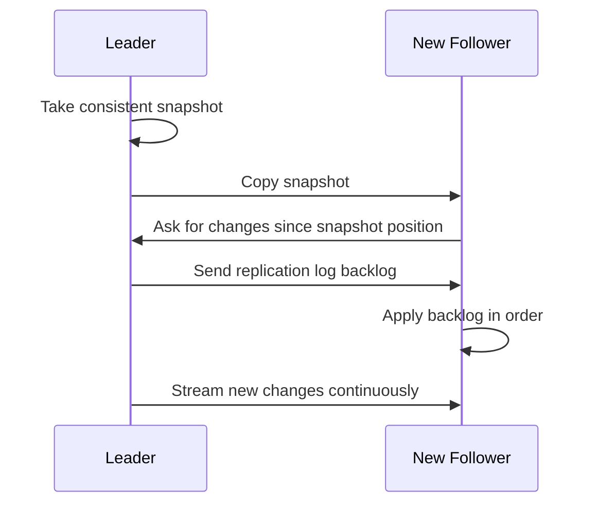

Steps:

1. Take a consistent snapshot of the leader's database at a known point in time.
2. Copy that snapshot to the new follower.
3. Record the exact position in the leader's replication log that corresponds to the snapshot.
4. Let the follower request all changes since that log position.
5. Once the follower processes the backlog, it has **caught up**.
6. The follower can now continue applying new changes as they arrive.

The key detail is the log position. Without it, the follower cannot know exactly which writes happened after the snapshot.

---

## IV. Handling Node Outages

Nodes can go down because of power loss, network interruption, maintenance, overloaded machines, or process crashes.

Replication is useful only if the system can recover from these failures.

### Follower Failure: Catch-Up Recovery

Follower failure is comparatively easy.

Each follower keeps a local log of the changes it has processed. When it comes back online, it can ask the leader:

> Give me all changes after the last log position I processed.

The follower applies those missing changes and catches up.

### Leader Failure: Failover

Leader failure is harder.

If the leader is gone, the system must:

1. Detect that the leader has failed.
2. Choose a new leader from the followers.
3. Reconfigure clients to send writes to the new leader.
4. Ensure the old leader becomes a follower if it returns.

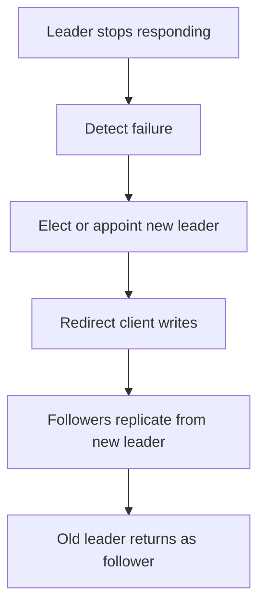

Automatic failover is powerful, but many things can go wrong:

- The new leader may not have received all writes from the old leader.
- If the old leader comes back, the system must prevent it from accepting writes as leader.
- Two nodes may both believe they are the leader, causing **split-brain**.
- A timeout that is too long slows recovery.
- A timeout that is too short causes unnecessary failovers.

Leader election is not just an operational detail. It is a consensus problem.

---

## V. Implementation of Replication Logs

Leader-based replication depends on some form of log. But what exactly should the leader send to followers?

There are several approaches.

### Statement-Based Replication

In statement-based replication, the leader logs every write statement it executes and sends those statements to followers.

Example:

```sql
UPDATE users SET last_seen = NOW() WHERE id = 42;
```

This sounds simple, but it can break in subtle ways:

1. Non-deterministic functions such as `NOW()` or `RAND()` may produce different values on each replica.
2. Auto-increment columns require statements to run in exactly the same order.
3. Statements that depend on existing data can produce different results if replicas differ.
4. Triggers, stored procedures, and user-defined functions may create different side effects.

Because of these edge cases, other replication methods are often preferred.

### Write-Ahead Log Shipping

Many storage engines append every write to a **write-ahead log** (WAL) before applying it to the data files.

So why not send the WAL directly to followers?

That works, but it tightly couples replication to the storage engine's internal format. If the storage engine changes its on-disk layout or log format, replication may become incompatible across versions.

WAL shipping is efficient, but it is low-level.

### Logical Log Replication

A **logical log** separates replication from the storage engine's physical representation.

Instead of describing low-level pages and bytes, it describes changes at the row level.

For a relational database, a logical log might contain:

- For an inserted row: the new values of all columns.
- For a deleted row: enough information to identify the deleted row, usually the primary key.
- For an updated row: the primary key plus the changed column values.

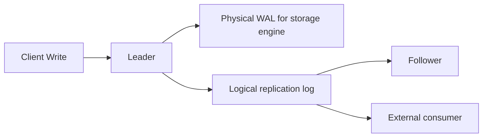

The advantage is decoupling. The database can change its internal storage format while keeping a stable logical replication format.

### Trigger-Based Replication

A trigger lets custom code run automatically when a database write occurs.

The trigger can record the change into a separate table. An external process reads that table, applies application-specific logic, and replicates the change elsewhere.

This is flexible, but it adds overhead and complexity. Tools such as Databus for Oracle and Bucardo for Postgres use this general idea.

---

## VI. Problems With Replication Lag

Leader-based replication often sends all writes to the leader while allowing reads from followers.

This is attractive for read-heavy workloads:

- Add more followers.
- Distribute read traffic across them.
- Reduce load on the leader.
- Serve reads from geographically nearby replicas.

But this pattern usually depends on asynchronous replication. If every follower had to synchronously acknowledge every write, one slow follower could slow down or stop the entire system.

With asynchronous followers, lag is normal.

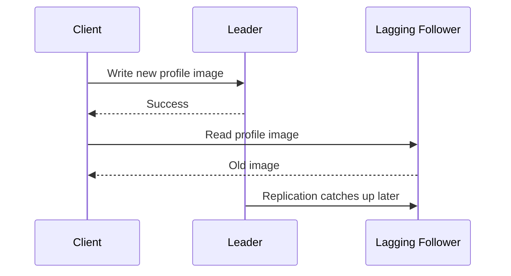

If writes stop and the system waits long enough, followers eventually catch up. This is called **eventual consistency**.

The problem is the word "eventually." Lag may be a fraction of a second, several seconds, or even minutes during overload or network trouble.

That lag creates user-visible anomalies.

---

## VII. Reading Your Own Writes

Many applications let users submit data and immediately view it.

If a user updates their profile and then reads from a lagging follower, the update may appear to be missing. From the user's point of view, the system lost their data.

The guarantee we want is **read-after-write consistency**, also called **read-your-writes consistency**.

It means:

> After a user writes something, that same user should be able to read their own write.

Possible solutions:

1. **Read user-owned data from the leader.** For example, a user's own profile is read from the leader, while other users' profiles can be read from followers.
2. **Use a time window.** For one minute after a user's last write, route their reads to the leader.
3. **Track the user's last write timestamp.** The client remembers the timestamp or version of its latest write. Reads must go to a replica that has caught up to at least that point.
4. **Route carefully across datacenters.** If the leader is in one datacenter, reads that require freshness may need to be routed there.

Multiple devices make this harder. If the same user writes from a mobile app and reads from a desktop browser, the desktop may not know the mobile app's latest write timestamp. That metadata may need to be stored centrally.

---

## VIII. Monotonic Reads

Another anomaly is seeing time move backward.

Imagine user `2345` reads a comment thread:

1. The first read goes to a follower with little lag and shows a new comment.
2. The second read goes to a follower with more lag and the comment disappears.

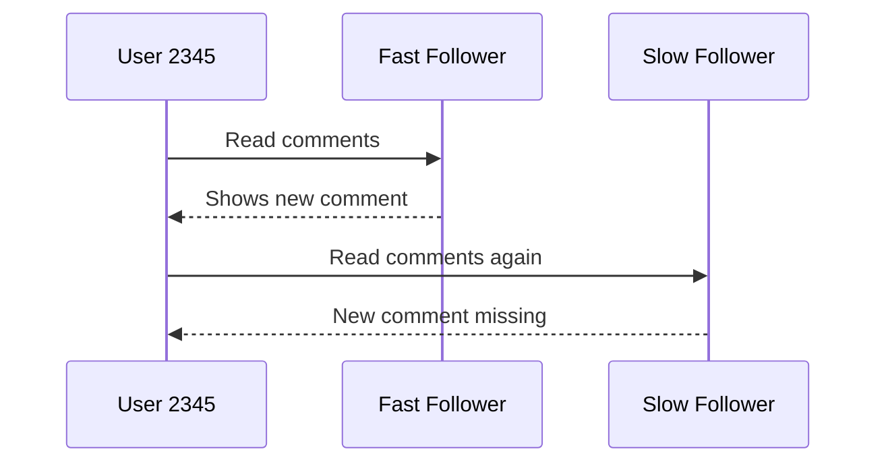

That is confusing because the user has observed the system going backward in time.

**Monotonic reads** prevent this. A user may still see stale data, but once they have seen newer data, they should not later see older data.

One practical approach is to route each user's reads to the same replica, perhaps by hashing the user ID. If that replica fails, the system needs a fallback that avoids sending the user to a much staler replica.

---

## IX. Consistent Prefix Reads

**Consistent prefix reads** guarantee that if writes happen in a certain order, readers see them in that same order.

For example:

1. Question: "What is the meaning of life?"
2. Answer: "42."

Without consistent prefix reads, a reader might see the answer before the question.

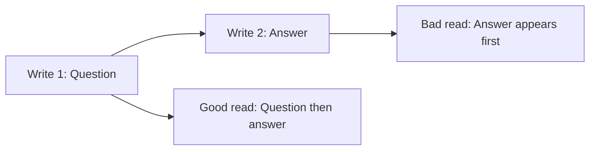

This anomaly can happen when related writes are replicated through different paths or partitions. The reader observes part of the history, but not the prefix that made it meaningful.

---

## X. Multi-Leader Replication

Single-leader replication has one major limitation: all writes must go through one leader.

If clients cannot reach the leader, writes stop.

**Multi-leader replication** allows more than one replica to accept writes. It is also called **master-master replication** or **active-active replication**.

Each leader also acts as a follower of the other leaders.

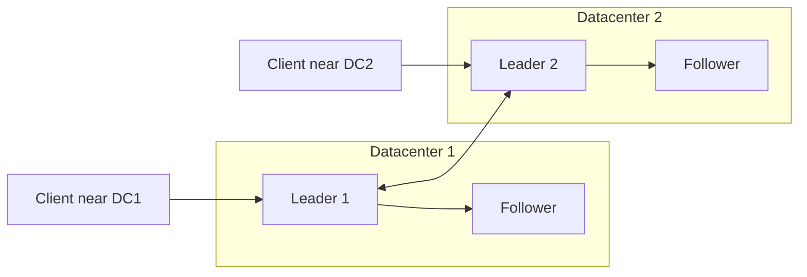

### Use Case: Multi-Datacenter Operation

In a multi-datacenter setup, each datacenter can have its own leader.

Advantages:

- **Lower latency:** users write to a nearby datacenter.
- **Datacenter fault tolerance:** if one datacenter fails, another can continue accepting writes.
- **Better network tolerance:** asynchronous replication between datacenters can tolerate temporary network interruptions.

The downside is conflict handling. The same record may be changed independently in two datacenters before replication catches up.

### Use Case: Offline Clients

Calendar apps are a classic example.

Your phone and laptop should let you create meetings even when offline. Each device has a local database that can accept writes. When the device comes online, it syncs changes with other replicas.

In this model, every device behaves like a temporary leader.

### Use Case: Collaborative Editing

Collaborative editors apply changes locally first so the UI feels instant. The changes are then asynchronously replicated to other users.

If the application wants to avoid conflicts entirely, it needs locking. But locking reduces collaboration, because only one user can edit a locked section at a time.

Many collaborative systems instead allow concurrent edits and use application-level conflict resolution.

---

## XI. Handling Write Conflicts

In single-leader replication, write conflicts are easier to detect. The leader serializes writes in one order.

In multi-leader replication, two leaders may accept conflicting writes at the same time.

Example:

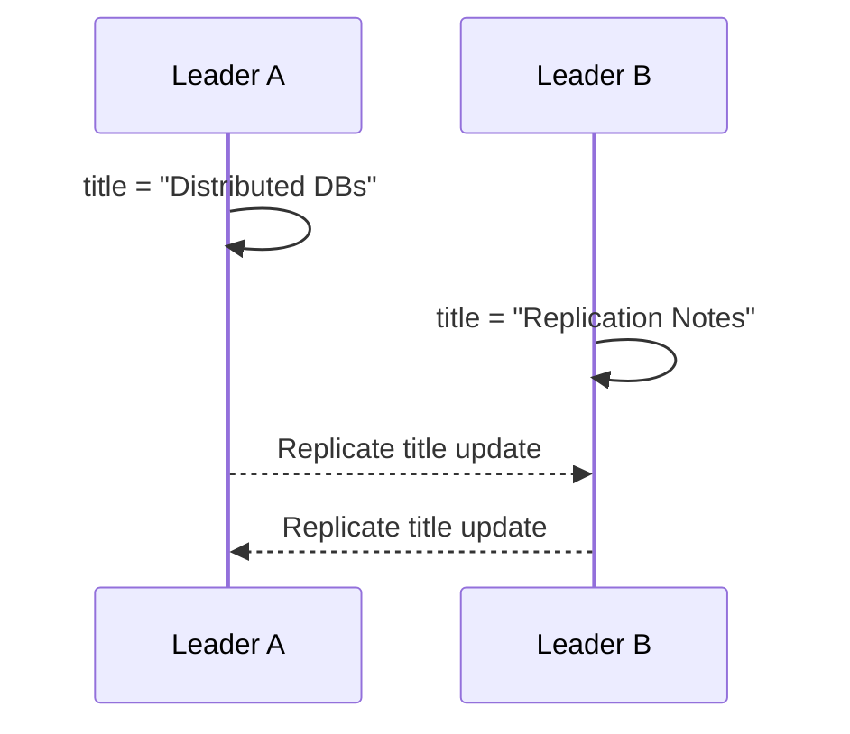

Both writes succeeded locally. When replication happens, the system must decide what the final value should be.

### Synchronous Conflict Detection

Could we wait for a write to replicate everywhere before telling the user it succeeded?

Technically yes. But then we lose the main benefit of multi-leader replication: allowing each leader to accept writes independently.

If conflict detection must be synchronous, single-leader replication may be simpler.

### Converging Toward One State

Every replica must eventually arrive at the same final value.

Common strategies:

1. **Last write wins (LWW):** attach a timestamp or unique ID and keep the "latest" write. This is simple but can silently lose data.
2. **Replica priority:** give each replica an ID and let writes from higher-priority replicas win. This is deterministic but still loses data.
3. **Explicit conflict records:** preserve all conflicting values and let application logic or users resolve them later.

There is no universal answer. Conflict resolution is part of the data model.

---

## XII. Multi-Leader Replication Topologies

With two leaders, the topology is simple: each leader sends writes to the other.

With more than two leaders, there are several options.

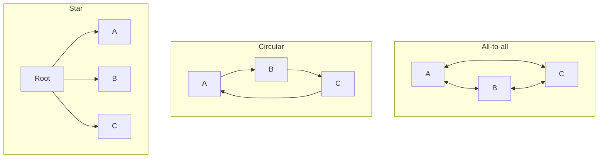

### Circular and Star Topologies

In circular and star topologies, writes may need to pass through several nodes before reaching every replica.

Nodes must forward changes they receive from others. To avoid infinite loops, each write is tagged with the IDs of nodes it has already passed through. If a node sees its own ID in the tag list, it ignores the write.

The weakness is failure sensitivity. If one node in a circular or star topology fails, replication paths may break until the topology is repaired or reconfigured.

### All-to-All Topology

All-to-all replication is more fault tolerant because messages can travel through multiple paths.

However, it introduces ordering problems. Some network links are faster than others, so one update may overtake another and arrive in a different order at different replicas.

Version vectors can help reason about these ordering relationships.

---

## XIII. Leaderless Replication

In leaderless replication, there is no single leader that accepts all writes.

Clients send reads and writes to several replicas directly.

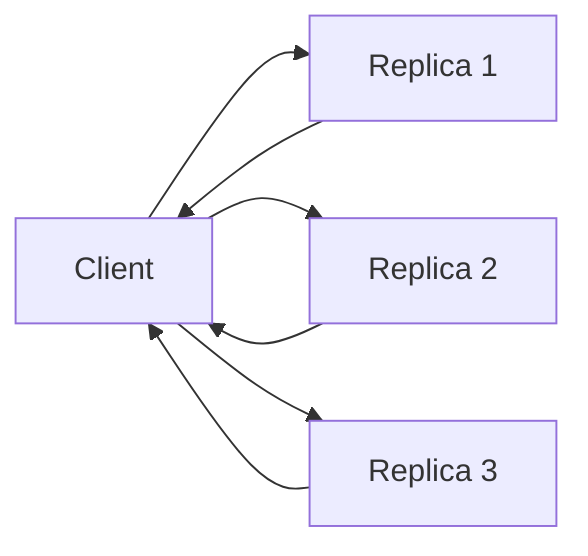

Imagine three replicas and one is unavailable.

The client sends a write to all three replicas, but only two receive it. Later, the unavailable replica comes back online. If a client reads from only that stale replica, it may get old data.

Leaderless systems avoid this by reading from multiple replicas in parallel and using version numbers to decide which value is newer.

---

## XIV. Read Repair and Anti-Entropy

After a replica comes back online, how does it catch up on writes it missed?

Dynamo-style datastores often use two mechanisms.

### Read Repair

During a read, the client contacts multiple replicas.

If one replica returns version `6` while others return version `7`, the client can detect that version `6` is stale and write the newer value back.

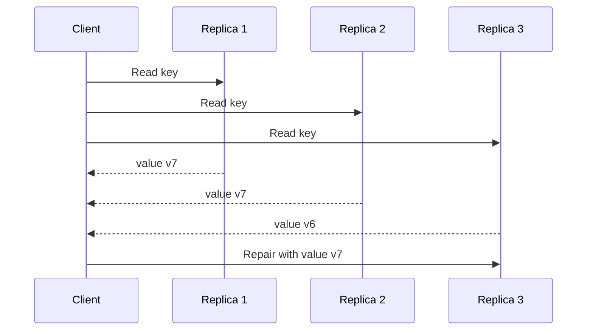

Read repair works well for data that is frequently read.

### Anti-Entropy

Anti-entropy is a background process that compares replicas and copies missing data from one replica to another.

Unlike a leader's replication log, anti-entropy does not necessarily copy writes in a strict order. It may also take some time before all replicas converge.

---

## XV. Quorums for Reading and Writing

Leaderless systems often use read and write quorums.

For example, with three replicas:

- A write succeeds if at least two replicas acknowledge it.
- A read queries at least two replicas.

If every successful write is present on at least two replicas, at most one replica can be stale. If a read asks two replicas, at least one should have the latest value.

The general rule is:

```text
W + R > N
```

Where:

| Symbol | Meaning |
| --- | --- |
| `N` | Number of replicas |
| `W` | Number of replicas required for a successful write |
| `R` | Number of replicas queried for a read |

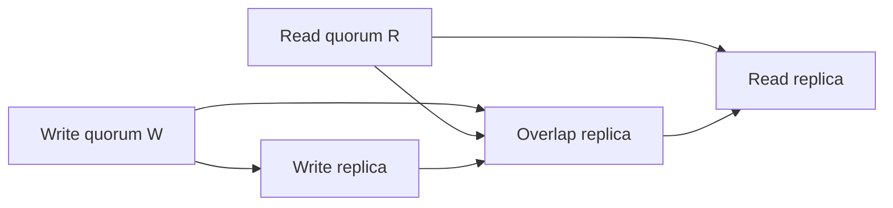

The overlap replica is what connects the latest write to a future read.

---

## XVI. Limitations of Quorum Consistency

Even with `W + R > N`, stale reads can still happen depending on the implementation.

Possible edge cases:

1. **Sloppy quorum:** writes may land on nodes outside the normal replica set, so the read and write sets may not overlap.
2. **Concurrent writes:** if two writes happen at the same time, there may be no clear "latest" write.
3. **Failed replicas:** a replica containing a new value may fail, and recovery from an old replica may reduce the number of copies of the new value.
4. **Weak conflict resolution:** if conflicts are resolved by last-write-wins, data may be silently discarded.

Quorum math gives a foundation, but the database still needs correct versioning, conflict detection, repair, and recovery behavior.

---

## XVII. Sloppy Quorums and Hinted Handoff

Sometimes a client cannot reach enough of the replicas that normally store a value.

The system has two choices:

1. Reject the request because the proper quorum cannot be reached.
2. Accept the request on other reachable nodes that are not part of the value's normal replica set.

The second option is called a **sloppy quorum**.

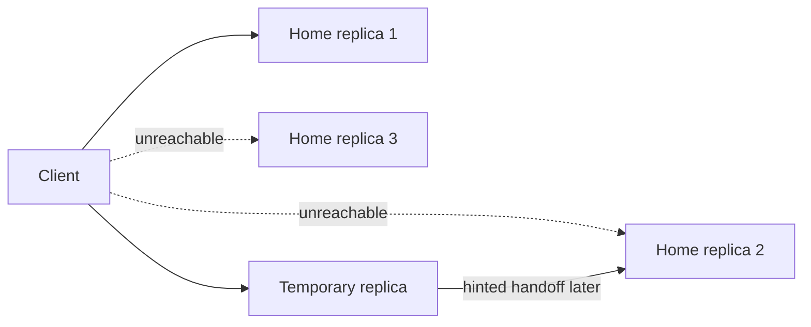

The reachable temporary node stores the write along with a hint saying which home replica should receive it later.

When the network problem is fixed, the temporary node forwards the write to the correct home replica. This is **hinted handoff**.

Sloppy quorums improve availability, but they weaken the clean overlap guarantee of normal quorum reads and writes.

---

## XVIII. Multi-Datacenter Leaderless Replication

Some leaderless systems support multi-datacenter replication without introducing a single global leader.

In systems such as Cassandra-style designs, replicas can be placed across datacenters. A client write may be sent to replicas in multiple datacenters, but the client usually waits only for acknowledgements from a quorum in the local datacenter.

This keeps local writes fast and allows the system to tolerate delays or outages on cross-datacenter links. Replication to remote datacenters can continue asynchronously.

The tradeoff is familiar: better availability and latency, but more complexity in consistency and conflict handling.

---

## XIX. Detecting Concurrent Writes

Leaderless and multi-leader systems must deal with concurrent writes.

The dangerous shortcut is **last write wins**.

### Last Write Wins

Last write wins tries to keep the most recent value and discard older values.

The problem is that "most recent" is not always well-defined in a distributed system. Clocks can drift, messages can be delayed, and two writes can be truly concurrent.

LWW is simple, but it can lose data.

### Happens-Before and Concurrency

To reason about conflicts, we need to know whether one operation happened before another.

If operation B read the result of operation A before writing, then B depends on A. We say A **happened before** B.

If two operations happened without either knowing about the other, they are **concurrent**.

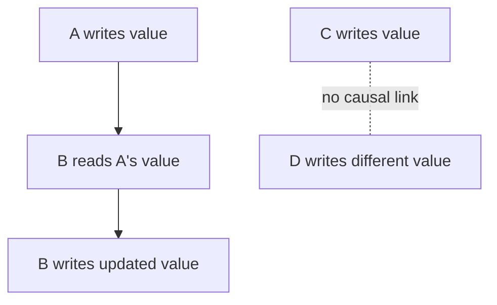

Concurrency does not mean "same millisecond." It means neither operation causally depended on the other.

---

## XX. Tracking Happens-Before Relationships

One way to track causality is to attach versions to values.

A simplified protocol:

1. The server keeps a version number for every key.
2. Every write increments the version number.
3. A read returns the latest version number and all current values that have not been overwritten.
4. A write must include the version number from the previous read.
5. When the server receives a write, it can overwrite values at that version or older.
6. Values with higher versions are kept because they may be concurrent with the incoming write.

This prevents the system from silently dropping concurrent writes.

---

## XXI. Merging Concurrently Written Values

When concurrent writes are preserved, the database may return multiple values for the same key.

Riak calls these concurrent values **siblings**.

The client or application must merge them.

For a shopping cart, merging may sound easy: take the union of items from both carts.

But deletion makes it harder. If one sibling removed an item and another sibling still contains it, a naive union would accidentally resurrect the deleted item.

To solve this, systems often keep a deletion marker called a **tombstone**.

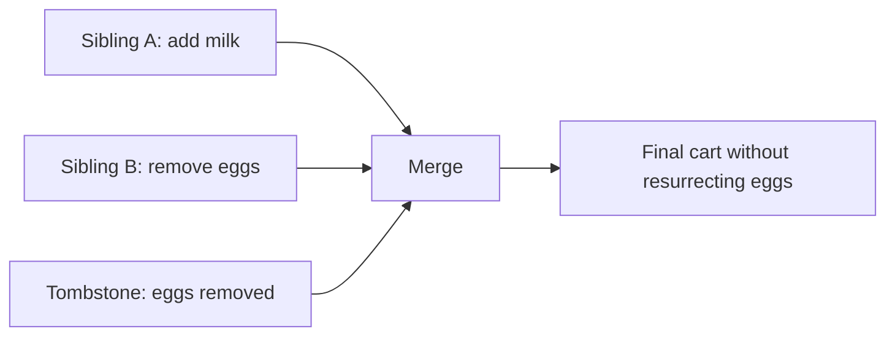

The tombstone tells the merge process:

> This item was intentionally removed. Do not bring it back just because it appears in an older sibling.

---

## XXII. Version Vectors

A single version number is not enough when multiple replicas can accept writes concurrently.

Instead, the system uses a version number per replica. Each replica increments its own counter when it processes a write and tracks the counters it has seen from other replicas.

The collection of these counters is called a **version vector**.

Example:

| Replica | Version vector |
| --- | --- |
| Replica A | `{A: 3, B: 1, C: 2}` |
| Replica B | `{A: 2, B: 4, C: 2}` |

Version vectors help the system answer:

- Did this write happen after another write?
- Are these writes concurrent?
- Can one value safely overwrite another?
- Do we need to keep siblings and ask the application to merge?

They are one of the core tools for reasoning about causality in replicated systems.

---

## Key Takeaways

- Replication improves latency, availability, and read throughput by keeping data on multiple machines.
- Leader-based replication sends all writes to one leader and streams changes to followers.
- Synchronous replication improves durability but can reduce availability.
- Asynchronous replication improves availability but creates replication lag.
- Replication lag causes anomalies such as stale reads, non-monotonic reads, and inconsistent prefix reads.
- Multi-leader replication improves write availability across datacenters and offline clients, but introduces write conflicts.
- Leaderless replication lets clients write to multiple replicas directly and often relies on read/write quorums.
- `W + R > N` ensures read and write quorums overlap, but real systems still need versioning and repair.
- Sloppy quorums and hinted handoff improve availability while weakening strict quorum guarantees.
- Version vectors help detect causality and preserve concurrent writes instead of silently losing data.

---

*Last Updated: August 25, 2026*

**End Note**: Replication is not just "copy data to another machine." It is a set of tradeoffs between latency, availability, durability, and correctness. The deeper lesson is that distributed systems rarely give guarantees for free: every consistency promise is paid for somewhere else.
