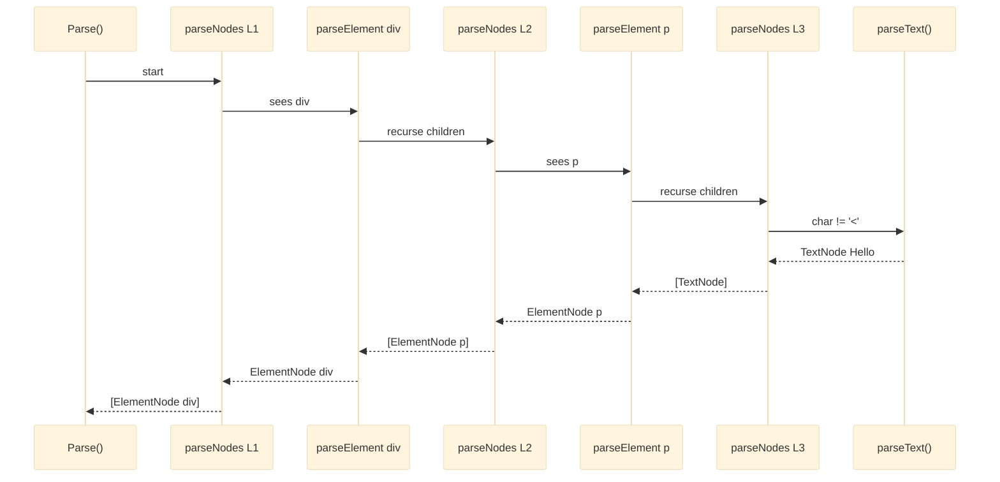
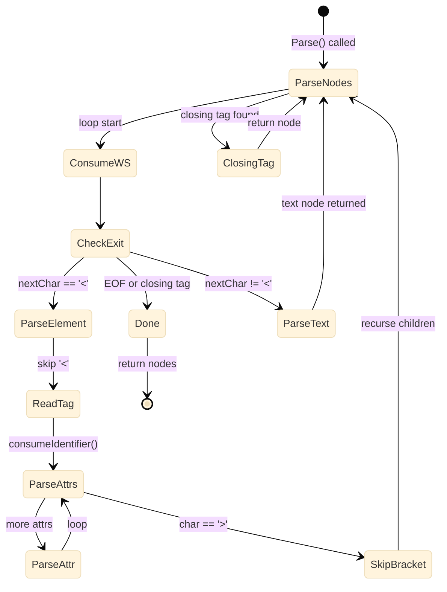

# Building a Recursive Descent HTML Parser in Go

**Technical Deep-Dive** | Browser Internals | March 2026

Your browser just parsed this page. Here's exactly how that works — and how I built the same thing from scratch in Go.

---

## Why Build Your Own HTML Parser?

When I built my [Go Browser Engine](go-browser.md), I had a choice: use a third-party HTML parsing library, or build one from scratch.

I chose scratch.

Not because it was easier — it wasn't. But because building the parser yourself forces you to confront a question that most developers never ask:

> **What actually IS HTML? Not what it looks like — what is it?**

The answer changes how you think about the web forever.

---

## What the Parser Has to Do

Before writing a single line of code, you need to understand the contract. The HTML parser sits at stage 2 of the browser pipeline:

```
Raw HTML string (text)
        │
        ▼
 ┌─────────────────┐
 │   HTML Parser   │   ← We are here
 └─────────────────┘
        │
        ▼
 *dom.Node tree (structured data)
```

Its job is deceptively simple: take a flat string of characters and produce a **tree** — a hierarchical data structure that represents the nesting of every element on the page.

```
Input:  <html><body><h1 class="title">Hello</h1><p>World</p></body></html>

Output:
  html
  └── body
      ├── h1  [class="title"]
      │   └── "Hello"
      └── p
          └── "World"
```

That transformation — from linear text to recursive tree — is the entire job.

---

## The Fundamental Insight: HTML is a Grammar

To parse anything, you first need to define what it is precisely. HTML, like all formal languages, has a **grammar** — a set of rules that describe what valid input looks like.

Here's a simplified grammar for the subset we care about:

```
document    := nodeList
nodeList    := node*
node        := element | text
element     := '<' tagName attributes '>' nodeList '</' tagName '>'
text        := [any characters not starting with '<']
attributes  := attribute*
attribute   := name '=' '"' value '"'
```

Read this out loud: *"A document is a list of nodes. A node is either an element or text. An element starts with `<tagName attributes>`, contains more nodes, and ends with `</tagName>`."*

This recursive definition is the key insight. Elements contain nodes. Nodes can be elements. Elements can contain elements. This is why the parser is **recursive descent** — the grammar is recursive, so the parser naturally mirrors that structure.

---

## The DOM: What We're Building Towards

The parser produces a tree of `dom.Node` objects. The node type is intentionally minimal — just two kinds of nodes, with the fields each needs:

```go
type NodeType int

const (
    ElementNode NodeType = iota  // e.g. <h1 class="title">
    TextNode                     // e.g. "Hello"
)

type Node struct {
    Type     NodeType
    TagName  string            // "h1", "div", "a" — ElementNode only
    Attr     map[string]string // {"class": "title", "href": "/"} — ElementNode only
    Text     string            // raw string content — TextNode only
    Children []*Node           // child nodes — ElementNode only
}
```

That's the entire data model. Everything the CSS engine, layout engine, and JavaScript runtime need flows through this structure.

---

## The Parser State

The parser has one job: consume the input string from left to right, one character at a time, never going back.

```go
type Parser struct {
    input string  // the full raw HTML string
    pos   int     // our current position — advances only forward
}
```

`pos` is the cursor. It starts at `0` and marches toward `len(input)`. Every helper function moves it forward. The parser never backtracks.

Three low-level helper methods form the foundation of everything:

```go
// Look at the current character without consuming it
func (p *Parser) nextChar() byte {
    return p.input[p.pos]
}

// Consume and return the current character, advance pos
func (p *Parser) consumeChar() byte {
    ch := p.input[p.pos]
    p.pos++
    return ch
}

// Consume characters while a condition holds
func (p *Parser) consumeWhile(test func(byte) bool) string {
    var result strings.Builder
    for p.pos < len(p.input) && test(p.nextChar()) {
        result.WriteByte(p.consumeChar())
    }
    return result.String()
}
```

With these three primitives, every higher-level parsing function is just a pattern of *"look, decide, consume, repeat"*.

---

## Parsing a Text Node

The simplest case: we're not looking at a `<`, so everything until the next `<` is raw text.

```go
func (p *Parser) parseText() *dom.Node {
    text := p.consumeWhile(func(ch byte) bool {
        return ch != '<'
    })
    return dom.NewText(text)
}
```

```
Input:  "Hello, world!</p>"
         ^pos

consumeWhile(ch != '<'):
  'H' → consumed
  'e' → consumed
  'l' → consumed
  ...
  '!' → consumed
  '<' → STOP

Output: TextNode{Text: "Hello, world!"}
Remaining input: "</p>"
```

Simple. Greedy. Stop at the first `<`.

---

## Parsing Attributes

Attributes are the key-value pairs inside an opening tag: `class="title"` or `href="/page"`.

```go
func (p *Parser) parseAttribute() (string, string) {
    name := p.consumeIdentifier()   // "class"
    p.consumeChar()                 // skip '='
    p.consumeChar()                 // skip opening '"'
    value := p.consumeWhile(func(ch byte) bool {
        return ch != '"'            // read until closing '"'
    })
    p.consumeChar()                 // skip closing '"'
    return name, value
}

func (p *Parser) parseAttributes() map[string]string {
    attrs := make(map[string]string)
    for p.nextChar() != '>' {
        p.consumeWhitespace()
        name, value := p.parseAttribute()
        attrs[name] = value
    }
    return attrs
}
```

Step through `class="title" href="/page">`:

```
pos → 'c' ... consumeIdentifier() → "class"
pos → '=' ... consumeChar() skips it
pos → '"' ... consumeChar() skips it
pos → 't' ... consumeWhile(≠'"') → "title"
pos → '"' ... consumeChar() skips it

attrs = {"class": "title"}

consumeWhitespace() skips ' '

pos → 'h' ... consumeIdentifier() → "href"
pos → '=' ... skip
pos → '"' ... skip
pos → '/' ... consumeWhile(≠'"') → "/page"
pos → '"' ... skip

attrs = {"class": "title", "href": "/page"}

pos → '>' — STOP
```

---

## Parsing an Element — The Core Function

Now the full element parser. This is the heart of the recursive descent:

```go
func (p *Parser) parseElement() *dom.Node {
    // 1. Consume '<'
    p.consumeChar()

    // 2. Read the tag name: "h1", "div", "a", etc.
    tagName := p.consumeIdentifier()

    // 3. Parse all attributes until we hit '>'
    attrs := p.parseAttributes()

    // 4. Consume '>'
    p.consumeChar()

    // 5. ← RECURSION: parse all child nodes
    children := p.parseNodes()

    // 6. Consume the closing tag: '</', tagName, '>'
    p.consumeChar() // '<'
    p.consumeChar() // '/'
    p.consumeIdentifier() // tagName (not validated — consumed and discarded)
    p.consumeChar() // '>'

    // 7. Wrap everything into a Node and return
    return dom.NewElement(tagName, attrs).AddChildren(children)
}
```

Step 5 is everything. When `parseElement` encounters children, it calls `parseNodes()` — which calls `parseElement()` again for any child elements. The call stack mirrors the nesting of the HTML. This is what makes it *recursive descent*.

---

## The Top-Level Loop: `parseNodes`

`parseNodes` is the orchestrator. It loops and dispatches to either `parseElement` or `parseText` based on a single character lookahead:

```go
func (p *Parser) parseNodes() []*dom.Node {
    var nodes []*dom.Node
    for {
        p.consumeWhitespace()

        // Stop if we've reached EOF or a closing tag
        if p.pos >= len(p.input) || strings.HasPrefix(p.input[p.pos:], "</") {
            break
        }

        // Dispatch: '<' means element, anything else means text
        if p.nextChar() == '<' {
            nodes = append(nodes, p.parseElement())
        } else {
            nodes = append(nodes, p.parseText())
        }
    }
    return nodes
}
```

The decision at each step is made with **one character of lookahead**. That's it. No token buffer. No lookahead table. Just: is the next character a `<` or not?

---

## The Call Stack is the Tree

This is the elegant part. When you trace through parsing `<div><p>Hello</p></div>`, the Go call stack at the deepest point looks exactly like the DOM tree being built:



The recursion unwinds exactly as the closing tags are consumed. Each `parseElement` call stays on the stack until its matching `</tag>` is found. The tree builds itself from the inside out.

---

## Full Parse Flow: State Machine View



---

## A Complete Worked Example

Let's trace `<h1 class="title">Hello</h1>` from start to finish:

```
Input: <h1 class="title">Hello</h1>
       ^pos=0

parseNodes() called
  consumeWhitespace() — nothing to skip
  nextChar() == '<' → call parseElement()

    parseElement():
      consumeChar() → '<'  pos=1
      consumeIdentifier() → "h1"  pos=3
      parseAttributes():
        consumeWhitespace() — skips ' '  pos=4
        nextChar() != '>' → parseAttribute()
          consumeIdentifier() → "class"  pos=9
          consumeChar() → '='  pos=10
          consumeChar() → '"'  pos=11
          consumeWhile(≠'"') → "title"  pos=16
          consumeChar() → '"'  pos=17
          return ("class", "title")
        consumeWhitespace() — nothing
        nextChar() == '>' → STOP
        return {"class": "title"}
      consumeChar() → '>'  pos=18

      parseNodes() ← RECURSE for h1's children
        nextChar() == 'H' (not '<') → parseText()
          consumeWhile(≠'<') → "Hello"  pos=23
          return TextNode{"Hello"}
        nextChar() == '<'
        input[pos:] starts with "</" → BREAK
        return [TextNode{"Hello"}]

      consumeChar() → '<'  pos=24
      consumeChar() → '/'  pos=25
      consumeIdentifier() → "h1"  pos=27
      consumeChar() → '>'  pos=28

      return ElementNode{
        TagName: "h1",
        Attr:    {"class": "title"},
        Children: [TextNode{"Hello"}]
      }

parseNodes() returns [ElementNode{h1}]
```

Done. 28 characters processed. A complete subtree returned.

---

## What This Parser Intentionally Omits

Real HTML parsers (like the one in Chrome's Blink engine) are hundreds of thousands of lines of C++, handling every edge case in the HTML5 specification. This one is intentionally minimal:

| Feature | Status | Reason Omitted |
|---|---|---|
| Self-closing tags (`<br/>`, ``) | ❌ | Would need special-case void element list |
| `<!DOCTYPE html>` | ❌ Ignored | Not meaningful for rendering |
| HTML comments (`<!-- -->`) | ❌ | Would corrupt the parse on real pages |
| Unquoted attribute values | ❌ | Added complexity for rare cases |
| Error recovery | ❌ | Real browsers have massive recovery logic |
| Malformed / unclosed tags | ❌ Undefined | No error recovery |

These omissions are not bugs — they're **scope decisions**. A browser engine for learning doesn't need to handle `<br>` the same way Chrome does. It needs to demonstrate the architecture clearly.

The right parser for learning is the simplest one that makes the next stage possible.

---

## Why Recursive Descent?

There are many parsing strategies. Why recursive descent?

**Alternatives considered:**

| Strategy | Tradeoff |
|---|---|
| Regex | Fast to write, impossible to maintain, cannot handle nesting |
| State machine (iterative) | Explicit stack management, more complex code |
| Parser generator (yacc, ANTLR) | Requires external tooling, hides the mechanism |
| **Recursive descent** | Code structure mirrors grammar, immediately readable |

With recursive descent, `parseElement` calls `parseNodes` calls `parseElement`. The grammar rule "elements contain nodes which contain elements" is directly expressed as "the function `parseElement` calls the function `parseNodes` which calls the function `parseElement`". There is no gap between the grammar definition and the implementation.

This is the most important property for a learning project: **the code IS the explanation**.

---

## The Output Feeds Everything Downstream

Once the parser returns its root `*dom.Node`, every other engine stage consumes it:

```
*dom.Node (parser output)
    │
    ├──▶ javascript runtime  — walks tree to find <script> tags
    │
    ├──▶ style engine        — walks tree to match CSS rules to each node
    │
    ├──▶ layout engine       — walks tree to compute X, Y, Width, Height
    │
    └──▶ paint / renderer    — walks tree to draw text and rectangles on screen
```

The DOM is the contract between the parser and everything else. Build it wrong, and every downstream stage fails. Build it right, and you have the foundation of a browser.

---

## Key Takeaways

- **One character of lookahead** is all you need to decide between element and text.
- **The call stack IS the parse tree** — recursion naturally handles nesting.
- **`consumeWhile(predicate)`** is the most powerful primitive — nearly every parsing operation is a specialisation of it.
- **Scope your parser to your grammar.** A minimal but correct parser is better than a complex one with hidden bugs.
- **Recursive descent maps the grammar directly to code** — making the implementation self-documenting.

---

## Source Code

The full parser lives in [`internal/parser/html.go`](https://github.com/jyotishmoy12/go-browser) in the Go Browser Engine repository.

```bash
git clone https://github.com/jyotishmoy12/go-browser.git
cd go-browser
go test ./internal/parser/...
```

---

[← Back to Blogs](blogs.md){ .md-button }
[View Go Browser Engine](go-browser.md){ .md-button }
