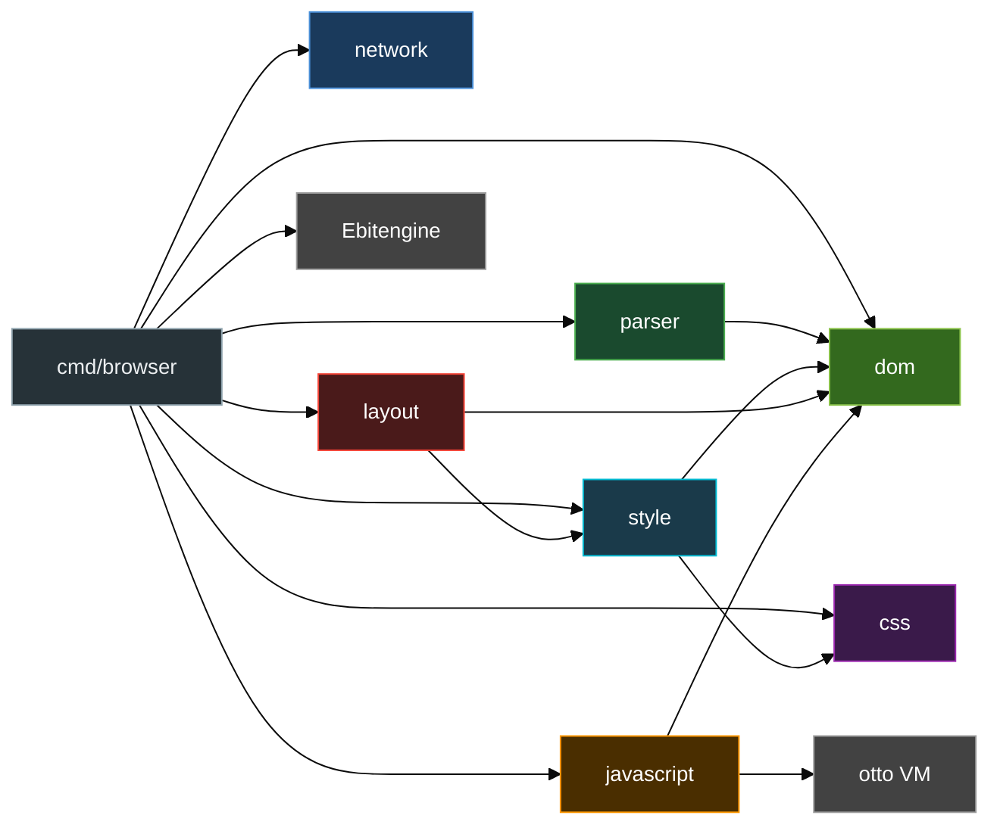
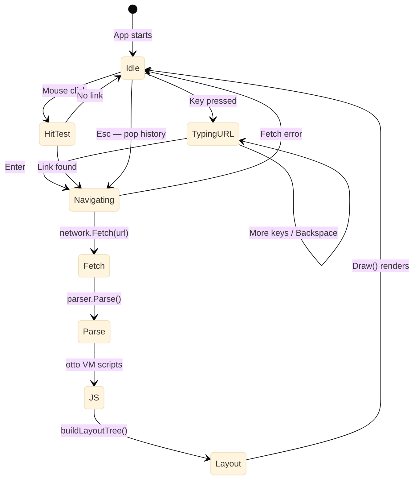
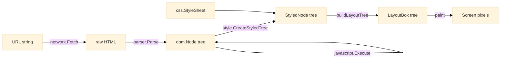
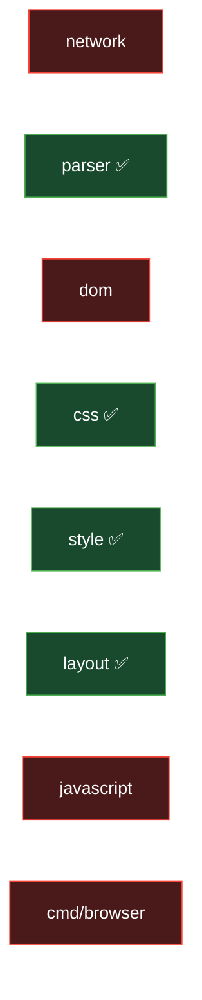

# Go Browser Engine — Built From Scratch

**Golang** | Systems Engineering | March 2026

A fully functional web browser engine implemented entirely in Go — from raw TCP socket to pixels on screen — with no use of `net/http` or any browser framework.

---

## What Is This?

Most developers use browsers daily but rarely look inside. This project tears down that abstraction: every layer of a real browser — network, parser, DOM, CSS, layout, JavaScript, and rendering — is built from scratch in Go and wired into a working desktop application powered by [Ebitengine](https://ebitengine.org/).

---

## The Full Pipeline

The engine is a sequential pipeline where each stage transforms its input into a richer representation consumed by the next.

```mermaid
%%{init: {'theme': 'base', 'themeVariables': {'fontSize': '15px'}}}%%
flowchart LR
    A([URL]) --> B["network\nTCP/TLS Fetch"]
    B -->|raw HTML| C["parser\nDOM Builder"]
    C -->|dom.Node tree| D["javascript\notto VM"]
    D -->|mutated DOM| E["css\nStyleSheet"]
    E --> F["style\nRule Matching"]
    F -->|StyledNode tree| G["layout\nBox Model"]
    G -->|LayoutBox tree| H["Ebitengine\nPaint"]
    H --> I([Screen])

    style B fill:#1a3a5c,color:#fff,stroke:#4a90d9
    style C fill:#1a4a2e,color:#fff,stroke:#4caf50
    style D fill:#4a2e00,color:#fff,stroke:#ff9800
    style E fill:#3a1a4a,color:#fff,stroke:#9c27b0
    style F fill:#1a3a4a,color:#fff,stroke:#00bcd4
    style G fill:#4a1a1a,color:#fff,stroke:#f44336
    style H fill:#2e2e1a,color:#fff,stroke:#cddc39
```



---

## Package Architecture

Eight self-contained packages with strictly top-down dependencies — no circular imports.

| Package | Responsibility |
|---|---|
| `internal/network` | Raw TCP/TLS HTTP client — fetches HTML without using `net/http` |
| `internal/parser` | Hand-written recursive-descent HTML tokenizer and DOM tree builder |
| `internal/dom` | DOM node types (Element, Text) — the shared data structure across all stages |
| `internal/css` | CSS rule and declaration model + CSS text parser |
| `internal/style` | Style resolution — matches CSS rules to DOM nodes, produces computed property maps |
| `internal/layout` | Block-level box model — computes X, Y, Width, Height for every element |
| `internal/javascript` | JavaScript runtime powered by the `otto` ES5 VM |
| `cmd/browser` | Main app — wires all subsystems, runs the Ebitengine window and paint loop |

### Package Dependency Graph



---

## Deep Dive: Key Engineering Decisions

### 1. Raw TCP/TLS Network Layer

The engine deliberately avoids Go's `net/http`. Instead, it opens raw sockets and constructs HTTP/1.1 requests manually.

- **HTTPS:** `tls.Dial` with full TLS handshake
- **HTTP:** `net.Dial` to a raw TCP socket
- **Chunked Transfer Encoding:** Manual hex-size loop using `io.ReadFull` — no standard library helpers
- **Result:** A deep understanding of exactly what happens before the first byte of HTML arrives

### 2. Recursive Descent HTML Parser

The parser is hand-written — no third-party HTML library.

- Reads the raw HTML string **one character at a time**
- Builds a live `*dom.Node` tree via recursive descent
- Handles nested elements, attributes, and text nodes
- Example transformation:

```
Input:  <h1 class="title">Hello</h1>

Output DOM:
  Node{ElementNode, TagName: "h1", Attr: {"class": "title"}}
    └── Node{TextNode, Text: "Hello"}
```

### 3. JavaScript Runs Before Layout

JavaScript execution is placed **between DOM parsing and CSS styling** — mirroring how real browsers work. Scripts can mutate the DOM tree before styles are computed and layout runs.

```
[parser] → *dom.Node → [javascript/otto VM] → mutated *dom.Node → [style] → [layout]
```

Current JS API surface:

| JS Global | Behaviour |
|---|---|
| `console.log(msg)` | Prints to stdout via `fmt.Printf` |
| `document.title` | Returns static string `"Go Browser Engine"` |

### 4. Block Box Model Layout Engine

Layout computes concrete `X`, `Y`, `Width`, `Height` float32 values for every element:

- **Block elements** (`h1`, `div`, `body`, `html`, `a`) → full width of containing block
- **Text nodes** → `len(text) × 9px` monospace approximation
- **Vertical stacking** → a `cursorY` accumulator positions children top-to-bottom
- **Link hit-testing** → `LinkURL` is propagated to all descendant boxes; a click anywhere inside finds the URL

### 5. Link Navigation with Hit-Testing

When the user clicks, the engine walks the entire `LayoutBox` tree and checks whether the click coordinates fall within any box that has a `LinkURL`. If found, that URL is fed back into the full pipeline — triggering a new network fetch → parse → layout → paint cycle.

---

## Interactive Flow Visualizer

<div class="flow-visualizer-container" data-nodes='["URL Input", "TCP/TLS Fetch", "DOM Parse", "JS Execute", "CSS Layout", "Paint Screen"]'>
    <div class="flow-nodes">
        <div class="flow-packet"></div>
    </div>
    <div class="flow-controls">
        <button class="md-button md-button--primary flow-btn trace-btn">Trace Request</button>
        <button class="md-button flow-btn reset-btn">Reset</button>
    </div>
</div>

---

## User Interaction Loop

`BrowserApp.Update()` runs at ~60 FPS. All user input is handled here.



### Controls

| Input | Action |
|---|---|
| Type in window | Edit the URL bar |
| `Backspace` | Delete last character |
| `Enter` | Navigate to typed URL |
| `Left Click` | Follow a hyperlink |
| `Mouse Wheel` | Scroll the page |
| `Esc` | Go back in history |

---

## Data Flow at a Glance



---

## What Works

| Layer | Implemented |
|---|---|
| **Network** | HTTP + HTTPS (raw TCP/TLS), chunked transfer decoding, plain body reads |
| **Parser** | Element nodes, text nodes, attribute parsing, nested trees, whitespace handling |
| **DOM** | Element & Text node types, constructor helpers, children API |
| **CSS** | Tag-name selectors, multi-selector rules, property declarations |
| **Style** | Tag-name rule matching, computed property maps, recursive tree styling |
| **Layout** | Block-level boxes, text-width estimation, vertical stacking, link min-height |
| **JavaScript** | Inline `<script>` execution (ES5 via otto), `console.log`, `document.title` |
| **Browser UX** | URL bar, navigation, click-to-follow links, back history (Esc), mouse-wheel scroll |

---

## Test Coverage

The project ships with **4 unit-test files** targeting the core transformation stages:



| Package | Test | What It Verifies |
|---|---|---|
| `internal/parser` | `TestParse` | Nested DOM tree built correctly from raw HTML |
| `internal/css` | `TestCSSParse` | Multi-selector rules and declarations parsed correctly |
| `internal/style` | `TestStyleMatching` | CSS rule correctly matched and applied to DOM node |
| `internal/layout` | `TestLayoutStacking` | Child boxes stacked vertically with correct Y offsets |

```bash
go test ./...        # Run all tests
go test -v ./...     # Verbose output
go test -race ./...  # Race detector
```

---

## Tech Stack

| Dependency | Purpose |
|---|---|
| [Ebitengine v2](https://ebitengine.org/) | 2D game engine used as the rendering + windowing backend |
| [otto](https://github.com/robertkrimen/otto) | Pure-Go JavaScript interpreter (ES5) |
| Go standard library (`net`, `crypto/tls`, `bufio`, `io`) | All networking, parsing, and I/O |

---

## Project Structure

```text
go-browser/
├── cmd/
│   └── browser/
│       └── main.go          # BrowserApp — navigation, Update/Draw loop
├── internal/
│   ├── network/
│   │   └── request.go       # Raw TCP/TLS HTTP fetcher
│   ├── parser/
│   │   └── html.go          # Recursive-descent HTML parser
│   ├── dom/
│   │   └── node.go          # DOM Node types (Element / Text)
│   ├── css/
│   │   ├── css.go           # StyleSheet / Rule / Declaration types
│   │   └── parser.go        # CSS text parser
│   ├── style/
│   │   └── style.go         # CSS rule matching → StyledNode tree
│   ├── layout/
│   │   └── layout.go        # Box model → LayoutBox tree (X/Y/W/H)
│   └── javascript/
│       └── runtime.go       # otto VM wrapper + console.log bindings
├── go.mod
└── go.sum
```

---

[← Back to Go Projects](../go-projects/){ .md-button }
