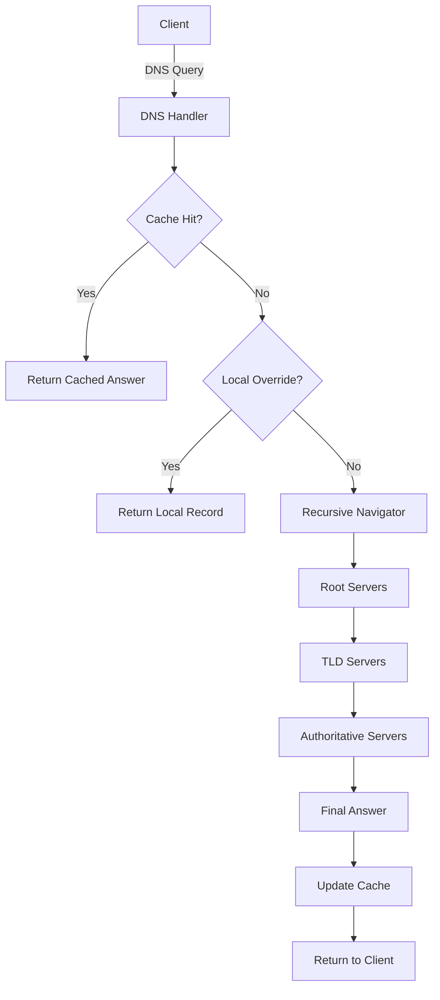

# Go-DNS-Server: Recursive & Authoritative DNS Resolver

A high-performance, recursive, and authoritative DNS server built from scratch in Go. This project implements the full resolution chain: **Root → TLD → Authoritative → Final Answer**.

Unlike typical DNS forwarders, this server does not depend on Google (8.8.8.8) or Cloudflare (1.1.1.1)—it performs true iterative resolution.

---

## Features

### 1. True Recursive Iterative Resolution
Instead of forwarding queries, the resolver starts at the Root Servers and walks the hierarchy. The resolver sets `RecursionDesired = false` so upstream servers treat it as a peer resolver.

### 2. Glue Record & Sub-Resolution Handling
When a DNS server refers to another nameserver without providing its IP, this resolver pauses the main query, resolves the nameserver hostname, and continues the original resolution.

### 3. High-Performance DNS Cache
- Implemented using `sync.Map`
- Thread-safe and TTL-aware
- Returns cached answers in ~0ms, preventing repeated upstream queries.

### 4. Authoritative Overrides (Local DNS)
Override any domain using `config.json` for local development, network-wide ad-blocking, or internal service routing.

### 5. Hot-Safe Concurrency
The server handles thousands of concurrent requests using goroutines. Thread safety is guaranteed using `sync.RWMutex` for config and `sync.Map` for caching.

---

## Architecture



---

## How Resolution Works

1. **Query Arrives:** The server receives a UDP packet.
2. **Check Cache/Local:** Fast-path for known or overridden records.
3. **Start at Root:** Begins at `A.ROOT-SERVERS.NET (198.41.0.4)`.
4. **Follow Referrals:** Iteratively queries TLDs and Authoritative servers.
5. **Handle Glue:** Resolves missing nameserver IPs on-the-fly.
6. **Store & Return:** Caches the final resource record and responds to the client.

---

## Project Structure

```text
cmd/
 └── server/
      └── main.go        # UDP listener, socket handling

internal/
 └── dns/
      ├── handler.go    # Query flow: Cache → Local → Resolve
      ├── resolver.go   # Iterative recursive engine
      ├── cache.go      # TTL-aware concurrent cache

config.json             # Local DNS overrides
```

---

## Built With

- **Go (Golang)**
- **golang.org/x/net/dns/dnsmessage** (DNS packet parsing)
- **sync package** (Thread-safe caching and concurrency)
