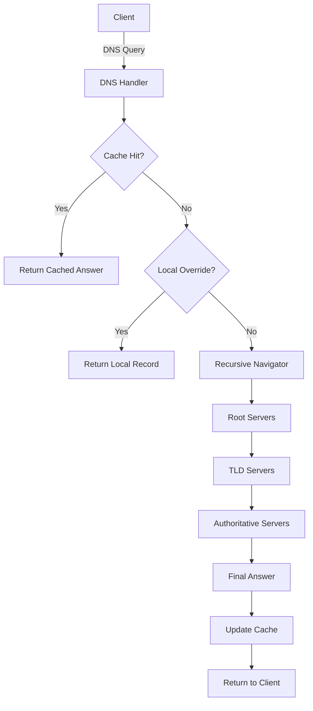

# Go-DNS-Server: Recursive & Authoritative DNS Resolver

A high-performance, recursive, and authoritative DNS server built from scratch in Go. This project implements the full resolution chain: **Root → TLD → Authoritative → Final Answer**.

Unlike typical DNS forwarders, this server does not depend on Google (8.8.8.8) or Cloudflare (1.1.1.1)—it performs true iterative resolution.

<a href="https://github.com/Jyotishmoy12/go-dns-server" class="github-link" target="_blank"><svg viewBox="0 0 16 16"><path d="M8 0C3.58 0 0 3.58 0 8c0 3.54 2.29 6.53 5.47 7.59.4.07.55-.17.55-.38 0-.19-.01-.82-.01-1.49-2.01.37-2.53-.49-2.69-.94-.09-.23-.48-.94-.82-1.13-.28-.15-.68-.52-.01-.53.63-.01 1.08.58 1.23.82.72 1.21 1.87.87 2.33.66.07-.52.28-.87.51-1.07-1.78-.2-3.64-.89-3.64-3.95 0-.87.31-1.59.82-2.15-.08-.2-.36-1.02.08-2.12 0 0 .67-.21 2.2.82.64-.18 1.32-.27 2-.27.68 0 1.36.09 2 .27 1.53-1.04 2.2-.82 2.2-.82.44 1.1.16 1.92.08 2.12.51.56.82 1.27.82 2.15 0 3.07-1.87 3.75-3.65 3.95.29.25.54.73.54 1.48 0 1.07-.01 1.93-.01 2.2 0 .21.15.46.55.38A8.013 8.013 0 0016 8c0-4.42-3.58-8-8-8z"/></svg>Source</a>

---

## Features

### 1. True Recursive Iterative Resolution
Instead of forwarding queries, the resolver starts at the Root Servers and walks the hierarchy. The resolver sets `RecursionDesired = false` so upstream servers treat it as a peer resolver.

### 2. Glue Record & Sub-Resolution Handling
When a DNS server refers to another nameserver without providing its IP, this resolver pauses the main query, resolves the nameserver hostname, and continues the original resolution.

### 3. High-Performance DNS Cache
- Implemented using `sync.Map`
- Thread-safe and TTL-aware
- Returns cached answers in ~0ms, preventing repeated upstream queries.

### 4. Authoritative Overrides (Local DNS)
Override any domain using `config.json` for local development, network-wide ad-blocking, or internal service routing.

### 5. Hot-Safe Concurrency
The server handles thousands of concurrent requests using goroutines. Thread safety is guaranteed using `sync.RWMutex` for config and `sync.Map` for caching.

## Interactive System Flow
<div class="flow-visualizer-container" data-nodes='["UDP Query", "Cache Hit?", "Root/TLD Iteration", "UDP Response"]'>
    <div class="flow-nodes">
        <div class="flow-packet"></div>
    </div>
    <div class="flow-controls">
        <button class="md-button md-button--primary flow-btn trace-btn">Trace Request</button>
        <button class="md-button flow-btn reset-btn">Reset</button>
    </div>
</div>

---

## Architecture



---

## How Resolution Works

1. **Query Arrives:** The server receives a UDP packet.
2. **Check Cache/Local:** Fast-path for known or overridden records.
3. **Start at Root:** Begins at `A.ROOT-SERVERS.NET (198.41.0.4)`.
4. **Follow Referrals:** Iteratively queries TLDs and Authoritative servers.
5. **Handle Glue:** Resolves missing nameserver IPs on-the-fly.
6. **Store & Return:** Caches the final resource record and responds to the client.

---

## Project Structure

```text
cmd/
 └── server/
      └── main.go        # UDP listener, socket handling

internal/
 └── dns/
      ├── handler.go    # Query flow: Cache → Local → Resolve
      ├── resolver.go   # Iterative recursive engine
      ├── cache.go      # TTL-aware concurrent cache

config.json             # Local DNS overrides
```

---

## Built With

- **Go (Golang)**
- **golang.org/x/net/dns/dnsmessage** (DNS packet parsing)
- **sync package** (Thread-safe caching and concurrency)
