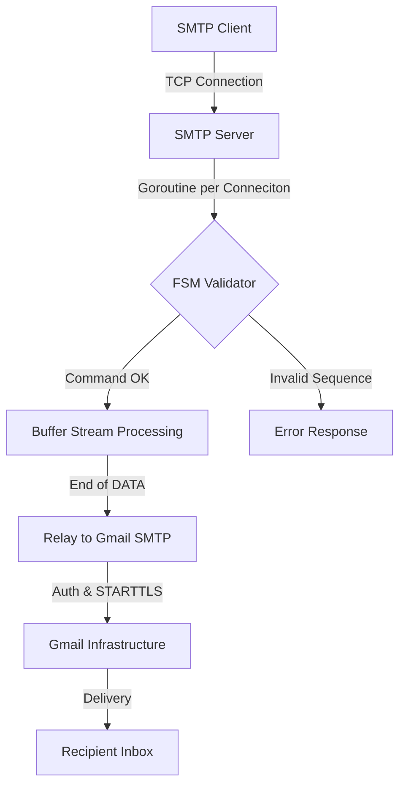

# Go-Based SMTP Relay Server

A custom-built SMTP (Simple Mail Transfer Protocol) server developed from scratch in Go to explore low-level TCP networking, state machine logic, and secure SMTP relaying.

<a href="https://github.com/Jyotishmoy12/SMTP_Server" class="github-link" target="_blank"><svg viewBox="0 0 16 16"><path d="M8 0C3.58 0 0 3.58 0 8c0 3.54 2.29 6.53 5.47 7.59.4.07.55-.17.55-.38 0-.19-.01-.82-.01-1.49-2.01.37-2.53-.49-2.69-.94-.09-.23-.48-.94-.82-1.13-.28-.15-.68-.52-.01-.53.63-.01 1.08.58 1.23.82.72 1.21 1.87.87 2.33.66.07-.52.28-.87.51-1.07-1.78-.2-3.64-.89-3.64-3.95 0-.87.31-1.59.82-2.15-.08-.2-.36-1.02.08-2.12 0 0 .67-.21 2.2.82.64-.18 1.32-.27 2-.27.68 0 1.36.09 2 .27 1.53-1.04 2.2-.82 2.2-.82.44 1.1.16 1.92.08 2.12.51.56.82 1.27.82 2.15 0 3.07-1.87 3.75-3.65 3.95.29.25.54.73.54 1.48 0 1.07-.01 1.93-.01 2.2 0 .21.15.46.55.38A8.013 8.013 0 0016 8c0-4.42-3.58-8-8-8z"/></svg>Source</a>

---

## Project Overview

The server acts as a **Mail Transfer Agent (MTA)**. It listens for local TCP connections, parses raw SMTP commands, maintains a stateful session, and relays the received data to a real-world inbox using Gmail's infrastructure.

---

## Engineering & System Design

### 1. Stateful Protocol Management (Finite State Machine)

SMTP is fundamentally stateful, requiring the server to remember the current context to validate incoming commands.

- **Pattern Used:** Finite State Machine (FSM)
- **Initial State:** The server starts in an `INIT` state waiting for a handshake.
- **Transitions:** It only allows transitions to `MAIL` after a successful `HELO`.
- **Security:** This validates the sequence of all incoming TCP packets to prevent protocol violations.

### 2. Concurrency: Per-Connection Goroutines

The server leverages Go's lightweight thread model to handle multiple sessions simultaneously.

- **Non-blocking I/O:** When `Accept()` receives a TCP connection, it hands off the socket to a new goroutine.
- **Isolation:** This ensures that a slow relay process to Gmail does not block other local clients from connecting.

### 3. Buffer-Oriented Stream Processing

Instead of waiting for an entire email to arrive, the server processes a continuous byte stream.

- **Stream Scanning:** Uses `bufio.NewScanner` to split input at `\r\n` (CRLF).
- **Memory Management:** During the `DATA` phase, it utilizes `strings.Builder` to accumulate message data efficiently, avoiding repeated string reallocation.

## Interactive System Flow

    

        

    

    

        <button class="md-button md-button--primary flow-btn trace-btn">Trace Request</button>
        <button class="md-button flow-btn reset-btn">Reset</button>
    

---

## Technical Specifications

### Network Configuration

| Setting | Value |
| --- | --- |
| **Port** | 2525 (Bypasses ISP restrictions on Port 25) |
| **Host** | 127.0.0.1 (Localhost) |
| **Protocol** | TCP |
| **Security** | STARTTLS via Go's `net/smtp` for Gmail relay |

### Supported SMTP Commands (RFC 5321)

| Command | Purpose | Technical Trigger |
| --- | --- | --- |
| **HELO / EHLO** | Client Identification | Moves FSM to `StateMailFrom`; resets session data. |
| **MAIL FROM:** | Specify Sender | Identifies the "Envelope Sender". Transitions to `StateRcptTo`. |
| **RCPT TO:** | Specify Recipient | Appends email address to the recipient slice. |
| **DATA** | Initialize Payload | Switches to `StateData`; sends `354` code. |
| **. (Single Dot)** | End-of-Message | Triggers the `relayToGmail` function to begin relay. |
| **QUIT** | Terminate Session | Sends `221` and closes the TCP socket. |

---

## Project Architecture

---

## Built With

- **Go (Golang)**
- **net package** (TCP Sockets)
- **net/smtp** (Relay client)
- **bufio & strings** (Stream processing)
