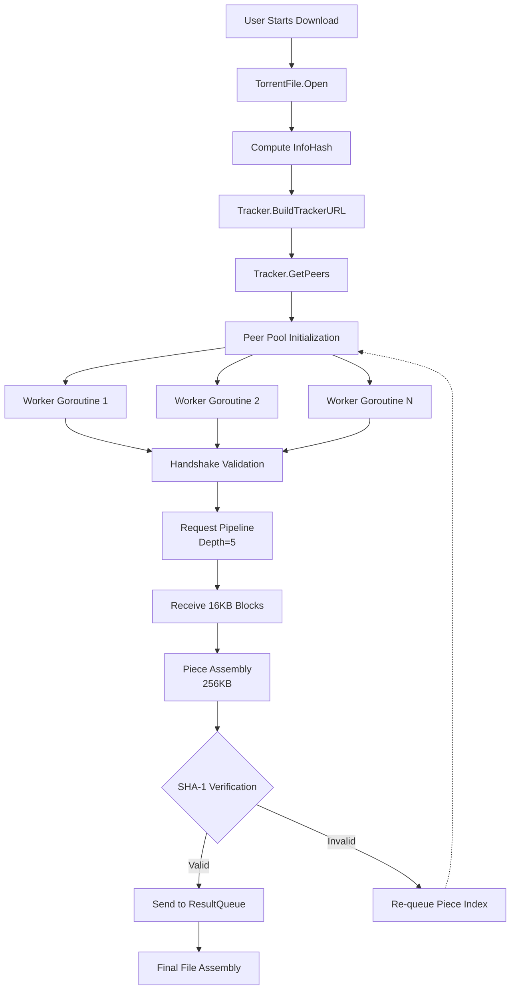

# Go-Torrent

**Golang** | Feb 2026

A BitTorrent v1.0 engine built from scratch to maximize download throughput and handle network volatility.

### Torrent Download Flow

### Key Highlights
- **Engineered Request Pipelining**: Configured a depth of 5 to overcome network RTT and maximize download throughput.
- **Stateless Workers**: Designed workers with automatic piece re-queuing on connection reset or SHA-1 hash mismatch.
- **Race-Free Concurrency**: Used goroutines and thread-safe channels for zero-race peer management.
- **Binary Protocol Handling**: Managed Big-Endian communication with peers smoothly.

### Bencode Parsing
- Implemented a reflection-based Bencode parser using Go struct tags to map binary keys to Go types in a single pass.

### Worker Pool Architecture
- Built a non-blocking worker pool to solve the "slow peer problem" where slow connections bottleneck the entire download.

## Interactive System Flow

    

        

    

    

        <button class="md-button md-button--primary flow-btn trace-btn">Trace Request</button>
        <button class="md-button flow-btn reset-btn">Reset</button>
    

