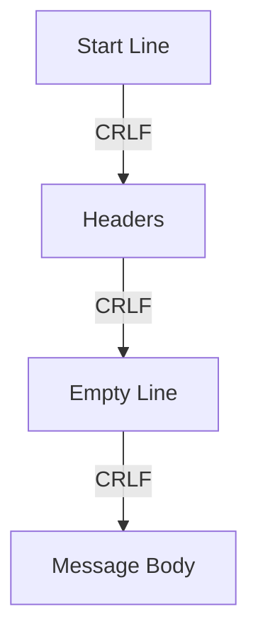

# HTTP Message Structure

HTTP works because plain text is treated as binary data. Since HTTP runs over TCP, requests or responses too large for a single TCP packet can be broken into multiple packets and reassembled in the correct order. TCP guarantees data integrity and order.

At the heart of HTTP is the **HTTP message**: the format used by HTTP requests and responses.

From [RFC 9112, Section 2.1](https://www.rfc-editor.org/rfc/rfc9112#section-2.1):

```text
start-line CRLF
*( field-line CRLF )
CRLF
[ message-body ]
```

### Visual Structure



---

## HTTP Message Breakdown

| Part                   | Example                          | Description                                                         |
| ---------------------- | -------------------------------- | ------------------------------------------------------------------- |
| **start-line CRLF**    | `POST /users/primeagen HTTP/1.1` | The request line (for requests) or the status line (for responses). |
| ***(field-line CRLF)** | `Host: google.com`               | Zero or more lines of HTTP headers (key-value pairs).               |
| **CRLF**               | *(blank line)*                   | Separates headers from the body.                                    |
| **[message-body]**     | `{"name": "TheHTTPagen"}`        | The body of the message (optional).                                 |

Both **HTTP requests** and **HTTP responses** follow this same format. Only the contents of each section differ.

---

## CRLF Explained

* **CRLF = Carriage Return + Line Feed (`\r\n`)**
* ASCII values: `CR = 13`, `LF = 10`
* Required in HTTP to mark the end of each line.
* A **blank CRLF** separates headers from the body.

Example (with `\r\n` shown explicitly):

```text
GET /goodies HTTP/1.1\r\n
Host: localhost:42069\r\n
User-Agent: curl/7.81.0\r\n
Accept: */*\r\n
\r\n
```

---

## Examples

### GET Request

| Part              | Example                                                                 |
| ----------------- | ----------------------------------------------------------------------- |
| **start-line**    | `GET /goodies HTTP/1.1`                                                 |
| **field-line(s)** | `Host: localhost:42069` <br>`User-Agent: curl/7.81.0` <br>`Accept: */*` |
| **CRLF**          | *(blank line)*                                                          |
| **message-body**  | *(empty)*                                                               |

---

### POST Request

| Part              | Example                                                                                                                              |
| ----------------- | ------------------------------------------------------------------------------------------------------------------------------------ |
| **start-line**    | `POST /coffee HTTP/1.1`                                                                                                              |
| **field-line(s)** | `Host: localhost:42069` <br>`User-Agent: curl/8.6.0` <br>`Accept: */*` <br>`Content-Type: application/json` <br>`Content-Length: 22` |
| **CRLF**          | *(blank line)*                                                                                                                       |
| **message-body**  | `{"flavor":"dark mode"}`                                                                                                             |

---

## cURL

[`curl`](https://curl.se/) is a command-line tool for making HTTP requests. It lets you easily inspect and send raw HTTP messages like the ones we’ve seen above.

Here are the raw HTTP requests that `curl` sent to our `tcplistener` program:

### cURL GET Example

```http
GET /goodies HTTP/1.1       # start-line CRLF
Host: localhost:42069       # *( field-line CRLF )
User-Agent: curl/7.81.0     # *( field-line CRLF )
Accept: */*                 # *( field-line CRLF )
                            # CRLF
                            # [ message-body ] (empty)
```

### cURL POST Example

```http
POST /coffee HTTP/1.1            # start-line CRLF
Host: localhost:42069            # *( field-line CRLF )
User-Agent: curl/8.6.0           # *( field-line CRLF )
Accept: */*                      # *( field-line CRLF )
Content-Type: application/json   # *( field-line CRLF )
Content-Length: 22               # *( field-line CRLF )
                                 # CRLF
{"flavor":"dark mode"}          # [ message-body ]
```

As annotated above, there are really just **four parts** to an HTTP message:

```text
start-line CRLF
*( field-line CRLF )
CRLF
[ message-body ]
```

---

## The Request-Line

When the **start-line** belongs to a request, it’s called the **request-line**.

According to RFC:

```text
HTTP-version  = HTTP-name "/" DIGIT "." DIGIT
HTTP-name     = %s"HTTP"
request-line  = method SP request-target SP HTTP-version
```

Breaking this down:

* **method** → The HTTP method (e.g., `GET`, `POST`, `PUT`, `DELETE`).
* **SP** → A single space.
* **request-target** → The path or resource being requested (e.g., `/coffee`).
* **HTTP-version** → The protocol version (e.g., `HTTP/1.1`).

### Example Request-Line

```text
GET /coffee HTTP/1.1
```

This means:

* Use the **GET** method.
* Target the resource `/coffee`.
* Communicate using **HTTP/1.1**.

---

## Headers (Field-Lines)

The RFC doesn’t actually call them “headers.” Instead, it uses the term **field-line**, but in practice they mean the same thing.

From **RFC 9110, Section 5 – Field Syntax**:

```text
field-line   = field-name ":" OWS field-value OWS
```

* **field-name** → Case-insensitive header name (e.g., `Host`, `User-Agent`).
* **:** → Must directly follow the field-name (no spaces before the colon).
* **OWS (Optional Whitespace)** → Allowed before and after the field-value.
* **field-value** → The actual value of the header.

### Valid Examples

```text
Host: localhost:42069
          Host: localhost:42069    
```

### Invalid Example

```text
Host : localhost:42069
```

Important:

* Unlimited whitespace is allowed before/after the **value**.
* No whitespace is allowed between the **field-name** and the colon.

---

### Ideal HTTP format

```text
Request line:
- Method: METHOD
- Target: TARGET
- Version: VERSION
Headers:
- KEY: VALUE
- KEY: VALUE
Body:
BODY_STRING
```
