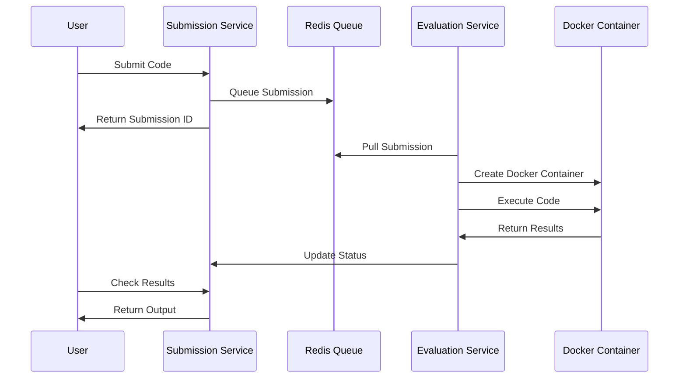

# LeetCode Backend System

> A production-ready, backend coding platform that enables users to solve algorithmic problems with real-time code evaluation across multiple programming languages.

**ExpressJs, TypeScript, NodeJs, MongoDB, Redis, Docker** | Sep 2025

| Service | Architecture | Scale |
| :--- | :--- | :--- |
| **Microservices** | 3 Core Services | Python & C++ Supported |

---

## Overview

Leetcode is a scalable, microservices-based coding platform backend. It features secure code execution in isolated Docker containers, real-time evaluation, and comprehensive problem management capabilities.

### Key Highlights
- **Secure Execution**: Code runs in isolated Docker containers with strict resource limits (10 PIDs, 50% CPU quota, `NetworkMode: none`).
- **Real-time Processing**: Asynchronous evaluation pipeline using Redis and BullMQ to decouple submissions from execution.
- **Multi-language Support**: Python (2s timeout) and C++ (1s timeout).
- **Comprehensive Results**: Detailed test case evaluation (AC, WA, TLE).

## Interactive System Flow

    

        

    

    

        <button class="md-button md-button--primary flow-btn trace-btn">Trace Request</button>
        <button class="md-button flow-btn reset-btn">Reset</button>
    

## System Architecture

The system consists of three core microservices working in harmony:
1. **Problem Service**: Handles Problem CRUD operations, search, and filtering.
2. **Submission Service**: Manages code submissions and the Redis evaluation queue.
3. **Evaluation Service**: Acts as a background worker, creating Docker containers to execute code and process results.

### Evaluation Pipeline

## Features

### Problem Management
- **CRUD Operations**: Complete problem lifecycle management
- **Difficulty Levels**: Easy, Medium, Hard categorization
- **Rich Descriptions**: Full Markdown support for problem statements
- **Custom Test Cases**: Flexible input/output validation

### Code Execution Engine
- **Multi-language Support**: 
  - **Python**: 2-second timeout
  - **C++**: 1-second timeout
- **Secure Isolation**: Docker containerization with resource limits
- **Real-time Processing**: Asynchronous evaluation pipeline

### Infrastructure
- **Microservices Architecture**: Independently scalable services
- **Message Queuing**: Redis with BullMQ for reliable job processing
- **Container Management**: Automated Docker lifecycle management
- **Observability**: Winston logging with correlation tracking
