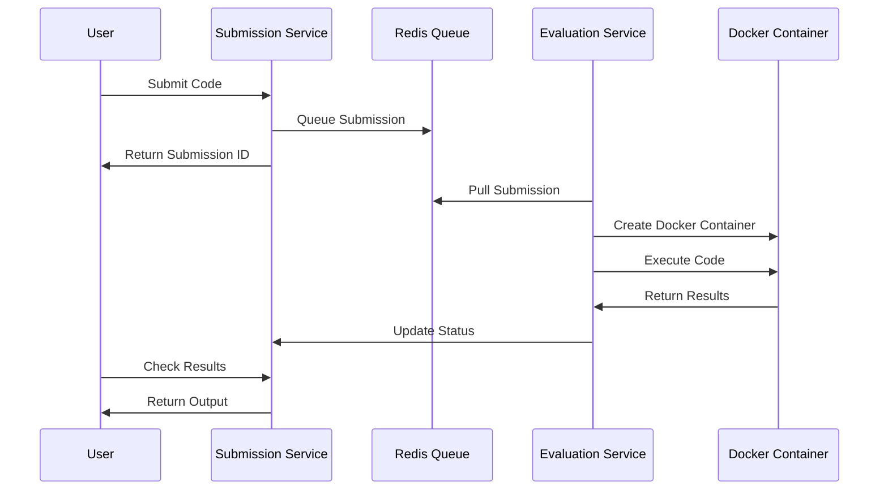

# LeetCode Backend System

> A production-ready, backend coding platform that enables users to solve algorithmic problems with real-time code evaluation across multiple programming languages.

**ExpressJs, TypeScript, NodeJs, MongoDB, Redis, Docker** | Sep 2025

<a href="https://github.com/Jyotishmoy12/Leetcode-backend-problem-service" class="github-link" target="_blank"><svg viewBox="0 0 16 16"><path d="M8 0C3.58 0 0 3.58 0 8c0 3.54 2.29 6.53 5.47 7.59.4.07.55-.17.55-.38 0-.19-.01-.82-.01-1.49-2.01.37-2.53-.49-2.69-.94-.09-.23-.48-.94-.82-1.13-.28-.15-.68-.52-.01-.53.63-.01 1.08.58 1.23.82.72 1.21 1.87.87 2.33.66.07-.52.28-.87.51-1.07-1.78-.2-3.64-.89-3.64-3.95 0-.87.31-1.59.82-2.15-.08-.2-.36-1.02.08-2.12 0 0 .67-.21 2.2.82.64-.18 1.32-.27 2-.27.68 0 1.36.09 2 .27 1.53-1.04 2.2-.82 2.2-.82.44 1.1.16 1.92.08 2.12.51.56.82 1.27.82 2.15 0 3.07-1.87 3.75-3.65 3.95.29.25.54.73.54 1.48 0 1.07-.01 1.93-.01 2.2 0 .21.15.46.55.38A8.013 8.013 0 0016 8c0-4.42-3.58-8-8-8z"/></svg>Problem</a>
<a href="https://github.com/Jyotishmoy12/Leetcode-backend-submission-service" class="github-link" target="_blank"><svg viewBox="0 0 16 16"><path d="M8 0C3.58 0 0 3.58 0 8c0 3.54 2.29 6.53 5.47 7.59.4.07.55-.17.55-.38 0-.19-.01-.82-.01-1.49-2.01.37-2.53-.49-2.69-.94-.09-.23-.48-.94-.82-1.13-.28-.15-.68-.52-.01-.53.63-.01 1.08.58 1.23.82.72 1.21 1.87.87 2.33.66.07-.52.28-.87.51-1.07-1.78-.2-3.64-.89-3.64-3.95 0-.87.31-1.59.82-2.15-.08-.2-.36-1.02.08-2.12 0 0 .67-.21 2.2.82.64-.18 1.32-.27 2-.27.68 0 1.36.09 2 .27 1.53-1.04 2.2-.82 2.2-.82.44 1.1.16 1.92.08 2.12.51.56.82 1.27.82 2.15 0 3.07-1.87 3.75-3.65 3.95.29.25.54.73.54 1.48 0 1.07-.01 1.93-.01 2.2 0 .21.15.46.55.38A8.013 8.013 0 0016 8c0-4.42-3.58-8-8-8z"/></svg>Submission</a>
<a href="https://github.com/Jyotishmoy12/Leetcode-backend-evaluation-service" class="github-link" target="_blank"><svg viewBox="0 0 16 16"><path d="M8 0C3.58 0 0 3.58 0 8c0 3.54 2.29 6.53 5.47 7.59.4.07.55-.17.55-.38 0-.19-.01-.82-.01-1.49-2.01.37-2.53-.49-2.69-.94-.09-.23-.48-.94-.82-1.13-.28-.15-.68-.52-.01-.53.63-.01 1.08.58 1.23.82.72 1.21 1.87.87 2.33.66.07-.52.28-.87.51-1.07-1.78-.2-3.64-.89-3.64-3.95 0-.87.31-1.59.82-2.15-.08-.2-.36-1.02.08-2.12 0 0 .67-.21 2.2.82.64-.18 1.32-.27 2-.27.68 0 1.36.09 2 .27 1.53-1.04 2.2-.82 2.2-.82.44 1.1.16 1.92.08 2.12.51.56.82 1.27.82 2.15 0 3.07-1.87 3.75-3.65 3.95.29.25.54.73.54 1.48 0 1.07-.01 1.93-.01 2.2 0 .21.15.46.55.38A8.013 8.013 0 0016 8c0-4.42-3.58-8-8-8z"/></svg>Evaluation</a>

| Service | Architecture | Scale |
| :--- | :--- | :--- |
| **Microservices** | 3 Core Services | Python & C++ Supported |

---

## Overview

Leetcode is a scalable, microservices-based coding platform backend. It features secure code execution in isolated Docker containers, real-time evaluation, and comprehensive problem management capabilities.

### Key Highlights
- **Secure Execution**: Code runs in isolated Docker containers with strict resource limits (10 PIDs, 50% CPU quota, `NetworkMode: none`).
- **Real-time Processing**: Asynchronous evaluation pipeline using Redis and BullMQ to decouple submissions from execution.
- **Multi-language Support**: Python (2s timeout) and C++ (1s timeout).
- **Comprehensive Results**: Detailed test case evaluation (AC, WA, TLE).

## Interactive System Flow

    

        

    

    

        <button class="md-button md-button--primary flow-btn trace-btn">Trace Request</button>
        <button class="md-button flow-btn reset-btn">Reset</button>
    

## System Architecture

The system consists of three core microservices working in harmony:
1. **Problem Service**: Handles Problem CRUD operations, search, and filtering.
2. **Submission Service**: Manages code submissions and the Redis evaluation queue.
3. **Evaluation Service**: Acts as a background worker, creating Docker containers to execute code and process results.

### Evaluation Pipeline

## Features

### Problem Management
- **CRUD Operations**: Complete problem lifecycle management
- **Difficulty Levels**: Easy, Medium, Hard categorization
- **Rich Descriptions**: Full Markdown support for problem statements
- **Custom Test Cases**: Flexible input/output validation

### Code Execution Engine
- **Multi-language Support**: 
  - **Python**: 2-second timeout
  - **C++**: 1-second timeout
- **Secure Isolation**: Docker containerization with resource limits
- **Real-time Processing**: Asynchronous evaluation pipeline

### Infrastructure
- **Microservices Architecture**: Independently scalable services
- **Message Queuing**: Redis with BullMQ for reliable job processing
- **Container Management**: Automated Docker lifecycle management
- **Observability**: Winston logging with correlation tracking
