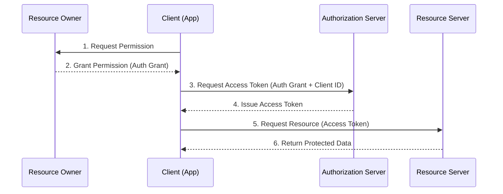

# The Magic of OAuth 2.0: Transforming Authentication & Authorization

OAuth 2.0, which stands for “Open Authorization”, is a standard designed to allow a website or application to access resources hosted by other web apps on behalf of a user.

> [!IMPORTANT]
> OAuth 2.0 is an **authorization** protocol and NOT an authentication protocol. It is designed primarily as a means of granting access to a set of resources, such as remote APIs or user data.

---

## Why OAuth 2.0?

Before OAuth (introduced in 2007), sharing data between apps was risky. Users often had to share their actual passwords with third-party apps, leading to security breaches and no easy way to revoke permissions. OAuth fixed this by using secure, limited-access **tokens**, giving users precise control and the ability to revoke access at any time.

---

## Core Roles in OAuth 2.0

1.  **Resource Owner**: The user who owns the data and can grant access to it.
2.  **Client**: The application requesting access to the user's account.
3.  **Authorization Server**: Verifies the user's identity and issues access tokens.
4.  **Resource Server**: Hosts the protected user resources/data.

---

## The Abstract OAuth 2.0 Flow

### Flow Breakdown:
- **Step 1-2**: The app asks the user for permission. If the user agrees, the app receives an **Authorization Grant**.
- **Step 3-4**: The app trades the grant and its own identity for a **Secret Access Token**.
- **Step 5-6**: The app uses the token to fetch data from the resource server.

---

## Grant Types

Different scenarios require different "flows" or grants:

-   **Authorization Code Grant**: The most common flow. Uses a single-use code exchanged for an access token (Server-side apps).
-   **Implicit Grant**: A simplified flow where the token is returned directly (Legacy SPAs).
-   **Resource Owner Credentials**: Requires the user to provide their password directly to the client (Only for trusted apps).
-   **Device Code Grant**: For input-constrained devices like Smart TVs.
-   **Refresh Token Grant**: Allows the app to get a new access token without re-prompting the user once the old one expires.

---

## Summary of Benefits

-   **Security**: No password sharing with third parties.
-   **Granularity**: Scopes allow apps to request only the specific data they need.
-   **Revocability**: Users can cancel an app's access without changing their main password.

OAuth 2.0 powers the "Login with Google", "Connect GitHub", and "Link Spotify" experiences we use every day.
