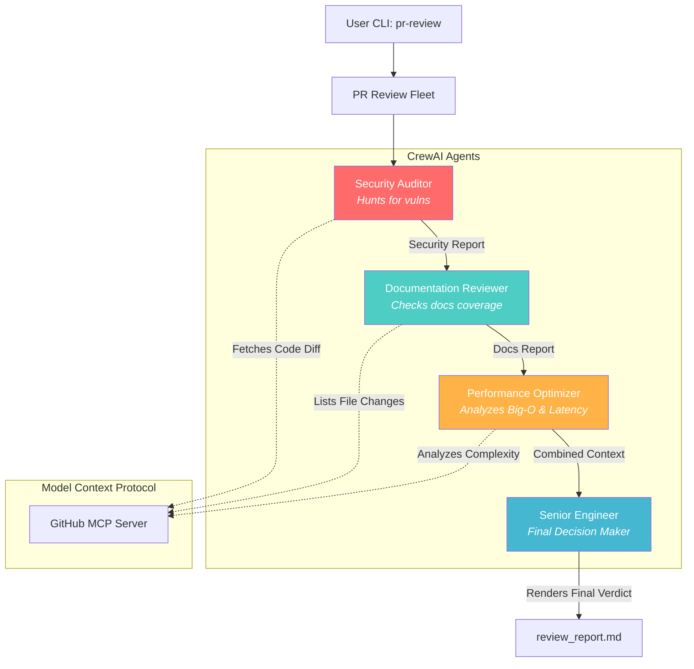

# Observer: AI-Powered PR Review Fleet

> **A squad of specialized AI agents that collaboratively audit GitHub Pull Requests for security vulnerabilities, documentation quality, and overall code health.**

**CrewAI, GitHub MCP, OpenAI, Python, Pydantic** | Apr 2026

<div class="github-links">
<a href="https://github.com/Jyotishmoy12/Observer" class="github-link" target="_blank"><svg viewBox="0 0 16 16"><path d="M8 0C3.58 0 0 3.58 0 8c0 3.54 2.29 6.53 5.47 7.59.4.07.55-.17.55-.38 0-.19-.01-.82-.01-1.49-2.01.37-2.53-.49-2.69-.94-.09-.23-.48-.94-.82-1.13-.28-.15-.68-.52-.01-.53.63-.01 1.08.58 1.23.82.72 1.21 1.87.87 2.33.66.07-.52.28-.87.51-1.07-1.78-.2-3.64-.89-3.64-3.95 0-.87.31-1.59.82-2.15-.08-.2-.36-1.02.08-2.12 0 0 .67-.21 2.2.82.64-.18 1.32-.27 2-.27.68 0 1.36.09 2 .27 1.53-1.04 2.2-.82 2.2-.82.44 1.1.16 1.92.08 2.12.51.56.82 1.27.82 2.15 0 3.07-1.87 3.75-3.65 3.95.29.25.54.73.54 1.48 0 1.07-.01 1.93-.01 2.2 0 .21.15.46.55.38A8.013 8.013 0 0016 8c0-4.42-3.58-8-8-8z"/></svg>Source</a>
</div>

---

## Overview

Observer is a multi-agent system designed to replace manual, error-prone pull request reviews with a rigorous, automated audit. By fusing **CrewAI**'s orchestration with the **Model Context Protocol (MCP)**, Observer provides agents with standardized, secure access to GitHub data, allowing them to hunt for vulnerabilities, inspect documentation, and optimize performance in parallel.

### The Agent Fleet

| Agent | Role | Focus Area |
|-------|------|-------------|
| **Security Auditor** | Vulnerability Analyst | Memory leaks, thread safety, injection vectors, and logic flaws. |
| **Docs Reviewer** | Quality Inspector | README updates, docstrings, API coverage, and changelog entries. |
| **Performance Ops** | Staff Engineer | Big-O inefficiencies, database N+1 loops, and sub-optimal latency. |
| **Senior Engineer** | Decision Maker | Consolidates all reports into a final merge verdict (APPROVE/REJECT). |

---

## System Architecture



---

## How It Works: Under the Hood

### 1. Multi-Agent Orchestration (CrewAI)
Observer utilizes a **Sequential Process** via CrewAI. Instead of a single "all-knowing" LLM, the system decomposes the review into isolated tasks. Each agent is given a strict "Backstory" (e.g., *a legendary compiler engineer*), which reduces hallucinations and ensures professional-grade analysis.

### 2. Standardized Tooling (MCP)
LLMs cannot natively browse codebases. Observer implements the **Model Context Protocol (MCP)** to solve this. It spawns an official GitHub MCP server as a background subprocess, providing the agents with standardized tools like `get_pull_request_diff` and `list_commits` via a secure `Stdio` interface.

### 3. Structured Data Lifecycle (Pydantic)
To ensure reliable communication between agents, all outputs are validated using **Pydantic** schemas.
- **Security Task**: Maps findings into `SecurityFinding` objects (severity, line range, suggestion).
- **Senior Engineer Task**: Receives a unified context and renders the final Markdown report based on structured data from previous steps.

---

## Security Architecture

Observer is designed with a **Security-First** mindset:
- **Token Isolation**: The GitHub API subprocess is quarantined, preventing it from accessing other environment keys (like OpenAI or AWS).
- **Read-Only Tools**: The system explicitly strips "dangerous" tools (like `delete_branch`), ensuring agents can only inspect the codebase, never modify it.
- **Local Processing**: Raw code is handled locally; reports are generated directly on the user's machine in the `output/` folder.

---

## Sample Review Verdict

The fleet generates high-fidelity reports like the example below:

```markdown
## PR Review Verdict: REQUEST_CHANGES (Confidence: 85%)

### Security Assessment (Risk: 7/10)
- **CRITICAL**: Potential Buffer overflow in `handle_connection()` at line 42.
- **HIGH**: Use of `strcpy` without bounds checking in `parse_header()`.

### Blocking Issues
1. Replace `strcpy` with `strncpy` in header parser.
2. Add input sanitization for connection handler.
```

---

[Back to Projects Hub](projects.md){ .md-button }
