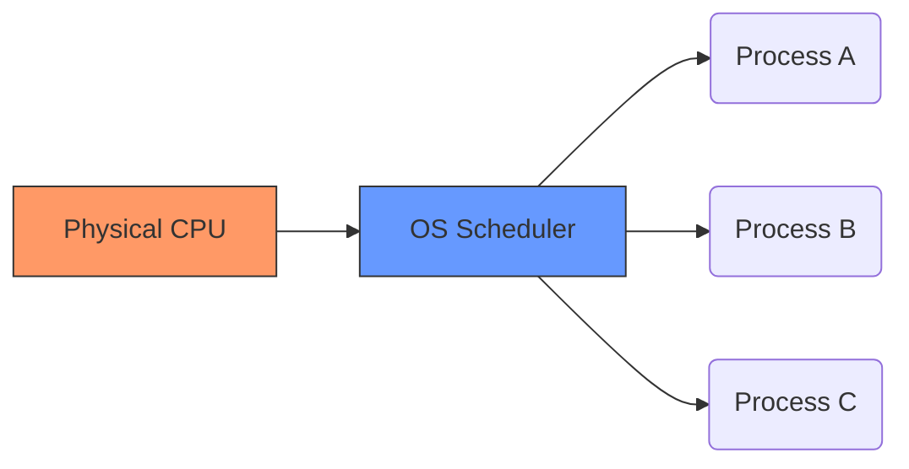
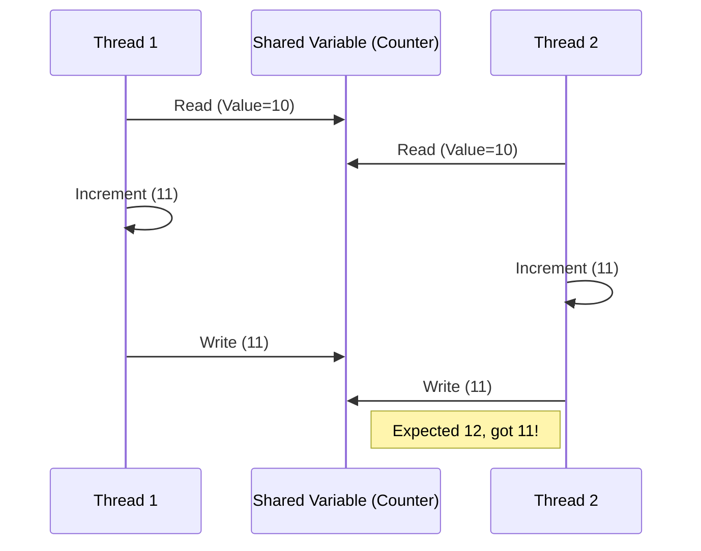

# Operating Systems: Three Easy Pieces (The Introduction)

> "An operating system (OS) is what transforms physical resources into easy-to-use virtual abstractions."

---

## 1. What is an Operating System?

Think of the OS as a **Resource Manager**. Its primary job is to manage physical resources (CPU, Memory, Disk) and provide a clean API to users.

### The Two Faces of an OS:
1.  **The Provider of Abstractions:** It takes complex hardware and turns it into simple abstractions like *processes*, *address spaces*, and *files*.
2.  **The Resource Manager:** It decides which process gets the CPU, how much memory each gets, and who can access the disk.

---

## 2. Pillar 1: Virtualization (The Illusion)

Virtualization is the process where the OS takes a physical resource and transforms it into a more general, powerful, and easy-to-use virtual form.

### A. CPU Virtualization (Time-Sharing)
The OS creates the illusion that each program has its own dedicated CPU.
-   **Mechanism:** The OS runs one program, stops it, and runs another. This is called **Time-Sharing**.

#### Code Demonstration: `cpu.c`
This program loops and prints a string passed as an argument.

```c
#include <stdio.h>
#include <stdlib.h>
#include "common.h"

int main(int argc, char *argv[]) {
    if (argc != 2) {
        fprintf(stderr, "usage: cpu <string>\n");
        exit(1);
    }
    char *str = argv[1];
    while (1) {
        Spin(1); // busy-wait for 1 second
        printf("%s\n", str);
    }
    return 0;
}
```

**The Magic:** If you run multiple instances (e.g., `./cpu A & ./cpu B`), the OS transparently switches the physical CPU between them, making them appear to run simultaneously.



### B. Memory Virtualization (Address Spaces)
The OS provides each process with a private **Virtual Address Space**.

#### Code Demonstration: `mem.c`
```c
#include <stdio.h>
#include <stdlib.h>
#include <unistd.h>
#include <assert.h>
#include "common.h"

int main(int argc, char *argv[]) {
    int *p = malloc(sizeof(int));
    assert(p != NULL);
    printf("(%d) address pointed to by p: %p\n", getpid(), p);
    *p = 0;
    while (1) {
        Spin(1);
        *p = *p + 1;
        printf("(%d) p: %d\n", getpid(), *p);
    }
    return 0;
}
```

**The Observation:** In `mem.c`, two processes can use the **same pointer address** (e.g., `0x1000`) but store different data. This is because the OS maps these "virtual" addresses to different physical locations in RAM, ensuring total isolation.

---

## 3. Pillar 2: Concurrency (The Shared Reality)

While virtualization isolates processes, **Concurrency** deals with multiple things happening at once within a single program (using **Threads**).

### The "Race Condition" Problem
When multiple threads share the same memory, they can interfere with each other during read-modify-write operations.



**OS Role:** The OS provides synchronization primitives (Locks, Semaphores) to ensure threads coordinate correctly.

---

## 4. Pillar 3: Persistence (The Long Term)

Unlike CPU and Memory (volatile), data in the **File System** must survive crashes and power loss.

### How the OS manages storage:
-   **Abstractions:** Instead of "sectors on a disk," the OS gives you **Files** and **Directories**.
-   **Reliability:** The OS uses techniques like *Journaling* to ensure that if the power fails mid-write, the file system remains consistent.

---

## 5. System Calls: The Gateway to the OS

Programs don't just "access" hardware. They must ask the OS for permission via **System Calls**.

| Action | Standard Library Call | Underlying System Call |
| :--- | :--- | :--- |
| Writing to Screen | `printf()` | `write()` |
| Allocating Memory | `malloc()` | `brk()` or `mmap()` |
| Opening a File | `fopen()` | `open()` |

### Protection: User vs. Kernel Mode
-   **User Mode:** Applications run here. They have restricted access to hardware.
-   **Kernel Mode:** The OS runs here. It has full access to the machine.
-   **The Transition:** A system call triggers a **trap** to the kernel, switching the processor from user mode to kernel mode.

---

## 6. OS Design Goals

When building an OS, engineers balance these competing goals:

1.  **Abstractions:** Make the system easy to use.
2.  **Performance:** Minimize the "overhead" (extra CPU cycles/memory) the OS uses.
3.  **Protection:** Ensure one program can't crash another or the OS itself.
4.  **Reliability:** The OS must run 24/7 without crashing.

---

## Historical Perspective: The Evolution

| Era | Focus |
| :--- | :--- |
| **Early Days** | Simple libraries; one program at a time. |
| **Batch Processing** | Running a sequence of jobs from a "batch." |
| **Multiprogramming** | Loading multiple jobs into memory to keep the CPU busy while others wait for I/O. |
| **Timesharing** | Interactivity! Each user feels like they have their own machine. |

---
*Last Updated: May 12, 2026*

**End Note**: This introductory chapter sets the stage for the three pillars of operating systems: Virtualization, Concurrency, and Persistence. By understanding how the OS manages resources and provides abstractions, we can build more efficient and reliable applications.
