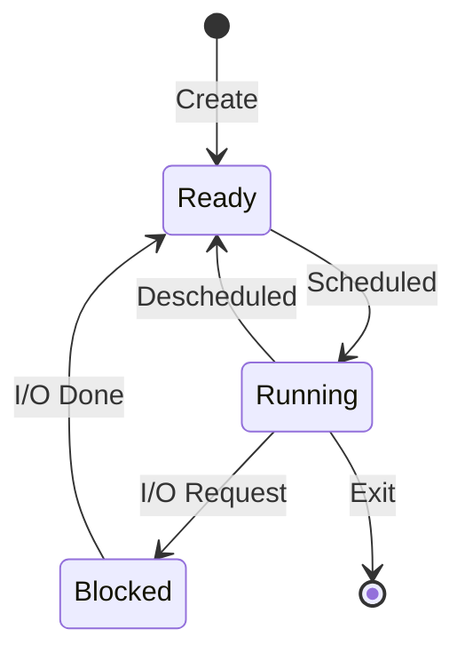

# Chapter 4: The Abstraction: The Process

> "A process is a running program. The program itself is a lifeless thing: it just sits there on the disk, a bunch of instructions waiting to spring into action. It is the operating system that transforms these bytes into something useful."

---

## 1. The Crux: The Illusion of Many CPUs

How can the OS provide the illusion of a nearly-endless supply of CPUs when there are only a few physical ones available?

The OS achieves this through **Virtualizing the CPU**. By running one process, then stopping it and running another, the OS creates the illusion of many virtual CPUs. This technique is known as **Time Sharing**.

> [!CAUTION]
> **Performance Trade-off**: Sharing the CPU inevitably leads to slower performance for each individual process, as they must share the hardware.

---

## 2. Machine State: What Constitutes a Process?

To understand a process, we must understand its **Machine State**—everything the program can read or update during execution.

### Key Components:
- **Memory (Address Space)**: Where instructions lie and where the data the program reads/writes sits.
- **Registers**:
    - **Program Counter (PC) / Instruction Pointer (IP)**: Tells us which instruction will execute next.
    - **Stack Pointer & Frame Pointer**: Used to manage the stack for function parameters, local variables, and return addresses.
- **Persistent Storage**: Includes a list of files the process currently has open.

---

## 3. Process API: The OS Interface

Any modern operating system must include these fundamental interfaces for process management:
1. **Create**: A way to create new processes.
2. **Destroy**: Forcefully stop a process.
3. **Wait**: Wait for a process to stop running.
4. **Miscellaneous Control**: Suspending or resuming a process.
5. **Status**: Getting information about a process (how long it has run, its state, etc.).

---

## 4. Process Creation: From Disk to Memory

How does the OS get a program up and running? It follows a systematic procedure:

1. **Loading**: The OS loads the code and static data from disk into the address space of the process.
    - *Modern optimization*: Loading is often done **lazily**, only bringing in pieces of code/data as needed.
2. **Stack Allocation**: The OS allocates memory for the program's **run-time stack** (for local variables, function parameters, and return addresses).
3. **Heap Allocation**: The OS allocates memory for the **heap** (for explicitly requested dynamic data via `malloc()`).
4. **I/O Setup**: Initializing tasks related to standard input, output, and error.
5. **Entry Point**: The OS starts execution at `main()`, handing off control of the CPU to the newly created process.

---

## 5. Process States

A process is always in one of three primary states:

- **Running**: The process is executing instructions on a processor.
- **Ready**: The process is prepared to run but the OS hasn't chosen to run it yet.
- **Blocked**: The process has performed some operation (like I/O) that makes it unready to run until some event happens.

---

## 6. Mechanisms vs. Policies

- **Context Switch (Mechanism)**: The low-level piece of code that gives the OS the ability to stop running one program and start running another.
- **Scheduling Policy (Policy)**: The high-level algorithms used to make decisions (e.g., *which* program should the OS run next?).

---
*Last Updated: May 14, 2026*

**End Note**: Understanding the process abstraction is the first step in mastering how an operating system virtualizes hardware. By managing machine state and transitioning between states, the OS provides a robust environment for multiple programs to coexist.
