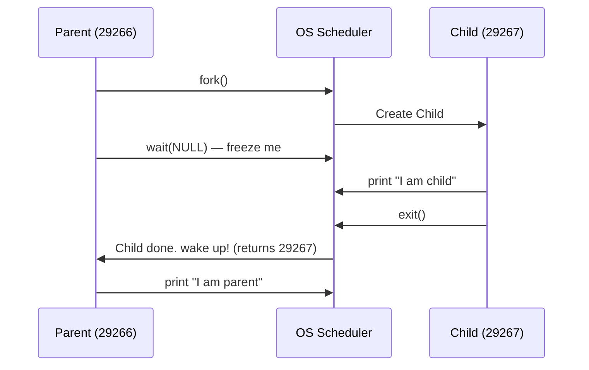
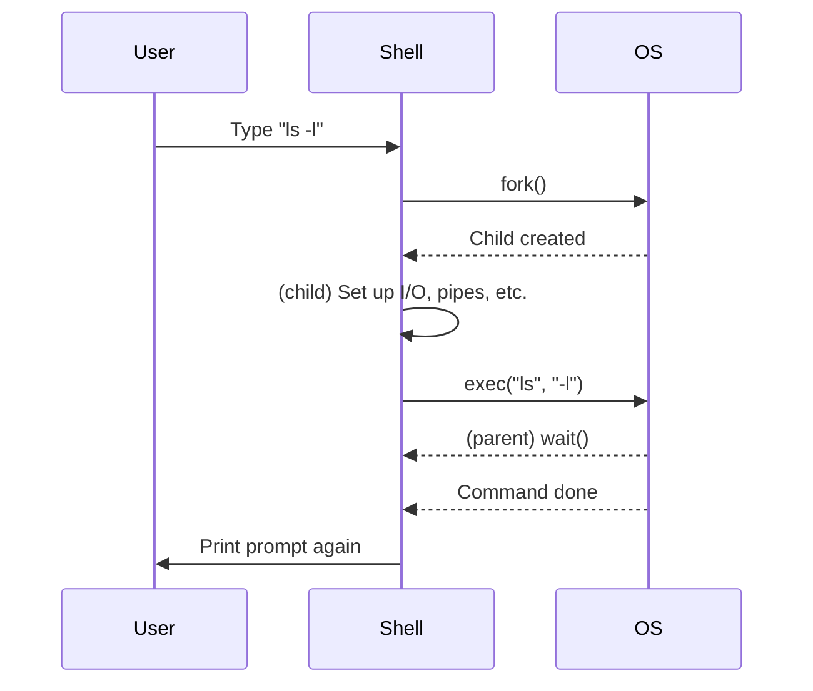

# Chapter 5: Interlude: Process API

> "The separation of `fork()` and `exec()` is not a bug, it's a feature. It is the very mechanism that allows the shell to do its magic."

---

## The Crux: How to Create and Control Processes

What interfaces should the OS present for process creation and control? How should these interfaces be designed to enable powerful functionality, ease of use, and high performance?

---

## 1. The `fork()` System Call

`fork()` is used to create a new process. The child process is an almost-exact copy of the parent.

```c
#include <stdio.h>
#include <stdlib.h>
#include <unistd.h>

int main(int argc, char *argv[]) {
    printf("hello (pid:%d)\n", (int) getpid());

    int rc = fork();

    if (rc < 0) {
        fprintf(stderr, "fork failed\n");
        exit(1);
    } else if (rc == 0) {
        // child (new process)
        printf("child (pid:%d)\n", (int) getpid());
    } else {
        // parent goes down this path
        printf("parent of %d (pid:%d)\n", rc, (int) getpid());
    }
    return 0;
}
```

**Output:**
```
prompt> ./p1
hello (pid:29146)
parent of 29147 (pid:29146)
child (pid:29147)
```

### Breaking Down the Three Phases

**Phase 1 — Initialization (Before the Fork)**

A single process starts, prints the `"hello"` message, and reaches `fork()`.

**Phase 2 — The Split (The `fork()` Call)**

The OS clones the process into two independent entities. The child does **not** start from the beginning — it wakes up exactly at the point where `fork()` is finishing.

**Phase 3 — Concurrent Execution**

Both parent and child run simultaneously. The OS delivers a different return value (`rc`) to distinguish them:

| Process | `rc` Value | Code Path | Reason |
| :--- | :--- | :--- | :--- |
| Parent (PID: 29146) | `29147` (Child's PID) | `else` block | `rc > 0` |
| Child (PID: 29147) | `0` | `else if` block | `rc == 0` |

> [!NOTE]
> **Output Order is Non-Deterministic.** Because both processes run simultaneously, the CPU scheduler decides who prints first. Running `p1` multiple times may produce different orderings — a fundamental trait of concurrent programming.

---

## 2. The `wait()` System Call

`wait()` allows a parent to **pause its own execution** until a child process has completely finished running, making the output order deterministic.

```c
#include <stdio.h>
#include <stdlib.h>
#include <unistd.h>
#include <sys/wait.h>

int main(int argc, char *argv[]) {
    int rc = fork();

    if (rc < 0) {
        fprintf(stderr, "fork failed\n");
        exit(1);
    } else if (rc == 0) {
        printf("hello, I am child (pid:%d)\n", (int) getpid());
    } else {
        int wc = wait(NULL);
        printf("hello, I am parent of %d (pid:%d)\n", rc, (int) getpid());
    }
    return 0;
}
```

**Output:**
```
prompt> ./p2
hello (pid:29266)
child (pid:29267)
parent of 29267 (rc_wait:29267) (pid:29266)
```

### Breaking Down the Three Phases

**Phase 1 — The Fork**

Both Parent (PID: 29266) and Child (PID: 29267) are created. Parent gets `rc = 29267`, Child gets `rc = 0`.

**Phase 2 — The Forked Paths**

- **Child Path**: Immediately executes, prints its message, and exits.
- **Parent Path**: Enters the `else` block and calls `wait(NULL)`, which **freezes the parent**.

**Phase 3 — The Enforced Pause (The Key Insight)**



> [!IMPORTANT]
> Unlike `p1.c`, this program is **deterministic**. The child will **always** print its message before the parent, regardless of the CPU scheduler's decisions.

---

## 3. The `exec()` System Call

`exec()` is used to run a **completely different program** within the current process. It **overwrites** the current process's code and memory with a new program from disk.

- The process keeps the **same PID**.
- The original code after `exec()` **vanishes** — it is never reached.
- The process is **reborn** as the new program.

```c
#include <stdio.h>
#include <stdlib.h>
#include <unistd.h>
#include <sys/wait.h>
#include <string.h>

int main(int argc, char *argv[]) {
    int rc = fork();

    if (rc < 0) {
        fprintf(stderr, "fork failed\n");
        exit(1);
    } else if (rc == 0) {
        // child: set up args and exec 'wc'
        char *myargs[3];
        myargs[0] = strdup("wc");    // program: word count
        myargs[1] = strdup("p3.c"); // argument: file to count
        myargs[2] = NULL;            // end of args marker

        execvp(myargs[0], myargs);
    } else {
        int wc = wait(NULL);
    }
    return 0;
}
```

**Output:**
```
prompt> ./p3
hello (pid:29383)
child (pid:29384)
29 107 1030 p3.c
parent of 29384 (rc_wait:29384) (pid:29383)
```

### Breaking Down the Transformation

**Phase 1** — Parent freezes on `wait(NULL)`. Child enters the `else if` block.

**Phase 2 — The Argument Setup**

| Index | Value | Purpose |
| :--- | :--- | :--- |
| `myargs[0]` | `"wc"` | The program to run |
| `myargs[1]` | `"p3.c"` | The file to count |
| `myargs[2]` | `NULL` | End-of-arguments marker |

**Phase 3 — The Transformation**

`execvp(myargs[0], myargs)` is called. The child is **completely overwritten** and reborn as the `wc` program. It never returns to the code below this line.

`wc` runs its calculation: **29 lines, 107 words, 1030 characters** in `p3.c`.

**Phase 4** — `wc` exits, the parent wakes up from `wait()` and finishes.

---

## 4. Why This API? Motivating `fork` + `exec`

The separation of `fork()` and `exec()` is not arbitrary — it is the key to how the **UNIX shell** works. It allows the shell to run code *after* the fork but *before* the exec (e.g., setting up I/O redirection).

### How the Shell Works Internally:



> "The shell is just a user program. It shows you a prompt, reads your command, forks a child, execs the program, waits for it to finish, and prints the prompt again."

---

## 5. Process Control & Signals

Beyond `fork()`, `exec()`, and `wait()`, UNIX provides additional control interfaces:

| Interface | Purpose |
| :--- | :--- |
| `kill()` | Send signals to a process (pause, die, etc.) |
| `SIGINT` (`Ctrl+C`) | Interrupt (normally terminates the process) |
| `SIGTSTP` (`Ctrl+Z`) | Stop (pauses the process mid-execution) |
| `fg` command | Resume a stopped process |

---
*Last Updated: May 19, 2026*

**End Note**: The elegance of `fork()` + `exec()` reveals a core UNIX philosophy — small, composable tools. By separating process creation from program loading, the OS gives the shell the power to set up environments, redirect I/O, and build pipelines before the target program ever runs.
