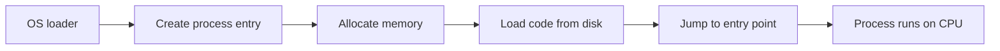
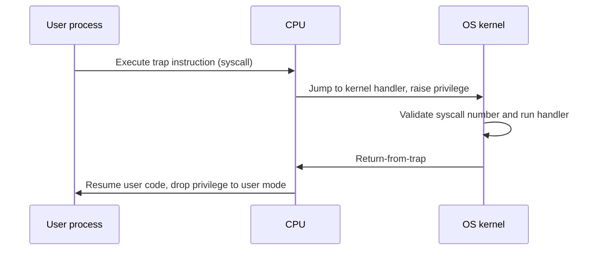
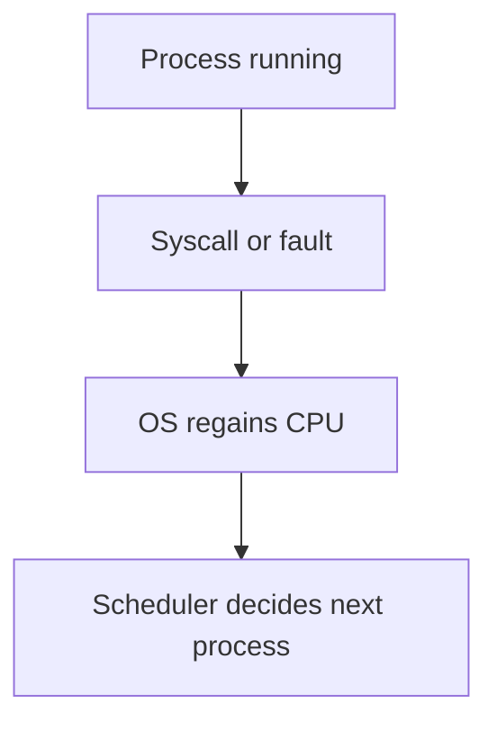
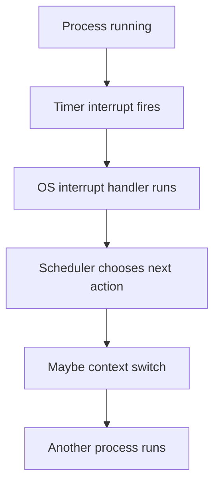
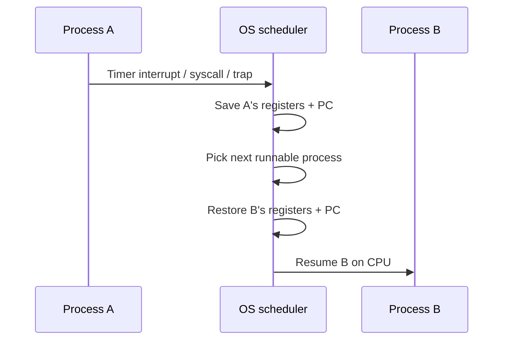

# Chapter 6: Mechanism — Limited Direct Execution

> "Run programs directly on the CPU for speed — but not without guardrails. The OS must share the CPU fairly, stay in control, and still let user programs do useful work."

---

## The Crux: Virtualizing the CPU Safely

To virtualize the CPU, the OS must share one (or a few) physical CPUs among many processes that appear to run at the same time.

The core idea is **time sharing**: run one process for a little while, then another, and so on. Rapid switching creates the illusion of many CPUs.

This raises two hard questions:

| Challenge | Question |
|---------|----------|
| **Performance** | How do we virtualize the CPU without excessive overhead? |
| **Control** | How do we run processes efficiently while retaining OS control? |

The classic answer is **limited direct execution**.

---

## 1. Limited Direct Execution (The Basic Idea)

Instead of interpreting every instruction in software, the OS lets a process run **directly on the hardware** for speed.

When the OS wants to start a program, it roughly:

1. Creates a process entry in the process list
2. Allocates memory for the process
3. Loads program code from disk into memory
4. Locates the entry point (`main`)
5. Jumps to it and starts running

**Direct execution is fast** — but it creates two problems.

---

## 2. Two Problems with Naive Direct Execution

### Problem A: How does the OS restrict what a process can do?

If a process runs freely on the CPU, nothing stops it from issuing privileged operations (for example, arbitrary disk I/O) and bypassing OS policy.

### Problem B: How does the OS regain the CPU for time sharing?

If a process never gives up the CPU, the OS cannot switch to another process. Virtualization breaks.

The rest of this chapter solves these two problems.

---

## 3. Problem #1 — Restricted Operations

### User mode vs kernel mode

Modern CPUs provide at least two privilege levels:

| Mode | Who runs here | Capabilities |
|------|----------------|--------------|
| **User mode** | Application code | Restricted — cannot perform privileged instructions |
| **Kernel mode** | OS code | Full privileges — I/O, memory management, hardware control |

If user code tries a privileged operation (such as direct disk I/O), the CPU raises an exception and the OS typically terminates the process.

### System calls: the safe bridge

User processes still need privileged services (read a file, create a process, send network data). The hardware provides **system calls** for this.

A user program cannot jump into arbitrary kernel code. It must request a specific service through a controlled entry point.

### How a trap works

1. User program executes a special **trap** instruction.
2. CPU jumps into the kernel and switches to **kernel mode**.
3. Kernel performs the privileged work.
4. Kernel executes **return-from-trap**.
5. CPU resumes the user program in **user mode**.

### Trap table (configured at boot)

At boot, the machine starts in kernel mode. One of the first OS jobs is to tell hardware which code to run for each exception/trap.

The OS sets up a **trap table** (handler addresses). Hardware remembers these handlers until reboot.

This means traps do not jump to random addresses — they jump to OS-approved handlers.

### System-call numbers (extra protection)

Each system call has a number (for example, `read`, `write`, `fork`).

- User code places the syscall number in a register (or agreed stack location).
- Kernel trap handler reads the number, validates it, and dispatches the correct kernel routine.

User code cannot say “jump to address X in the kernel.” It can only say “invoke service N.”

---

## 4. Problem #2 — Switching Between Processes

Even with syscalls, the OS still needs a reliable way to **get the CPU back**.

### Approach 1: Cooperative multitasking

The OS trusts processes to yield CPU voluntarily.

Processes often transfer control during syscalls (`read`, `write`, `fork`, etc.). Some systems also provide an explicit **yield** syscall.

Illegal behavior (divide by zero, bad memory access) also traps to the OS, giving control back.

**Limitation:** a buggy or malicious process can spin forever in a loop without syscalls and never yield.

### Approach 2: Non-cooperative — timer interrupt

To avoid relying on process cooperation, hardware provides a **timer interrupt**.

The OS programs a timer to fire every few milliseconds. When it fires:

1. Currently running process is interrupted
2. CPU jumps to a preconfigured interrupt handler in the OS
3. OS regains control even if the process never called a syscall

This is how modern OSes guarantee the kernel can always intervene.

---

## 5. Saving and Restoring Context

Once the OS regains control (via syscall, fault, or timer interrupt), it must decide:

- keep running the current process,
- create a new process,
- or switch to a different one.

That decision is made by the **scheduler**.

If the decision is to switch processes, the OS runs a low-level routine called a **context switch**:

1. Save the current process state (registers, PC, stack pointer, etc.)
2. Restore another process's saved state
3. Resume execution where that process left off

From the process's perspective, it simply “wakes up” later and continues — unaware that other processes ran in between.

---

## 6. Putting It All Together

Limited direct execution is the foundation of CPU virtualization:

| Mechanism | Solves |
|-----------|--------|
| **User/kernel mode** | Restricts what user code can do directly |
| **Trap + syscall dispatch** | Lets user code request privileged services safely |
| **Trap table at boot** | Ensures traps enter trusted OS handlers |
| **Timer interrupt** | Guarantees OS can regain CPU for time sharing |
| **Context switch** | Saves/restores process state between runs |

Without these pieces, you either get unsafe execution (no isolation) or slow emulation (no direct execution).

---

*Last Updated: May 28, 2026*

**End Note**: Limited direct execution is the contract between speed and control. The CPU runs user code at full hardware speed most of the time, but the OS uses traps, privilege levels, and timer interrupts to stay in charge — enabling both isolation and the illusion of many CPUs from one physical processor.
