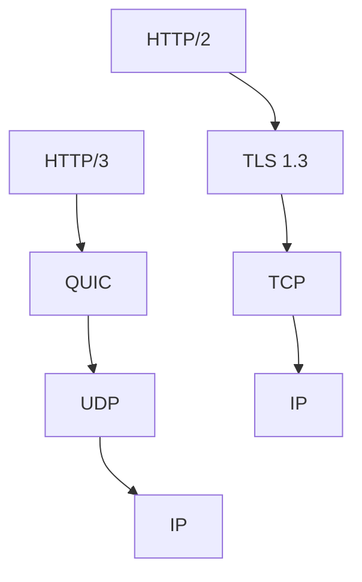
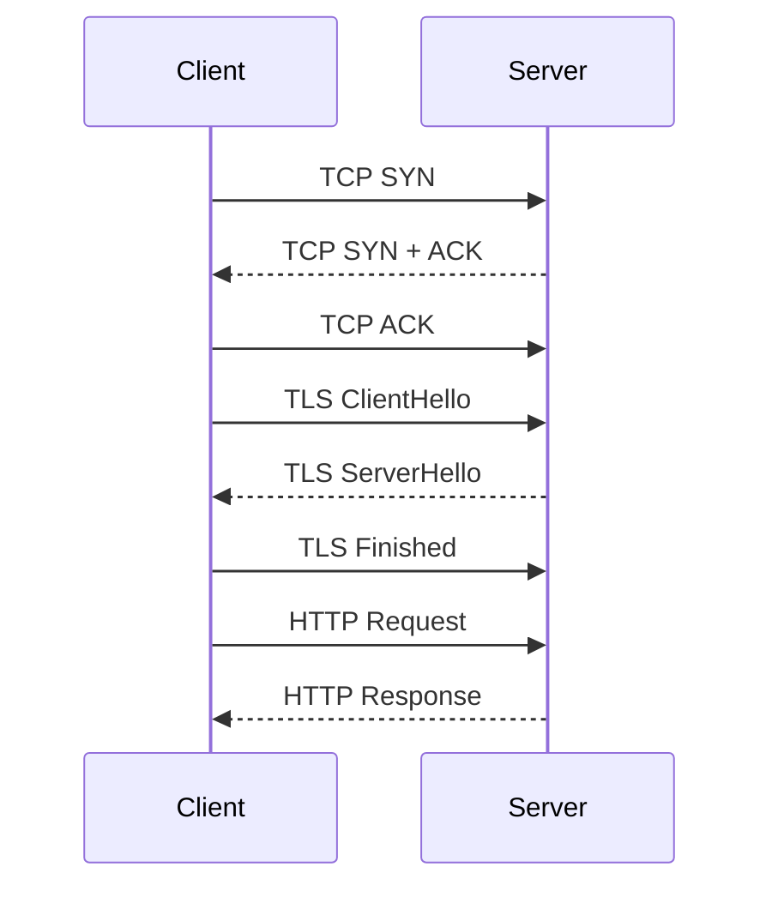
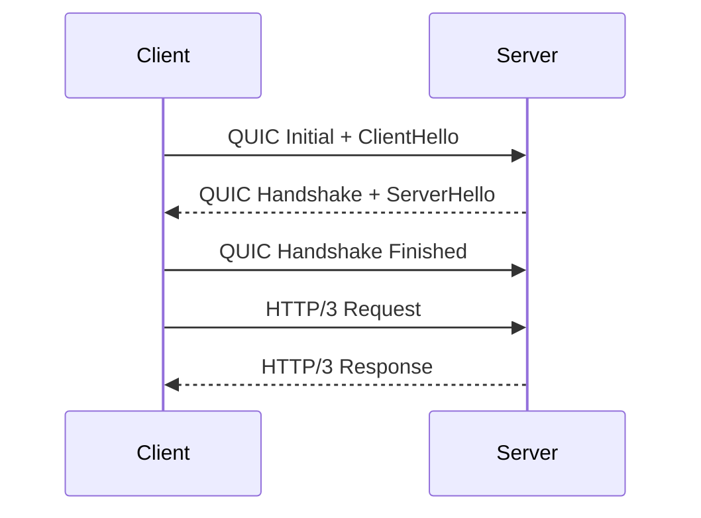
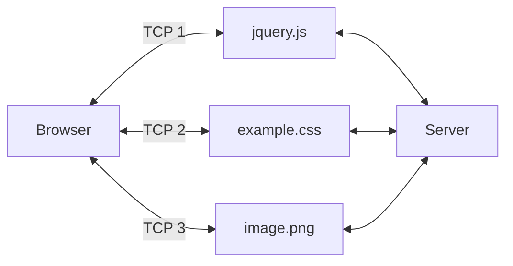
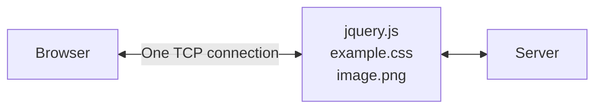
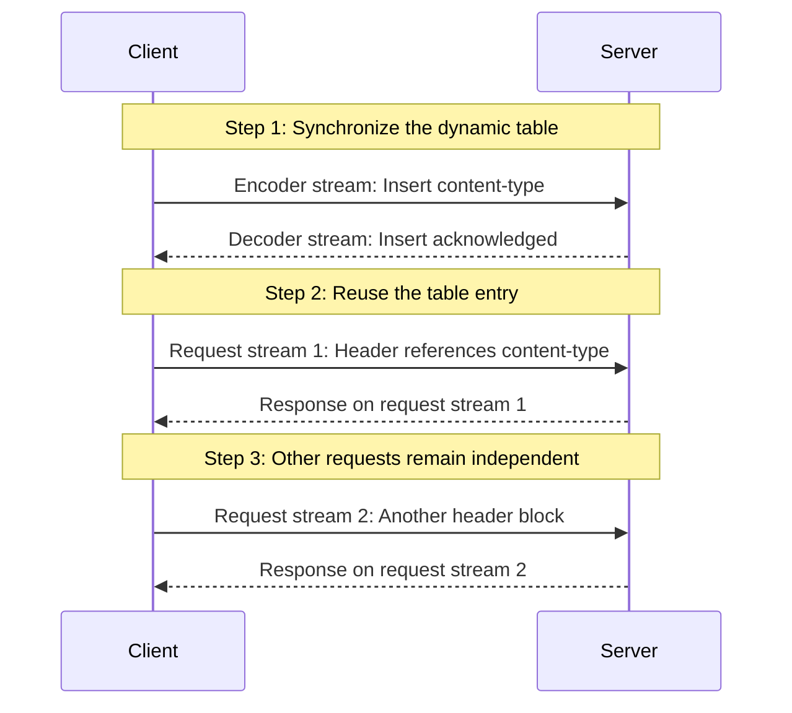
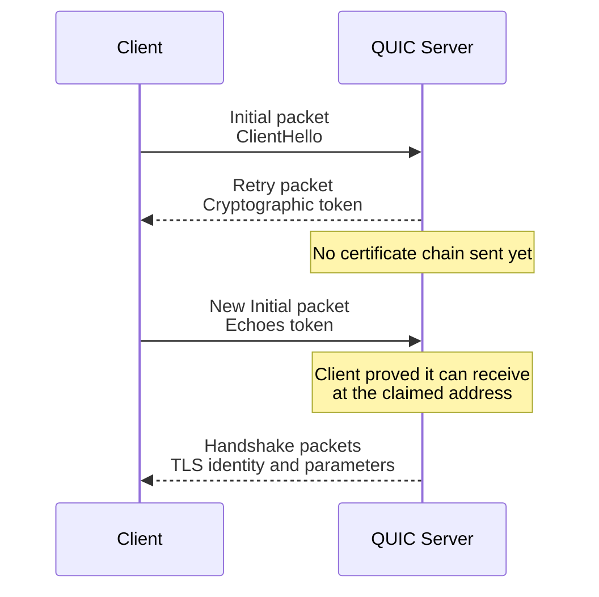

# QUIC Deep-Dive: The Transport Protocol Behind HTTP/3

**Technical Deep-Dive** | Transport Protocols | June 2026

QUIC is an encrypted-by-default transport protocol designed to reduce connection-establishment latency, support independent multiplexed streams, and allow connections to survive changes in network path.

Despite its name originally expanding to **Quick UDP Internet Connections**, modern IETF QUIC is simply called **QUIC**. It runs over UDP, integrates TLS 1.3, and provides the transport foundation for HTTP/3.

---

## From Google QUIC to IETF QUIC

Two related protocols have carried the QUIC name:

1. **Google QUIC (gQUIC)** was the original protocol developed and deployed by Google.
2. **IETF QUIC** was standardized after years of experimentation and redesign.

IETF QUIC diverged significantly from gQUIC and should be treated as a separate protocol rather than a later wire-compatible version. QUIC version 1 was standardized in 2021 through RFC 9000, with TLS integration defined by RFC 9001 and HTTP/3 defined by RFC 9114.

So why introduce a new transport protocol when TCP already powers most of the internet?

The answer lies in the interaction between connection setup, encryption, multiplexing, packet loss, and changing network paths.

---

## QUIC's Core Improvements

QUIC combines capabilities that traditionally live across several layers:



| HTTP/2 stack | HTTP/3 stack |
| --- | --- |
| HTTP/2 handles multiplexed HTTP messages. | HTTP/3 maps HTTP messages to QUIC streams. |
| TLS 1.3 provides encryption and authentication. | QUIC integrates the TLS 1.3 handshake and packet protection. |
| TCP provides ordering, reliability, recovery, and congestion control. | QUIC provides streams, reliability, recovery, and congestion control. |
| IP routes packets across networks. | UDP carries QUIC packets over IP. |

At a high level, QUIC provides:

- Encryption and authentication through an integrated TLS 1.3 handshake
- Faster connection establishment
- Multiple independent streams inside one connection
- Reduced head-of-line blocking between streams
- Connection migration across network paths
- Transport evolution in user space instead of operating-system kernels

### TCP vs. QUIC

| Feature | TCP | QUIC |
| --- | --- | --- |
| Transport base | Native transport protocol over IP | Secure transport protocol carried over UDP |
| Encryption | Not built in; normally paired with TLS | TLS 1.3 is integrated into the protocol |
| New secure connection | TCP handshake followed by a TLS handshake | Transport and TLS negotiation happen together |
| Typical setup latency | Usually 2 RTTs before application data with TCP + TLS 1.3 | Usually 1 RTT; 0-RTT is possible for resumed connections |
| Data model | One ordered byte stream per connection | Multiple independent ordered streams per connection |
| Packet-loss impact | Missing data can block delivery for the entire connection | Missing data normally blocks only the affected stream |
| Connection identity | Primarily identified by source and destination IP addresses and ports | Uses connection IDs that are independent of the network path |
| Network changes | An IP or port change generally requires a new connection | Can migrate an existing connection to a validated new path |
| Implementation | Commonly implemented inside the operating-system kernel | Commonly implemented in application or user-space libraries |
| Protocol evolution | Kernel and middlebox behavior can slow deployment | Encrypted metadata and user-space updates make evolution easier |
| Main modern HTTP version | HTTP/1.1 and HTTP/2 | HTTP/3 |

---

## Built-In Security and Faster Handshakes

TCP does not provide encryption by itself. HTTPS over TCP therefore requires two distinct operations:

1. Establish a TCP connection.
2. Perform a TLS handshake over that connection.

With TCP and TLS 1.3, a new connection normally needs one round trip for the TCP handshake and another round trip for the TLS handshake before application data can flow.

QUIC combines transport and cryptographic negotiation. It carries TLS 1.3 handshake messages directly in QUIC `CRYPTO` frames and uses QUIC's own packet-protection format instead of the TLS record layer.

### HTTP Request over TCP + TLS



### HTTP Request over QUIC



A fresh QUIC connection can therefore become ready for application data after one round trip. When reconnecting to a server for which the client has suitable session state, QUIC can also support **0-RTT data**, allowing the client to send application data immediately.

> **Important:** 0-RTT data has weaker replay protections than ordinary 1-RTT data. Applications should only use it for operations that are safe to repeat.

QUIC authenticates every packet and encrypts as much connection metadata as practical. This reduces the amount of transport information visible to middleboxes and makes protocol evolution less dependent on network devices correctly interpreting transport internals.

---

## Head-of-Line Blocking

HTTP/2 introduced multiplexing: multiple HTTP requests and responses can share one TCP connection. This avoids opening several TCP and TLS connections as HTTP/1.1 commonly did.

However, TCP exposes a single ordered byte stream. If one TCP segment is lost, bytes received after the missing segment cannot be delivered to the application until that segment is retransmitted—even if those later bytes belong to a different HTTP/2 stream.

This is **transport-level head-of-line blocking**.

### HTTP/1.1: Multiple TCP Connections



### HTTP/2: One Multiplexed TCP Connection



HTTP/1.1 commonly opens several TCP connections so that resources can be transferred in parallel. HTTP/2 multiplexes those exchanges over one TCP connection, reducing connection overhead. The tradeoff is that all HTTP/2 streams still depend on TCP's single ordered byte stream.

QUIC provides multiple independent ordered streams inside a single connection. Losing data for one stream can block that stream, but it does not prevent complete data from other streams from being delivered.

QUIC does not eliminate every form of head-of-line blocking. Ordering still exists within each individual stream, and HTTP/3 control data can introduce application-level dependencies. Its major improvement is eliminating TCP's connection-wide ordering dependency across unrelated streams.

---

## Connection Migration

TCP connections are conventionally identified by a four-tuple:

```text
Source IP + Source Port + Destination IP + Destination Port
```

If any part of that tuple changes, the packets appear to belong to a different TCP connection.

This is inconvenient for mobile devices. A phone might begin a request over cellular data and then connect to Wi-Fi. Its source IP address and port can change even though the application session is still active.

NAT rebinding can cause the same problem. A NAT device may assign a new external port after a timeout or other state change.

### QUIC Connection IDs

QUIC packets can carry a **connection ID**: an opaque identifier selected by an endpoint. This allows the endpoint to associate packets with the correct connection without relying exclusively on the four-tuple.

When a peer appears on a new network path, QUIC uses `PATH_CHALLENGE` and `PATH_RESPONSE` frames to verify that the peer can receive packets at the new address. After validation, traffic can migrate without repeating the complete transport and TLS handshakes.

Connection IDs can also be rotated to reduce the risk of allowing passive observers to correlate a connection across network changes.

---

## UDP and Middlebox Compatibility

QUIC uses UDP partly because UDP offers a minimal, widely deployed interface that applications can build upon in user space.

That flexibility has a tradeoff: some firewalls, NAT devices, and enterprise networks apply shorter timeouts, rate limits, or restrictive policies to UDP traffic. If QUIC cannot establish a usable path, HTTP clients generally need a fallback such as HTTP/2 over TCP.

Unlike TCP-aware devices, legacy middleboxes cannot infer QUIC connection state by observing `SYN`, `ACK`, and `FIN` flags. QUIC therefore defines its own encrypted transport state, connection IDs, idle timeouts, and path-validation mechanisms at the endpoints.

---

## Why HTTP/3 Uses QPACK Instead of HPACK

HTTP headers contain significant repetition. Fields such as `content-type`, `user-agent`, and `accept-encoding` appear across many requests and responses.

HTTP/2 uses **HPACK** to compress these fields. HPACK maintains dynamic tables shared by an encoder and decoder, allowing later header blocks to refer to entries transmitted earlier.

This works naturally over TCP because bytes arrive at the application in the same order in which they were sent. An HPACK table update is processed before a later header block that depends on it.

QUIC changes that assumption. It guarantees ordering within one stream, but not across different streams. If every HTTP request uses an independent stream, a header block could arrive before the dynamic-table update it references.

Serializing all headers onto one stream would restore ordering—but it would also recreate head-of-line blocking.

### QPACK's Design

HTTP/3 solves this problem with **QPACK**, a header-compression format designed specifically for QUIC.

Each request or response uses its own bidirectional QUIC stream. In addition, each endpoint creates two unidirectional QPACK streams:

- An **encoder stream** sends instructions that modify the peer's dynamic table.
- A **decoder stream** sends acknowledgements and information about blocked streams.



The **encoder stream** updates the receiver's dynamic table. The **decoder stream** reports which updates and header blocks were processed. Once the client knows that the server has received an entry, request streams can reference that entry instead of transmitting the full header again.

Request and response data still travel on their own bidirectional streams. If one request stream is delayed, unrelated request streams can continue independently.

QPACK lets endpoints balance compression efficiency against the risk of blocking. A header block may reference a dynamic-table entry that has not yet arrived, but the peer limits how many such streams are allowed to become blocked. Encoders can also avoid unacknowledged references when latency is more important than maximum compression.

---

## Defending Against Reflection and Amplification Attacks

UDP permits source-address spoofing because it has no transport handshake that proves the sender can receive packets at the claimed address.

An attacker can exploit this property:

1. Send a small request to a public UDP server.
2. Spoof the victim's IP address as the source.
3. Cause the server to send a much larger response to the victim.

This is a **reflection attack** when the server reflects traffic toward the victim, and an **amplification attack** when the response is substantially larger than the request.

QUIC faces a particular asymmetry during connection establishment. A client can send an Initial packet containing a TLS `ClientHello`, while the server may need to return several packets containing its TLS handshake and certificate chain.

QUIC uses several defenses.

### Minimum Initial Datagram Size

A client must pad the UDP datagram carrying its first Initial packet to at least **1200 bytes**. This forces an attacker to spend meaningful bandwidth for each spoofed attempt.

### Three-Times Anti-Amplification Limit

Before validating a client's address, a server cannot send more than three times the number of bytes it has received from that address.

For example:

```text
Bytes received from unvalidated address: 1,200
Maximum bytes the server may send:       3,600
```

This bounds the amplification factor while still giving the server enough room to progress with the handshake.

### Address Validation with Retry

A server can choose to validate the client's source address before performing the expensive part of the handshake:



The Retry token is bound to information such as the client's address. A spoofing attacker cannot normally receive the token sent to the victim and therefore cannot return a valid token to continue the handshake.

Retry adds another round trip, so servers generally use it selectively rather than for every connection.

---

## What QUIC Does Not Magically Fix

QUIC improves transport behavior, but it does not remove every networking problem:

- Packet loss still delays data on the affected stream.
- Congestion control still limits how quickly the connection can send.
- Restrictive networks may block or degrade UDP.
- 0-RTT data requires application-level replay awareness.
- Connection migration requires validation of the new path.
- Independent streams do not remove every dependency at the HTTP layer.

QUIC is valuable because it gives endpoints better tools for managing these problems without forcing every stream through one ordered TCP byte stream.

---

## Key Takeaways

- **QUIC is a secure, connection-oriented transport protocol carried over UDP.**
- **TLS 1.3 is integrated into QUIC**, reducing setup latency for new connections.
- **HTTP/3 maps requests onto independent QUIC streams**, avoiding connection-wide head-of-line blocking caused by TCP packet loss.
- **Connection IDs allow connections to survive IP address and port changes**, with path validation protecting migration.
- **QPACK replaces HPACK** because QUIC does not guarantee ordering across streams.
- **Padding, anti-amplification limits, and Retry tokens** help defend QUIC servers from reflection and amplification attacks.

QUIC is not merely “TCP over UDP.” It redesigns the boundary between transport, security, and application protocols so that modern internet traffic can establish connections faster, recover more precisely, and adapt to changing networks.

---


[← Back to Blogs](blogs.md){ .md-button }
