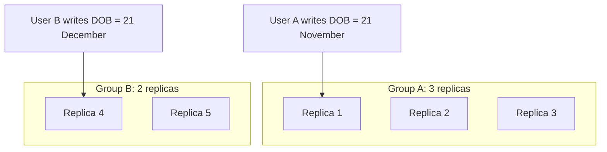
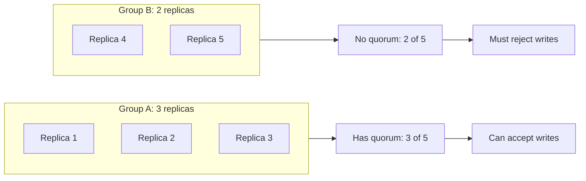
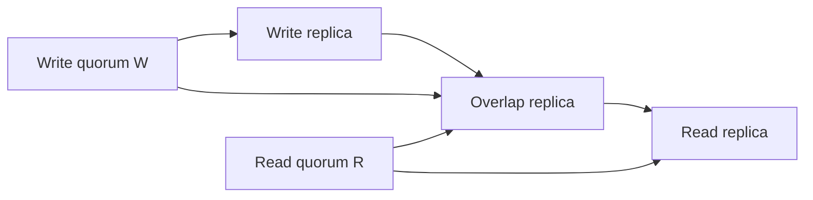

# What Are Quorums in Distributed Systems?

**Technical Deep-Dive** | Distributed Systems | July 2026

Data integrity is one of the most important promises a database can make. In a single-machine database, keeping that promise is already hard. In a distributed database, it becomes much harder because the data is spread across multiple machines that can fail, lag, or lose communication with each other.

Imagine a database replicated across five servers. If one server crashes, the app should stay online because the other replicas still exist.

But now imagine a worse failure: the network cable, router, or link between those servers breaks. Suddenly the five servers are split into two isolated groups:

- Three servers on one side
- Two servers on the other side

If both groups keep accepting writes, you can end up with two different versions of reality. One side might update a user's date of birth to **21 November**, while the other side updates the same field to **21 December**.

When the network heals, the system has a painful question to answer:

> Which value is the truth?

This is the kind of disaster quorum rules are designed to prevent.

---

## The Big Problem: Network Partitions and Split-Brain

Before talking about quorums, we need to understand what goes wrong in the first place.

### Network Partition

A **network partition** happens when some nodes in a distributed system can no longer communicate with other nodes.

The machines might still be alive. The database process might still be running. But because messages cannot travel between the two groups, each group may believe the other group is down.


In this example, replicas `1`, `2`, and `3` can talk to each other. Replicas `4` and `5` can talk to each other. But the two groups cannot communicate across the partition.

### Split-Brain

The **split-brain problem** happens when two isolated groups both believe they are allowed to make decisions.



If both groups accept writes, the database no longer has one clear truth. It has two conflicting histories.

That is why distributed systems need a referee rule.

---

## So, What Is a Quorum?

A **quorum** is the minimum number of nodes that must agree before the system is allowed to make progress.

The simplest version is a **strict majority quorum**:

```text
quorum = floor(N / 2) + 1
```

Where `N` is the total number of replicas.

For a five-node cluster:

```text
quorum = floor(5 / 2) + 1
       = 2 + 1
       = 3
```

So, in a five-node cluster, at least three replicas must agree before the system accepts a decision.

> Quorums are not only used in databases. They also appear in consensus algorithms, coordination systems, leader election, replicated logs, and many other distributed protocols.

---

## How Quorum Prevents Split-Brain

Let us return to the five-server partition:



Since the quorum size is `3`, only the group with three replicas can keep accepting writes.

The group with two replicas does not have enough votes. It must stop accepting updates until it can talk to enough replicas again.

This is the magic of strict majority quorum:

> It is mathematically impossible for two separate groups to both contain a majority of the same cluster.

That single rule prevents both sides of a network split from creating conflicting versions of the data.

---

## Read and Write Quorums

Some distributed databases use configurable read and write quorums.

There are three important values:

| Symbol | Meaning |
| --- | --- |
| `N` | Total number of replicas |
| `W` | Number of replicas that must acknowledge a write |
| `R` | Number of replicas that must be contacted for a read |

### Write Quorum

A **write quorum** is the minimum number of replicas that must confirm they saved a value before the database tells the client:

```text
Success.
```

If `W = 3`, then at least three replicas must acknowledge the write.

### Read Quorum

A **read quorum** is the minimum number of replicas the database must consult when reading a value.

If `R = 3`, the database reads from at least three replicas and uses version information to decide which value is newest.

---

## The Overlap Rule

The core quorum formula is:

```text
R + W > N
```

This means the read set and write set must overlap by at least one replica.



The overlapping replica acts like a witness. It has seen the latest write, so the read quorum has a path to discover the latest value.

For example, if:

```text
N = 5
W = 3
R = 3
```

Then:

```text
R + W = 6
6 > 5
```

Because the total is greater than the number of replicas, the read quorum and write quorum must overlap somewhere.

Important nuance: `R + W > N` helps ensure a read can observe the latest completed write, but strong consistency still depends on the database protocol using versions, ordering, conflict resolution, or consensus correctly. The formula is the mathematical foundation, not the entire database implementation.

---

## Majority Quorum Math

In consensus-style systems such as Raft or Paxos-based designs, the common rule is to require a strict majority for decisions.

If the quorum size is `Q`, then:

```text
2Q > N
```

Solving that gives:

```text
Q > N / 2
```

Because we cannot have half a server, the standard majority quorum formula becomes:

```text
Q = floor(N / 2) + 1
```

For five replicas:

```text
Q = floor(5 / 2) + 1
Q = 2 + 1
Q = 3
```

That is why a five-node cluster needs three votes.

---

## Applying It to the Five-Server Cluster

Let us apply the formula to our original example:

| Cluster state | Available replicas | Quorum required | Can accept writes? |
| --- | ---: | ---: | --- |
| Group A | 3 | 3 | Yes |
| Group B | 2 | 3 | No |

The group of three can continue operating because it has a quorum.

The group of two must reject writes because it cannot prove that it represents the real cluster majority.

When the network heals, there is no split-brain conflict to resolve because only one side was allowed to make changes.

---

## The Tradeoffs

Quorums solve a huge correctness problem, but they are not free.

### Complexity

Quorum-based systems are harder to design and implement. They need careful handling of timeouts, retries, node failures, stale replicas, version metadata, and recovery.

### Performance

Every quorum operation requires communication with multiple nodes. That increases latency compared to writing to just one server.

### Availability

Quorums protect correctness by sometimes saying **no**. If a client can only reach two replicas in a five-node cluster, the system may reject writes even though those two replicas are technically alive.

### Maintenance

Operators must monitor replica health, network behavior, disk failures, and cluster membership. A quorum system only stays reliable if the cluster itself is cared for.

---

## Key Takeaways

- A **network partition** splits a cluster into groups that cannot talk to each other.
- **Split-brain** happens when multiple isolated groups accept conflicting writes.
- A **quorum** is the minimum number of nodes required to make progress.
- A strict majority quorum is calculated as `floor(N / 2) + 1`.
- For `N = 5`, the majority quorum is `3`.
- The rule `R + W > N` ensures read and write quorums overlap.
- Quorums trade some availability and latency for stronger correctness.

---

## Conclusion: Math over Luck

Distributed systems are unpredictable. Networks split, servers lag, disks fail, and messages arrive late.

If we try to handle those failures with guesswork, we eventually get corrupted data.

Quorums replace guesswork with math. By requiring enough replicas to agree, the system prevents two isolated groups from both claiming authority at the same time.

That is the quiet power of quorum-based design: even when infrastructure breaks into isolated islands, a small piece of discrete math keeps the data from breaking with it.

---

[← Back to Blogs](blogs.md){ .md-button }
