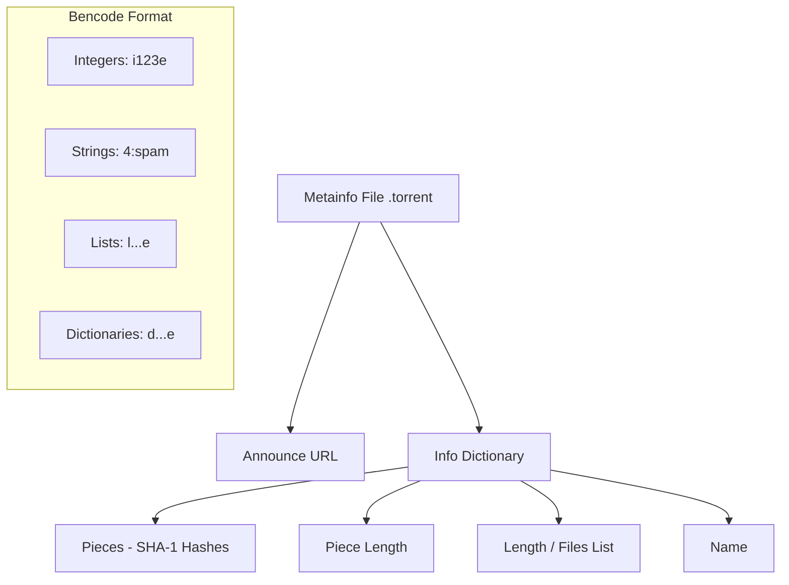

# Inside the .torrent File: Understanding Bencode & Metadata

If you have ever used torrents, I am sure you have encountered the `.torrent` file. But have you ever wondered what's inside it?

Let's try to understand.

Just like in our REST servers we use JSON format, for torrents we use another format called **Bencode**.

---

## What's in a .torrent file?

In a `.torrent` file, we mainly have two important properties:

1.  **Announce**: This defines the URL of the tracker. It provides a list of peers (IP addresses) who are sharing the file, and from those peers we download our desired data.
2.  **Info**: A dictionary that contains the core metadata of the file(s) being shared.

### The Info Dictionary
The `info` section consists of several critical properties:

- **Pieces**: A single string containing concatenated 20-byte SHA-1 hashes. Each chunk represents the hash of one piece of the file, used to verify data integrity.
- **Piece length**: The size of each piece (in bytes).
- **Length**: The total length of the file (for single-file torrents).
- **Name**: The name of the file or root directory.

---

## Visualizing the Structure

---

## The Metadata Secret
The most interesting part? That tiny `.torrent` file doesn't actually contain your movie, software, or dataset. It only contains **metadata** and **cryptographic fingerprints**. It is a piece of engineering excellence that allows decentralized file sharing at scale.

Thank you for reading!
