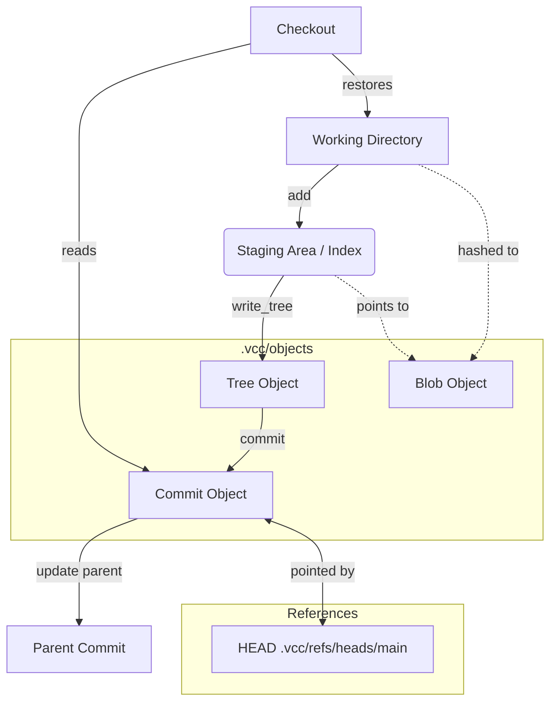
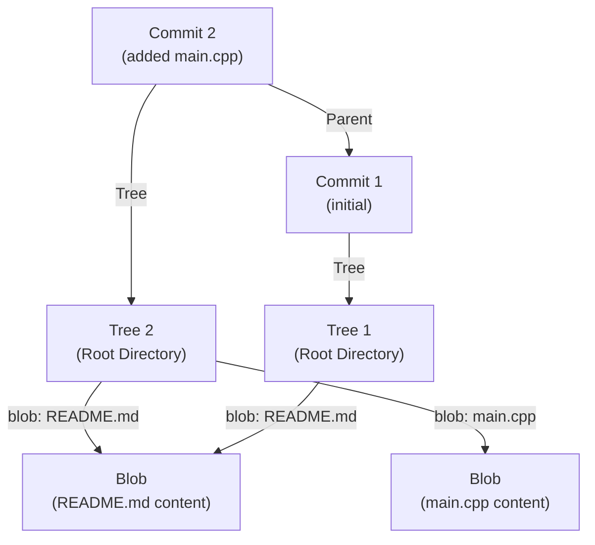

# VCC: A Version Control System Built From Scratch

**C++17** | Systems Programming & Developer Tooling

VCC is a custom-built version control system implemented entirely in C++. It replicates Git's core architecture — content-addressable object storage, SHA-1 hashing, blob/tree/commit graph, staging, history traversal, and time-travel checkouts — all without using any existing VCS libraries.

<a href="https://github.com/Jyotishmoy12/VCC-version-control" class="github-link" target="_blank"><svg viewBox="0 0 16 16"><path d="M8 0C3.58 0 0 3.58 0 8c0 3.54 2.29 6.53 5.47 7.59.4.07.55-.17.55-.38 0-.19-.01-.82-.01-1.49-2.01.37-2.53-.49-2.69-.94-.09-.23-.48-.94-.82-1.13-.28-.15-.68-.52-.01-.53.63-.01 1.08.58 1.23.82.72 1.21 1.87.87 2.33.66.07-.52.28-.87.51-1.07-1.78-.2-3.64-.89-3.64-3.95 0-.87.31-1.59.82-2.15-.08-.2-.36-1.02.08-2.12 0 0 .67-.21 2.2.82.64-.18 1.32-.27 2-.27.68 0 1.36.09 2 .27 1.53-1.04 2.2-.82 2.2-.82.44 1.1.16 1.92.08 2.12.51.56.82 1.27.82 2.15 0 3.07-1.87 3.75-3.65 3.95.29.25.54.73.54 1.48 0 1.07-.01 1.93-.01 2.2 0 .21.15.46.55.38A8.013 8.013 0 0016 8c0-4.42-3.58-8-8-8z"/></svg>Source</a>

---

## The Architecture

VCC is structured around six managers, each owning a specific domain of the version control lifecycle:



| Manager | Responsibility |
|---------|---------------|
| **RepoManager** | Initializes the `.vcc` directory structure and validates repository state |
| **IndexManager** | Hashes files into blobs, manages the staging area, respects `.vccignore` |
| **TreeManager** | Converts staged index entries into a deterministically sorted Tree object |
| **CommitManager** | Wraps a Tree with metadata (author, message, parent) into a Commit object |
| **LogManager** | Traverses the commit DAG backward from HEAD to render history |
| **CheckoutManager** | Restores the working directory to match any previous commit snapshot |

---

## The Internal Database

When `vcc init` executes, it generates VCC's primary data store:

```text
.vcc/
├── objects/        # Immutable object database (content-addressable)
│   ├── a1/         # Directory (first 2 chars of SHA-1)
│   │   └── b2c...  # File (remaining 38 chars of SHA-1)
├── refs/
│   └── heads/
│       └── main    # 40-char hash pointing to the latest commit
└── index           # Mutable staging area (flat text file)
```

---

## Deep Dive: The Object Model

VCC stores three object types inside `.vcc/objects/`, each addressed by the SHA-1 hash of its serialized content. This makes the entire database a **content-addressable filesystem** — objects are retrieved by *what they contain*, not by arbitrary IDs.

### 1. Blobs (Binary Large Objects)

Blobs store the exact byte-for-byte contents of a staged file. They carry **zero metadata** — no filename, no permissions, no timestamps. Rename `src/main.cpp` to `src/app.cpp` without changing the code? The blob hash stays identical.

```cpp
std::string content = read_file(filename);
SHA1 checksum; checksum.update(content);
std::string hash = checksum.final();
```

### 2. Trees (Directory Snapshots)

Trees map blobs to human-readable filenames, forming the directory hierarchy. `TreeManager::write_tree()` reads the index, **alphabetically sorts** entries (for deterministic hashing), and constructs a payload:

```text
100644 blob 8af7c... src/main.cpp
100644 blob 2cf3b... README.md
```

Two directories with identical files produce **identical Tree hashes** — enabling automatic deduplication.

### 3. Commits (History Nodes)

Commits bind a Tree to a moment in time. The payload is purely text-based:

```text
tree 724505ffcdbe7324f617f3e166d3f44f17e0e34a
parent 4fc37118897576c907dce5f629a0802113b578bf
author Jyotishmoy Deka

added codes
```

Because the parent hash is embedded inside the payload, altering **any** historical commit changes its hash, which recursively invalidates all subsequent commits — guaranteeing a **tamper-proof, mathematically verifiable history**.

---

## Object Graph Visualization

The resulting DAG achieves extreme spatial efficiency through content-based deduplication:



*Because `README.md` didn't change between Commit 1 and Commit 2, Tree 2 calculates the same SHA-1 for the file — dynamically deduplicating the storage footprint.*

---

## The Checkout Algorithm

Time-traveling to a previous commit (`checkout <hash>`) is a six-step deterministic process:

1. **Read Target** — Locate the commit object in `.vcc/objects/`
2. **Parse Payload** — Line-by-line parse to extract the 40-char tree hash from the `tree` prefix
3. **Read Tree** — Locate the Tree object using the extracted hash
4. **Parse Entries** — Iteratively parse `<mode> <type> <hash> <filename>` entries
5. **Reconstruct Working Directory** — For every blob entry, load the binary content and overwrite the local file
6. **Move HEAD** — Rewrite `.vcc/refs/heads/main` to point to the target commit hash

---

## Command Reference

| Command | Usage | Description |
|---------|-------|-------------|
| `init` | `.\vcc.exe init` | Initialize a new VCC repository with the `.vcc` directory structure |
| `add` | `.\vcc.exe add <file>` | Hash file contents to a blob, store in objects, and update the index |
| `write-tree` | `.\vcc.exe write-tree` | Create a Tree object from the current staging area (returns SHA-1) |
| `commit` | `.\vcc.exe commit "<msg>"` | Snapshot the tree with metadata and update HEAD |
| `log` | `.\vcc.exe log` | Traverse and display the full commit history from HEAD |
| `checkout` | `.\vcc.exe checkout <hash>` | Restore working directory to match a specific commit |

---

## Interactive System Flow
<div class="flow-visualizer-container" data-nodes='["Working Dir", "SHA-1 Hash", "Blob Store", "Tree Object", "Commit DAG"]'>
    <div class="flow-nodes">
        <div class="flow-packet"></div>
    </div>
    <div class="flow-controls">
        <button class="md-button md-button--primary flow-btn trace-btn">Trace Request</button>
        <button class="md-button flow-btn reset-btn">Reset</button>
    </div>
</div>

---

## Summary

This project demonstrates a deep understanding of how Git works internally — from SHA-1 content addressing and immutable object graphs to index management and working directory reconstruction. Every core concept — blobs, trees, commits, HEAD, checkout — was implemented from first principles in C++17 with raw file I/O and no external VCS libraries.
