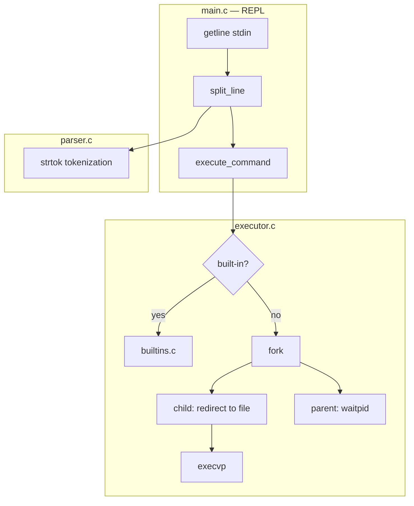
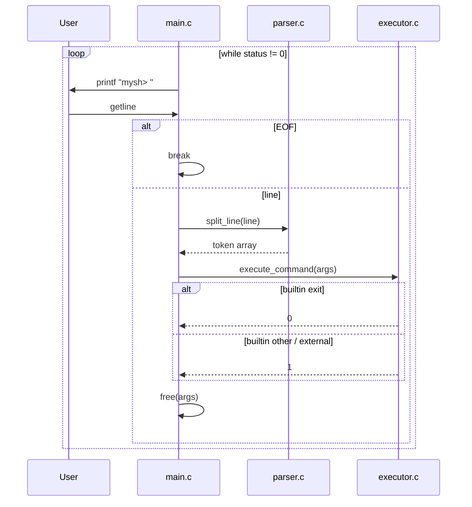
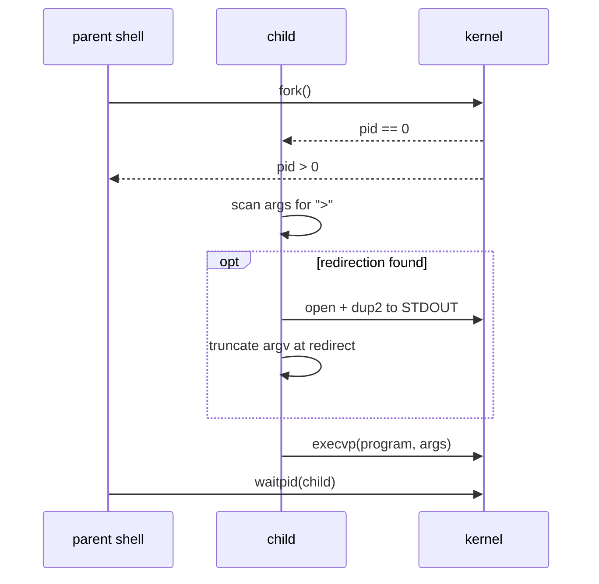

# WOMM-Sh: A Minimal Unix Shell Built From Scratch

**C** | Process API & Shell Internals

**mysh** is a minimal Unix shell written in C — a hands-on exploration of OSTEP’s Process API. It reads commands from standard input, parses them into tokens, runs built-ins (`cd`, `exit`) in the parent process, and launches external programs via `fork` / `execvp` with optional stdout redirection (`>`).

<a href="https://github.com/Jyotishmoy12/WOMM-Sh" class="github-link" target="_blank"><svg viewBox="0 0 16 16"><path d="M8 0C3.58 0 0 3.58 0 8c0 3.54 2.29 6.53 5.47 7.59.4.07.55-.17.55-.38 0-.19-.01-.82-.01-1.49-2.01.37-2.53-.49-2.69-.94-.09-.23-.48-.94-.82-1.13-.28-.15-.68-.52-.01-.53.63-.01 1.08.58 1.23.82.72 1.21 1.87.87 2.33.66.07-.52.28-.87.51-1.07-1.78-.2-3.64-.89-3.64-3.95 0-.87.31-1.59.82-2.15-.08-.2-.36-1.02.08-2.12 0 0 .67-.21 2.2.82.64-.18 1.32-.27 2-.27.68 0 1.36.09 2 .27 1.53-1.04 2.2-.82 2.2-.82.44 1.1.16 1.92.08 2.12.51.56.82 1.27.82 2.15 0 3.07-1.87 3.75-3.65 3.95.29.25.54.73.54 1.48 0 1.07-.01 1.93-.01 2.2 0 .21.15.46.55.38A8.013 8.013 0 0016 8c0-4.42-3.58-8-8-8z"/></svg>Source</a>

---

## Project Overview

**mysh** implements a classic read–eval–print loop: print `mysh> `, read a line with `getline(3)`, parse into an `argv`-style token array, execute via built-ins or `fork` + `execvp`, and repeat until `exit` or EOF. The design is intentionally small — no job control, pipes, background jobs, or custom line editing.

Full module-level notes and additional diagrams live in the repo at [`docs/TECHNICAL.md`](https://github.com/Jyotishmoy12/WOMM-Sh/blob/main/docs/TECHNICAL.md).

---

## Features

- Interactive REPL with `mysh>` prompt
- Built-in commands: `cd`, `exit` (run in the parent so `cd` affects the shell)
- External programs via `fork` + `execvp`
- Output redirection: `command > file` (stdout truncate/create in the child before `execvp`)

**Requirements:** GCC (or another C compiler) and a POSIX environment (**Linux**, **macOS**, or **WSL** on Windows).

---

## Quick Start

```bash
make
./mysh
```

Example session:

```text
mysh> pwd
/home/user/project
mysh> ls -l > listing.txt
mysh> cd src
mysh> exit
```

---

## Architecture



| Module | Files | Responsibility |
|--------|--------|----------------|
| Entry / REPL | `main.c` | Prompt, input loop, call parser + executor |
| Parser | `parser.c`, `parser.h` | Split input into a NULL-terminated token array |
| Executor | `executor.c`, `executor.h` | Dispatch built-ins vs external commands |
| Built-ins | `builtins.c`, `builtins.h` | `cd`, `exit` in the parent process |

### Project layout

```text
WOMM-Sh/
├── Makefile
├── README.md
├── docs/
│   └── TECHNICAL.md
└── src/
    ├── main.c          # REPL loop
    ├── parser.c/h      # Tokenization
    ├── executor.c/h    # Built-ins, fork/exec, redirection
    └── builtins.c/h    # cd, exit
```

---

## Module Highlights

### Parser (`split_line`)

Uses `strtok(3)` with delimiters ` \t\r\n\a`. Returns pointers into the **mutated** input line (no per-token copies). Grows the pointer array with `realloc` when token count exceeds `TOKEN_BUFSIZE` (64).

### Built-ins

Registered via parallel name/function arrays:

```c
char *builtin_str[] = { "cd", "exit" };
int (*builtin_func[])(char **) = { &builtin_cd, &builtin_exit };
```

| Command | Behavior | Return |
|---------|----------|--------|
| `cd [dir]` | `chdir(args[1])` in parent; errors if no argument | `1` |
| `exit` | Stops the shell | `0` |

### Executor

`execute_command(char **args)` scans for built-ins first; otherwise `fork()`s, optionally rewrites `argv` for `>`, runs `execvp` in the child, and `waitpid` in the parent.

---

## Execution Model

### REPL sequence



### External command path



---

## I/O Redirection

Supported syntax (stdout only, one redirect per command):

```text
program [arg ...] > filename
```

The child scans for `>`, opens the file with `O_WRONLY | O_CREAT | O_TRUNC`, `dup2`s to `STDOUT_FILENO`, then NULL-terminates `argv` before `execvp`. Example: `ls -l > out.txt` → `execvp` sees `["ls", "-l", NULL]`.

Not implemented: `<`, `>>`, `2>`, pipes, or heredocs.

---

## Build System

| Variable | Value |
|----------|--------|
| `CC` | `gcc` |
| `CFLAGS` | `-Wall -Wextra -O2` |
| `TARGET` | `mysh` |

All four `.c` files compile and link in one invocation. Targets: `make` / `make all`, `make clean`.

---

## POSIX Dependencies

| API | Used in |
|-----|---------|
| `getline` | `main.c` |
| `fork`, `execvp`, `chdir` | `executor.c`, `builtins.c` |
| `waitpid` | `executor.c` |
| `open`, `dup2` | `executor.c` (redirection) |
| `strtok`, `malloc`, `realloc` | `parser.c` |

Does not build natively on Windows without WSL, MSYS2, or Cygwin.

---

## Limitations & Extension Points

**Current limitations**

- Whitespace-only tokenization (no quoting)
- No `cd` with no args (`$HOME` fallback)
- No pipelines, background `&`, or `export`
- Redirection only on external commands (not built-ins)
- Parent always waits synchronously

**Natural extensions**

| Feature | Approach |
|---------|----------|
| Pipes | `pipe` + two forks, `dup2` between children |
| `>>` append | `O_APPEND` in `open` flags |
| Background jobs | Fork without wait; job table + `WNOHANG` |
| Quoted strings | Custom tokenizer instead of `strtok` |

---

## Summary

This project demonstrates how a real shell uses the **fork/exec split** — built-ins in the parent, programs in a child — and why that design matters for `cd`, I/O redirection, and process isolation. Every piece was implemented in C with POSIX APIs only, aligned with OSTEP Chapter 5 (Process API).

---

[Back to C/C++ Projects](cpp-projects.md){ .md-button }
